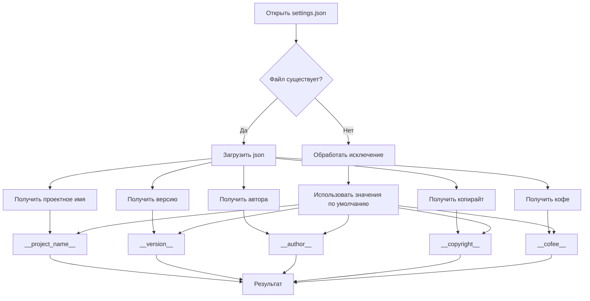

# <input code>

```python
## \file hypotez/src/templates/version.py
# -*- coding: utf-8 -*-\n\n#! venv/bin/python/python3.12\n
"""
.. module: src.templates 
	:platform: Windows, Unix
	:synopsis:

"""


"""
	:platform: Windows, Unix
	:synopsis:

"""

"""
	:platform: Windows, Unix
	:synopsis:

"""


"""
  :platform: Windows, Unix

"""
"""
  :platform: Windows, Unix
  :platform: Windows, Unix
  :synopsis:
"""
  
""" module: src.templates """


import json

settings:dict = None

try:
    with open('../settings.json', 'r') as settings_file:
        settings = json.load(settings_file)
except (FileNotFoundError, json.JSONDecodeError):
    ...

__project_name__ = settings.get("project_name", 'hypotez') if settings  else 'hypotez'
__version__: str = settings.get("version", '')  if settings  else ''
__doc__: str = ''
__details__: str = ''
__author__: str = settings.get("author", '')  if settings  else ''
__copyright__: str = settings.get("copyrihgnt", '')  if settings  else ''
__cofee__: str = settings.get("cofee", "Treat the developer to a cup of coffee for boosting enthusiasm in development: https://boosty.to/hypo69")  if settings  else "Treat the developer to a cup of coffee for boosting enthusiasm in development: https://boosty.to/hypo69"
```

# <algorithm>

**Шаг 1:** Инициализация `settings` как `None`.

**Шаг 2:** Попытка открыть файл `../settings.json`.

    * **Если файл найден:**
        * Загрузка данных из файла в переменную `settings` с использованием `json.load()`.
    * **Если файл не найден или содержимое не в формате JSON:**
        * Обработка исключений `FileNotFoundError` и `json.JSONDecodeError`. Пропускаем обработку.


**Шаг 3:** Чтение настроек из `settings`.

    * Если `settings` не пустое, то извлекаем значения для `__project_name__`, `__version__`, `__author__`, `__copyright__`, `__cofee__`, используя метод `get()`. В случае, если ключ не найден, возвращаем значения по умолчанию.
    * Если `settings` пустое, то используем значения по умолчанию.


# <mermaid>



**Объяснение диаграммы:**

Диаграмма показывает последовательность действий программы. Начало — открытие файла `settings.json`.  В зависимости от наличия файла и валидности JSON, происходит чтение настроек или использование значений по умолчанию.  Результатом работы является наполнение переменных `__project_name__`, `__version__`, `__author__`, `__copyright__`, и `__cofee__`.

**Зависимости:**

* `json`: Модуль `json` используется для работы с файлом `settings.json` в формате JSON.
* `hypotez.src`: `settings.json` находится в папке `hypotez/src`.


# <explanation>

* **Импорты:**
    * `import json`: Импортирует модуль `json`, необходимый для работы с файлом `settings.json` в формате JSON.


* **Переменные:**
    * `settings: dict = None`: Переменная, которая хранит данные, загруженные из файла `settings.json`. Инициализируется как `None`, чтобы указать, что значения пока не загружены.
    * `__project_name__`, `__version__`, `__author__`, `__copyright__`, `__cofee__`:  Эти переменные хранят значения, извлеченные из файла конфигурации.  Использование `settings.get()` с значениями по умолчанию обеспечивает, что эти переменные не будут `None`, если соответствующие ключи отсутствуют в файле.


* **Обработка ошибок:**
    * `try...except`: Блок `try...except` обрабатывает возможные ошибки при чтении файла `settings.json`.  Если файл не найден или имеет некорректный формат JSON, исключение `FileNotFoundError` или `json.JSONDecodeError` поймано и пропущено. Это важно, так как приложение не будет завершаться при таких ошибках.


* **Функции:**
    * Нет функций в традиционном смысле (кроме `json.load`).  Код представляет собой последовательность операций с файлами и переменными.


* **Классы:**
    * Нет классов в данном коде.

* **Возможные ошибки или области для улучшений:**

    * **Отсутствие проверки корректности данных:** Код не проверяет, что данные в `settings.json` имеют ожидаемые типы.  Важно добавить проверку (например, проверка, что `version` — строка, а `project_name` — строка).

    * **Логирование:** Для отладки и мониторинга было бы полезно добавить логирование, чтобы видеть, когда файл не найден или имеет некорректный формат.


**Цепочка взаимосвязей:**

Этот фрагмент кода (`hypotez/src/templates/version.py`) отвечает за чтение информации о версии проекта из файла `settings.json`.  Он служит своего рода инициализатором, определяющим переменные, используемые, вероятно, другими частями проекта (например, для отображения информации о версии). Файл `settings.json` содержит настройки для проекта, например, имя проекта, его версию, автора.