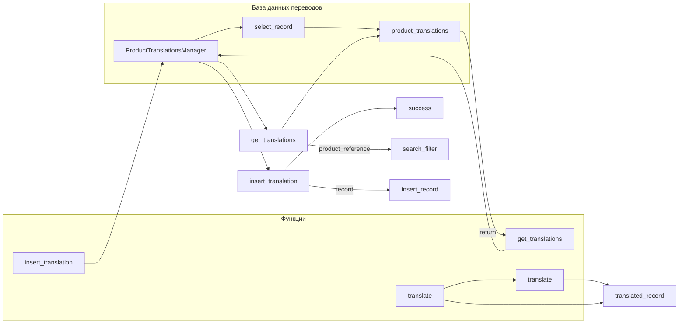

## <input code>

```python
## \file hypotez/src/translators/translate_product_fields.py
# -*- coding: utf-8 -*-
#! venv/Scripts/python.exe
#! venv/bin/python/python3.12

"""
.. module: src.translators 
	:platform: Windows, Unix
	:synopsis:

"""


"""
	:platform: Windows, Unix
	:synopsis:

"""


"""
	:platform: Windows, Unix
	:synopsis:

"""


"""
  :platform: Windows, Unix

"""
"""
  :platform: Windows, Unix
  :platform: Windows, Unix
  :synopsis:
"""
  
""" module: src.translators """


""" Модуль управления переводами.
Слой связи между словарем полей товара, таблицей переводов и переводчиками

`get_translations_from_presta_translations_table(product_reference, credentials, i18n)`
    1. получает референс товара, параметры подключения к базе переводов престашоп и язык перевода в формате en_EN, he_HE, ru-RU 
    2. созадет условуе запроса
    3. возвращает результат
    
@todo
    1. Продумать какой нибудж парсер для en_EN, he_HE, ru-RU
"""
...
from pathlib import Path
from typing import List, Dict
...
from src import gs
from src.utils.printer import  pprint
from src.product.product_fields.product_fields import record
from src.db import ProductTranslationsManager
from src.ai import translate
from src.endpoints.PrestaShop import PrestaShop
from src import gs
from src.product.product_fields.product_fields import record
from src.db import ProductTranslationsManager
from src.ai import translate
from src.endpoints.PrestaShop import PrestaShop

def get_translations_from_presta_translations_table(product_reference: str, credentials: dict, i18n: str = None) -> list:
    """Функция возвращает словарь переводов полей товара."""
    with ProductTranslationsManager(credentials) as translations_manager:
        search_filter = {'product_reference': product_reference}
        product_translations = translations_manager.select_record(**search_filter)
    return product_translations

def insert_new_translation_to_presta_translations_table(record, credentials):
    with ProductTranslationsManager(credentials) as translations_manager:
        translations_manager.insert_record(record)

def translate_record(record: dict, from_locale: str, to_locale: str) -> dict:
    """Функция для перевода полей товара."""
    translated_record = translate(record, from_locale, to_locale)
    ... # Добавить обработку переведенной записи
    return translated_record
```

## <algorithm>

**Шаг 1:** Функция `get_translations_from_presta_translations_table` получает `product_reference`, `credentials` (данные для подключения к базе) и необязательный параметр `i18n` (язык).

**Пример:**
`get_translations_from_presta_translations_table("product123", {"host": "example.com"}, "en_EN")`

**Шаг 2:** Функция создаёт словарь `search_filter` с условием поиска по `product_reference`.

**Пример:**
`search_filter = {'product_reference': 'product123'}`

**Шаг 3:** Функция использует `ProductTranslationsManager` для выполнения запроса к базе данных и получения данных из таблицы переводов, соответствующих условиям поиска.

**Пример:**
`product_translations` - список словарей с переводом.

**Шаг 4:** Функция возвращает полученные данные `product_translations`.


**Шаг 5:** Функция `insert_new_translation_to_presta_translations_table` получает `record` (данные для вставки) и `credentials` (данные для подключения).


**Пример:**
`insert_new_translation_to_presta_translations_table({'product_reference': 'prod1', 'name': 'Name1', 'locale': 'en'}, {"host": "example.com"})`

**Шаг 6:** Функция использует `ProductTranslationsManager` для вставки `record` в базу данных.


**Шаг 7:** Функция `translate_record` получает `record` (переводимые данные), `from_locale` (исходный язык), и `to_locale` (целевой язык).

**Пример:**
`translate_record({'name': 'My Product'}, 'en_EN', 'ru_RU')`

**Шаг 8:** Функция вызывает функцию `translate` из модуля `src.ai`, передавая ей `record`, `from_locale`, и `to_locale`.

**Пример:**
`translated_record` - результат перевода.

**Шаг 9:** Функция обрабатывает переведённую запись `translated_record`.


**Шаг 10:** Функция возвращает переведённую запись `translated_record`.


## <mermaid>



## <explanation>

**Импорты:**

- `from pathlib import Path`: Импортирует класс `Path` для работы с путями файлов.
- `from typing import List, Dict`: Импортирует типы данных `List` и `Dict` для объявления типов переменных.
- `from src import gs`: Импортирует модуль `gs` из пакета `src`.
- `from src.utils.printer import pprint`: Импортирует функцию `pprint` для красивой печати данных.
- `from src.product.product_fields.product_fields import record`: Импортирует определение типа `record` из файла `product_fields.py` в подпапке `product/product_fields`.
- `from src.db import ProductTranslationsManager`: Импортирует класс `ProductTranslationsManager` для взаимодействия с базой данных переводов.
- `from src.ai import translate`: Импортирует функцию `translate` из модуля `translate.py`, который, предположительно, отвечает за перевод текста.
- `from src.endpoints.PrestaShop import PrestaShop`: Импортирует класс `PrestaShop`, вероятно, для взаимодействия с API PrestaShop.


**Классы:**

- `ProductTranslationsManager`:  Представляет класс для работы с базой данных переводов.  Он, предположительно, содержит методы для выборки данных (`select_record`), вставки данных (`insert_record`) и других операций, связанных с управлением таблицей переводов. Необходим для взаимодействия с БД.

**Функции:**

- `get_translations_from_presta_translations_table(product_reference: str, credentials: dict, i18n: str = None) -> list`: Функция для получения переводов полей товара. Принимает на вход `product_reference` (идентификатор товара), `credentials` (данные авторизации для подключения к базе данных) и необязательный параметр `i18n` (язык перевода). Возвращает список переводов или пустой список, если переводы не найдены.
- `insert_new_translation_to_presta_translations_table(record, credentials)`: Функция для добавления нового перевода в базу данных.
- `translate_record(record: dict, from_locale: str, to_locale: str) -> dict`: Функция перевода полей товара.  `record` содержит данные для перевода, `from_locale` — язык исходного текста, `to_locale` — язык перевода. Возвращает переведенный `record`. Недостаточно информации о реализации перевода.


**Переменные:**

- `MODE`: Переменная, хранящая режим работы (например, 'dev').
- `product_reference`: Строковая переменная, хранящая идентификатор товара для поиска переводов.
- `credentials`: Словарь, содержащий параметры подключения к базе данных.
- `i18n`: Строка, определяющая язык перевода.
- `search_filter`: Словарь, используемый для формирования условия запроса в базе данных.
- `product_translations`: Список переводов, возвращаемых функцией.

**Возможные ошибки/улучшения:**

- Отсутствует реализация `translate` — функция `translate_record` не полностью реализована. Необходимо определить, откуда берутся исходные данные для перевода и как они обрабатываются.
- Не указан формат данных `record`.
- Не описан механизм работы с языковыми кодами.
- `@todo` указывает на необходимость добавления парсера для языка.

**Взаимосвязи с другими частями проекта:**

- `ProductTranslationsManager` связан с базой данных переводов.
- `translate` связан с модулем `src.ai`, ответственным за перевод.
- `PrestaShop` — вероятно, модуль для взаимодействия с API PrestaShop.
- `gs`, `pprint`, `record` —  ещё не совсем понятно, что они представляют.  Необходимо посмотреть определения `gs` и `record`.


Этот код является начальной точкой, и его необходимо дополнить деталями для понимания работы и корректного использования.