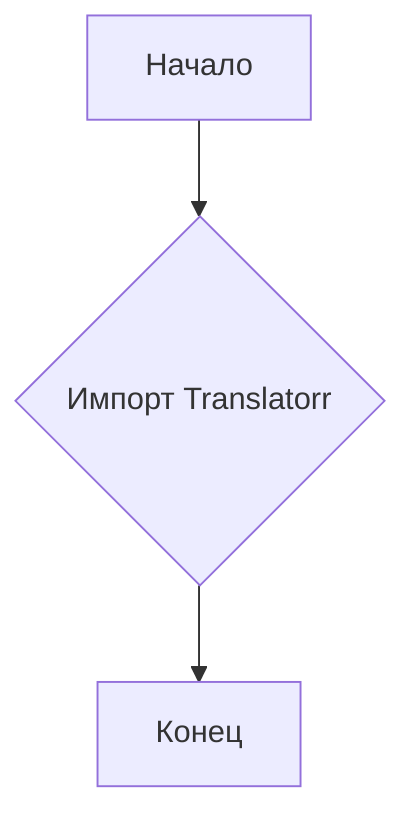
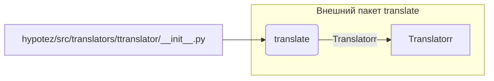

```MD
# Анализ файла `hypotez/src/translators/ttranslator/__init__.py`

1. **<input code>**:

```python
## \file hypotez/src/translators/ttranslator/__init__.py
# -*- coding: utf-8 -*-\

#! venv/bin/python/python3.12

"""
.. module:: src.translators.ttranslator 
	:platform: Windows, Unix
	:synopsis:

"""


"""
	:platform: Windows, Unix
	:synopsis:

"""


"""
	:platform: Windows, Unix
	:synopsis:

"""


"""
  :platform: Windows, Unix

"""
"""
  :platform: Windows, Unix
  :platform: Windows, Unix
  :synopsis:
"""
  
""" module: src.translators.ttranslator """


# https://github.com/terryyin/translate-python?tab=readme-ov-file

from translate import Translatorr
```

2. **<algorithm>**:

Этот файл, скорее всего, представляет собой инициализационный модуль для подсистемы перевода (`translators`).  В данном виде он не содержит собственного алгоритма, а только импортирует класс или функцию `Translatorr` из внешнего пакета `translate`.  Блок-схема в этом случае тривиальна: импорт, завершение.



Пример:  Если в коде программы используется `from translate import Translatorr`, то переменная `Translatorr` в текущем пространстве имен будет связана с определением из внешнего пакета.

3. **<mermaid>**:



**Объяснение диаграммы:** Модуль `hypotez/src/translators/ttranslator/__init__.py` напрямую зависит от внешнего пакета `translate`, из которого он импортирует класс `Translatorr`.  Диаграмма показывает эту зависимость.


4. **<explanation>**:

* **Импорты:** `from translate import Translatorr` импортирует класс `Translatorr` из пакета `translate`.  Это указывает на то, что код предполагает использование функций или классов, связанных с переводами, но сам не определяет их.  Важно понимать, что `translate` - это отдельный пакет, возможно, `pip install translate` установленный отдельно.  Проследить зависимость от `src` не представляется возможным без доступа к файлам пакета `translate`.


* **Классы:**  Нет собственных классов, только импорт `Translatorr` из внешнего пакета.


* **Функции:** Нет определенных функций.


* **Переменные:** `` — константа, скорее всего, определяющая режим работы (в данном случае, «разработка»).  В контексте перевода, это может указывать на то, что при выполнении в режиме разработки используются другие настройки или логика.


* **Возможные ошибки или области для улучшений:**
    * Недостаточная информация. Файл `__init__.py` должен содержать описание класса или функций, используемых в этом модуле.
    * Отсутствие документации.  Комментарии `""" ... """` нужны, чтобы подробно объяснить назначение и использование методов, аргументов и т.д.

* **Цепочка взаимосвязей:**  Для построения полной цепочки взаимосвязей нужен доступ к исходному коду `translate` и коду, который использует `Translatorr` в `hypotez`.  Без этого мы можем лишь утверждать, что `Translatorr` используется для перевода.  Возможно, существуют дополнительные файлы (например, с переводами), использующие этот модуль.


**Вывод:**  Файл `__init__.py` служит инициализатором модуля перевода. Он импортирует нужные классы из стороннего пакета, но сам не содержит логики перевода.  Необходимы дополнительные файлы и пояснения для полного понимания функциональности всей системы.