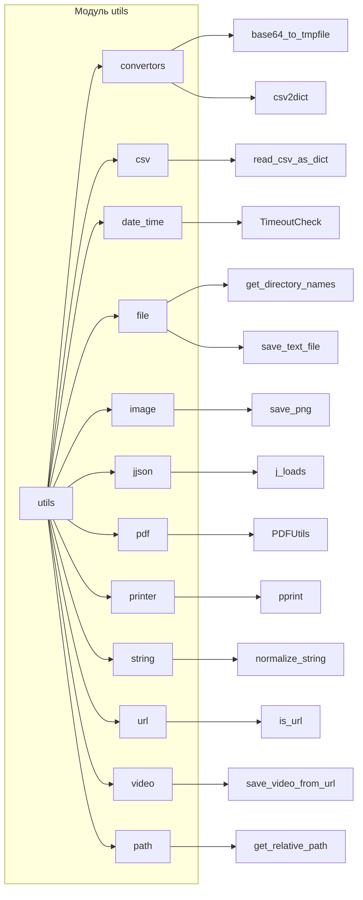

# <input code>

```python
# # -*- coding: utf-8 -*-\
# #! venv/Scripts/python.exe
# #! venv/bin/python/python3.12

# """
# Модуль для работы с утилитами
# =========================================================================================

# Этот модуль содержит набор небольших, полезных утилит, предназначенных для упрощения 
# повседневных задач программирования. Модуль включает инструменты для конвертации данных, 
# работы с файлами и формата вывода. Это позволяет ускорить разработку, предоставляя 
# простые и переиспользуемые функции.

# Пример использования
# --------------------

# Пример использования функций модуля `src.utils`:

# .. code-block:: python

#     from src.utils import csv2dict, json2xls, save_text_file

#     # Конвертация CSV в словарь
#     csv_data = csv2dict('data.csv')

#     # Конвертация JSON в XLSX
#     json_data = json2xls('data.json')

#     # Сохранение текста в файл
#     save_text_file('output.txt', 'Hello, World!')
# """

# MODE = 'dev'

# """ 
# Коллекция небольших утилит, предназначенных для упрощения часто выполняемых задач программирования.
# Включает инструменты для конвертации данных, работы с файлами и форматированного вывода.
# """

# # Импорты утилит в алфавитном порядке
# from .convertors import (
#     TextToImageGenerator,
#     base64_to_tmpfile,
#     base64encode,
#     csv2dict,
#     csv2ns,
#     decode_unicode_escape,
#     dict2csv,
#     dict2html,
#     dict2ns,
#     dict2xls,
#     dict2xml,
#     dot2png,
#     escape2html,
#     html2dict,
#     html2escape,
#     html2ns,
#     html2text,
#     html2text_file,
#     json2csv,
#     json2ns,
#     json2xls,
#     json2xml,
#     md2dict,
#     ns2csv,
#     ns2dict,
#     ns2xls,
#     ns2xml,
#     replace_key_in_dict,
#     speech_recognizer,
#     text2speech,
#     webp2png,
#     xls2dict
# )

# from .csv import (
#     read_csv_as_dict,
#     read_csv_as_ns,
#     read_csv_file,
#     save_csv_file
# )

# from .date_time import (
#     TimeoutCheck
# )

# from .file import (
#     get_directory_names,
#     get_filenames,
#     read_text_file,
#     recursively_get_file_path,
#     recursively_read_text_files,
#     recursively_yield_file_path,  
#     remove_bom,
#     save_text_file
# )

# from .image import (
#     save_png,
#     save_png_from_url
# )

# from .jjson import (
#     j_dumps,
#     j_loads,
#     j_loads_ns
# )

# from .pdf import (
#     PDFUtils
# )

# from .printer import (
#     pprint
# )

# from .string import (
#     ProductFieldsValidator,
#     StringFormatter,
#     normalize_string,
#     normalize_int,
#     normalize_float,
#     normalize_boolean
# )

# from .url import (
#     extract_url_params, 
#     is_url
# )

# from .video import (
#     save_video_from_url
# )

# from .path import get_relative_path
```

# <algorithm>

**Описание алгоритма работы кода (блок-схема):**

Этот код представляет собой модуль `utils`, который содержит набор утилит для различных задач.  Утилиты импортируются из подпапок.  Прямого алгоритма работы, в виде циклов или рекурсии, не наблюдается.  Этот код, скорее, определяет множество функций и классов, которые могут быть использованы в других частях проекта.

Каждая импортированная функция и класс выполняет свою специфическую задачу (например, конвертация данных, работа с файлами, форматирование вывода).


# <mermaid>



# <explanation>

**Импорты:**

Модуль `utils` импортирует функции и классы из других подмодулей (`convertors`, `csv`, `date_time`, `file`, `image`, `jjson`, `pdf`, `printer`, `string`, `url`, `video`, `path`). Это позволяет организовать код по функциональным областям и улучшить его читаемость.  Отметим, что импорты берут функции и классы не только из одного уровня вложенности (в данном случае из `src/utils/`), но и из вложенных каталогов.

**Классы:**

Код определяет множество классов (например, `TextToImageGenerator`, `PDFUtils`, `TimeoutCheck`, и другие), которые представляют собой абстракции с атрибутами и методами, относящимися к определённой функциональной области.  Присутствие множества классов указывает на структурированный и потенциально масштабируемый подход к реализации утилит.

**Функции:**

Множество функций, имеющихся в файлах (например, `csv2dict`, `json2xls`, `save_text_file`, `read_csv_as_dict`, `get_filenames`, и другие), отвечают за выполнение конкретных задач, таких как конвертация форматов, чтение/запись файлов, и так далее.  Каждая функция имеет свои параметры и возвращаемые значения, которые уточняются их реализациями в соответствующих файлах.

**Переменные:**

Переменная `MODE` задаёт режим работы, например, для отладки или производства.   Эта переменная используется для выбора различных настроек или способов работы в зависимости от текущей среды.  

**Возможные ошибки или области для улучшений:**

* **Недостаток документирования:** Документация, хотя и есть, должна быть более детальной и содержательной.  Необходимо описывать каждый параметр, возвращаемое значение, возможные исключения и примеры использования каждой функции и класса.
* **Недостаток тестирования:** Отсутствие тестов может привести к ошибкам, которые не будут обнаружены до этапа деплоя.
* **Возможно, требуется больше модульности:**  Разделение на ещё более мелкие подмодули (может быть, по определённым функциям, а не функциональным областям) может сделать код ещё более модульным и переиспользуемым.

**Взаимосвязь с другими частями проекта:**

Этот модуль `utils` играет роль общего хранилища для утилит, которые могут использоваться другими частями проекта. Например, функции преобразования файлов (CSV, JSON, XML) будут использоваться для обработки данных из различных источников.  Прочие функции, например, работы с файлами, будут использоваться для хранения и чтения данных, а функция работы с изображениями — для визуализации данных.  Этот модуль является необходимой частью для более широкого функционирования проекта.