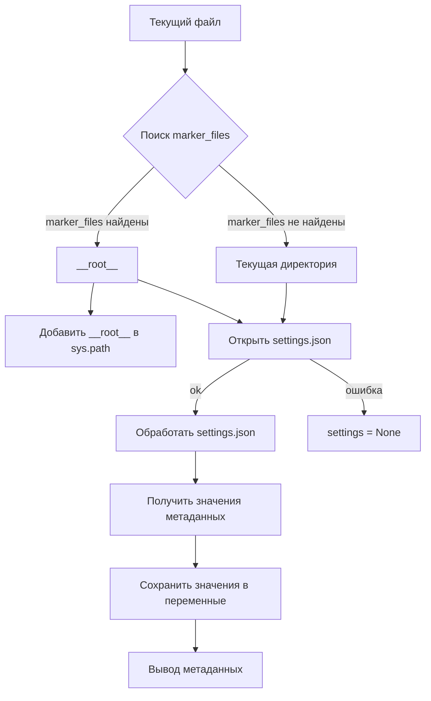

# <input code>

```python
## \file hypotez/src/logger/header.py
# -*- coding: utf-8 -*-\n
#! venv/bin/python/python3.12
"""
.. module:: src.logger 
	:platform: Windows, Unix
	:synopsis:

"""


"""
	:platform: Windows, Unix
	:synopsis: Модуль определяющий корневой путь к проекту. Все импорты строятся относительно этого пути.
    :TODO: В дальнейшем перенести в системную переменную"""

import sys
import json
from packaging.version import Version
from pathlib import Path
def set_project_root(marker_files=('__root__','.git')) -> Path:
    """
    Finds the root directory of the project starting from the current file's directory,
    searching upwards and stopping at the first directory containing any of the marker files.

    Args:
        marker_files (tuple): Filenames or directory names to identify the project root.
    
    Returns:
        Path: Path to the root directory if found, otherwise the directory where the script is located.
    """
    __root__:Path
    current_path:Path = Path(__file__).resolve().parent
    __root__ = current_path
    for parent in [current_path] + list(current_path.parents):
        if any((parent / marker).exists() for marker in marker_files):
            __root__ = parent
            break
    if __root__ not in sys.path:
        sys.path.insert(0, str(__root__))
    return __root__


# Get the root directory of the project
__root__ = set_project_root()
"""__root__ (Path): Path to the root directory of the project"""

from src import gs

settings:dict = None
try:
    with open(gs.path.root / 'src' / 'settings.json', 'r') as settings_file:
        settings = json.load(settings_file)
except (FileNotFoundError, json.JSONDecodeError):
    ...

doc_str:str = None
try:
    with open(gs.path.root / 'src' / 'README.MD', 'r') as settings_file:
        doc_str = settings_file.read()
except (FileNotFoundError, json.JSONDecodeError):
    ...


__project_name__ = settings.get("project_name", 'hypotez') if settings  else 'hypotez'
__version__: str = settings.get("version", '')  if settings  else ''
__doc__: str = doc_str if doc_str else ''
__details__: str = ''
__author__: str = settings.get("author", '')  if settings  else ''
__copyright__: str = settings.get("copyrihgnt", '')  if settings  else ''
__cofee__: str = settings.get("cofee", "Treat the developer to a cup of coffee for boosting enthusiasm in development: https://boosty.to/hypo69")  if settings else "Treat the developer to a cup of coffee for boosting enthusiasm in development: https://boosty.to/hypo69"
```

# <algorithm>

1. **`set_project_root`:**
   - Принимает кортеж `marker_files` с именами файлов, которые должны присутствовать в корне проекта.
   - Начинает поиск корневой директории от текущего файла.
   - Проходит по родительским директориям, проверяя наличие файлов из `marker_files`.
   - Если файл найден, то сохраняет путь к родительской директории в `__root__` и завершает цикл.
   - Если корневой каталог не найден, возвращает директорию текущего файла.
   - Добавляет найденный корневой путь в `sys.path`.
   - Возвращает найденный корневой путь.

   Пример: Если текущий файл находится в `/home/user/project/src/logger/header.py`, и `pyproject.toml` есть в `/home/user/project`, то `__root__` будет `/home/user/project`.


2. **Чтение настроек:**
   - Получает корневой путь из функции `set_project_root`.
   - Пытается открыть файл `settings.json` в директории `src`.
   - Парсит `settings.json` с помощью `json.load`.
   - Если файл не найден или некорректный формат JSON, то `settings` остается None.
   - Аналогично считывает `README.MD`.


3. **Получение метаданных:**
   - Получает значения из словаря `settings` по ключам: `project_name`, `version`, `author`, `copyright`, `coffee`.
   - Если значение не найдено или `settings` отсутствует, использует значения по умолчанию.
   - Сохраняет значения в глобальных переменных.


# <mermaid>



# <explanation>

**Импорты:**

- `sys`: Используется для изменения пути поиска модулей (`sys.path`).
- `json`: Для работы с файлами JSON.
- `packaging.version`: Для работы с версиями пакетов (не используется напрямую, но импортируется).
- `pathlib`: Для работы с путями.
- `src.gs`:  Ссылается на модуль `gs` из пакета `src`, скорее всего, содержащий вспомогательные функции или классы для работы с путями в проекте. Важно, что импорт происходит *относительно* корня проекта, определенного функцией `set_project_root`.

**Классы:**

- Нет явных классов.

**Функции:**

- `set_project_root(marker_files)`:  Находит корневую директорию проекта, начиная с текущего файла и ищет в родительских директориях заданные файлы (маркеры проекта, например, `pyproject.toml`).  Возвращает найденный путь.  Важная функция для построения корректных относительных путей в проекте. Аргумент `marker_files` позволяет гибко задавать список файлов-маркеров для поиска.

**Переменные:**

- `MODE`: Строковая константа, вероятно, определяющая режим работы (например, 'dev' или 'prod').
- `__root__`: Объект `Path`, содержащий корневой путь к проекту.
- `settings`: Словарь, содержащий настройки проекта, считанные из `settings.json`.
- `doc_str`: Строка, содержащая содержимое файла `README.MD`.
- Глобальные переменные: `__project_name__`, `__version__`, `__doc__`, `__details__`, `__author__`, `__copyright__`, `__cofee__`:  Содержат метаданные о проекте, полученные из `settings.json`.

**Возможные ошибки и улучшения:**

- **Обработка ошибок:** Обработка `FileNotFoundError` и `json.JSONDecodeError` корректна, но можно добавить более детальную информацию об ошибке в логи (например, имя файла и тип ошибки).
- **Типизация:** Используется аннотация типов `-> Path` для функции `set_project_root`. Это хорошо, но стоит использовать аннотации типов и для других переменных, чтобы повысить читаемость и надежность кода.
- **Документация:** У функции `set_project_root` неплохая документация, но можно добавить примеры использования.
- **Модуль `gs`:**  Необходимо понимать, что делает модуль `gs`, особенно атрибут `gs.path.root`, чтобы лучше понять функциональность.  Проверка корректности импорта (или его отсутствие).

**Взаимосвязь с другими частями проекта:**

- Модуль `gs` вероятно содержит другие функции для работы с путями.
- Файлы `settings.json` и `README.MD` содержат важные данные для настройки проекта и документации.
- Взаимодействие с этим файлом подразумевает существование модулей для обработки параметров проекта.

Этот код устанавливает корневой путь проекта и загружает настройки.  Это важный шаблон для организации проекта, обеспечивая возможность корректного обращения к ресурсам проекта из разных модулей.