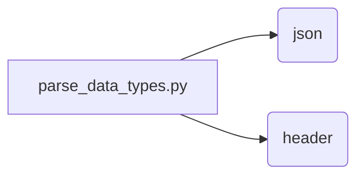

```MD
1. **<input code>**

```python
## \file /src/utils/ai/parse_data_types.py
# -*- coding: utf-8 -*-
#! venv/Scripts/python.exe
#! venv/bin/python/python3.12

"""
module: src.utils.ai.parse_data_types
	:platform: Windows, Unix
	:synopsis: Модуль определяющий корневой путь к проекту. Все импорты строятся относительно этого пути.
    :TODO: В дальнейшем перенести в системную переменную"""

...
import json
import header
```

2. **<algorithm>**

Данный код представляет собой заголовок Python-файла.  
Алгоритм состоит из одной части - импорта необходимых модулей. Алгоритм не имеет пошаговой обработки данных. Это просто импорт.


3. **<mermaid>**



4. **<explanation>**

* **Импорты:**
    * `json`: Этот импорт необходим для работы с данными в формате JSON. Он позволяет загружать и сохранять данные в формате JSON. Связь с другими пакетами: если в этом модуле планируется работа с файлами JSON, то json используется для парсинга/сериализации данных в этом формате.
    * `header`: Этот импорт предполагает существование модуля `header` в проекте, скорее всего, в том же пакете `/src/utils/`. Он содержит информацию, относящуюся к  установкам, конфигурации или другим настройкам.  Связь с другими пакетами - предполагается, что модуль `header` предоставляет глобальные константы или настройки, важные для `parse_data_types`.
    Связь с другими частями проекта: Данный модуль импортирует `header`, предполагается, что это для получения необходимых констант или настроек, необходимых для работы с данными в `parse_data_types`.


* **Классы:** Нет объявлений классов в приведённом фрагменте.


* **Функции:** Нет определений функций в приведённом фрагменте.


* **Переменные:**
    * `MODE`: Строковая переменная, которая вероятно определяет режим работы программы (например, 'dev', 'prod').  Значение этой переменной может использоваться в других частях проекта для выбора стратегий обработки или доступа к ресурсам.


* **Возможные ошибки или области для улучшений:**
    * Отсутствует основная логика. Фрагмент кода только импортирует модули. Необходимо добавить код для обработки данных, парсинга, и т.д., для завершённой функциональности.
    * `...`: Отмечает, что в файле есть незавершенный код. Это не ошибка, а просто указывает, что в этом файле есть дополнительный код.
    * Отсутствует документация для переменной `MODE` в коде.  Следует добавить строку документации с описанием.
    * `#! venv/Scripts/python.exe`: и `#! venv/bin/python/python3.12`: Эти строки определяют интерпретатор Python, но скорее всего уже заданы в настройках. В современном коде такой способ запуска используется реже.  В современных проектах более стандартно использовать `#!/usr/bin/env python3`.

**Цепочка взаимосвязей с другими частями проекта:**

Модуль `parse_data_types` вероятно будет взаимодействовать с другими модулями в пакете `/src/utils/` для работы с данными. Вероятно, `header` содержит настройки для обработки данных.  Без дальнейшего кода невозможно точно определить все связи.  Проект скорее всего использует паттерн `MVC` или аналогичный для обработки данных.

**Важно:**  Представленный код является очень небольшим фрагментом и не позволяет оценить полную функциональность и зависимости.  Для более глубокого анализа необходим весь код файла.