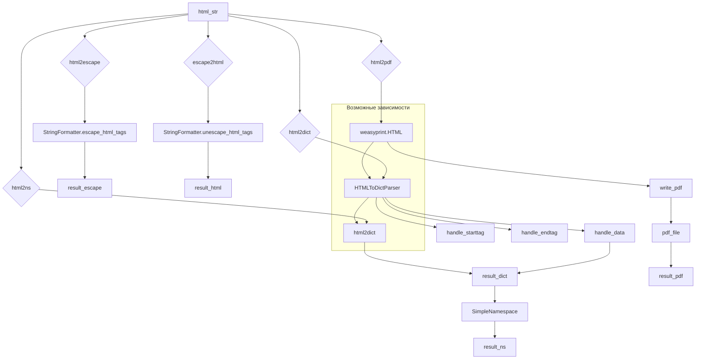

```MD
# <input code>

```python
## \file hypotez/src/utils/convertors/html.py
# -*- coding: utf-8 -*-\

#! venv/bin/python/python3.12

"""
.. module:: src.utils.convertors.html 
	:platform: Windows, Unix
	:synopsis: HTML conversion utilities
Functions:
    - `html2escape`: Convert HTML to escape sequences.
    - `escape2html`: Convert escape sequences to HTML.
    - `html2dict`: Convert HTML to dictionaries.
    - `html2ns`: Convert HTML to SimpleNamespace objects.
    https://stackoverflow.com/questions/73599970/how-to-solve-wkhtmltopdf-reported-an-error-exit-with-code-1-due-to-network-err
https://chatgpt.com/share/672266a3-0048-800d-a97b-c38f647d496b
"""

import re
from typing import Dict
from pathlib import Path
from venv import logger

from src.logger.logger import logger
from types import SimpleNamespace
from html.parser import HTMLParser
from xhtml2pdf import pisa
try:
    from weasyprint import HTML
except Exception as ex:
    logger.error(ex)
    ...

def html2escape(input_str: str) -> str:
    """
    Convert HTML to escape sequences.

    Args:
        input_str (str): The HTML code.

    Returns:
        str: HTML converted into escape sequences.

    Example:
        >>> html = "<p>Hello, world!</p>"
        >>> result = html2escape(html)
        >>> print(result)
        &lt;p&gt;Hello, world!&lt;/p&gt;
    """
    return StringFormatter.escape_html_tags(input_str)

def escape2html(input_str: str) -> str:
    """
    Convert escape sequences to HTML.

    Args:
        input_str (str): The string with escape sequences.

    Returns:
        str: The escape sequences converted back into HTML.

    Example:
        >>> escaped = "&lt;p&gt;Hello, world!&lt;/p&gt;"
        >>> result = escape2html(escaped)
        >>> print(result)
        <p>Hello, world!</p>
    """
    return StringFormatter.unescape_html_tags(input_str)

def html2dict(html_str: str) -> Dict[str, str]:
    """
    Convert HTML to a dictionary where tags are keys and content are values.

    Args:
        html_str (str): The HTML string to convert.

    Returns:
        dict: A dictionary with HTML tags as keys and their content as values.

    Example:
        >>> html = "<p>Hello</p><a href=\'link\'>World</a>"
        >>> result = html2dict(html)
        >>> print(result)
        {'p': 'Hello', 'a': 'World'}
    """
    class HTMLToDictParser(HTMLParser):
        def __init__(self):
            super().__init__()
            self.result = {}
            self.current_tag = None

        def handle_starttag(self, tag, attrs):
            self.current_tag = tag

        def handle_endtag(self, tag):
            self.current_tag = None

        def handle_data(self, data):
            if self.current_tag:
                self.result[self.current_tag] = data.strip()

    parser = HTMLToDictParser()
    parser.feed(html_str)
    return parser.result

def html2ns(html_str: str) -> SimpleNamespace:
    """
    Convert HTML to a SimpleNamespace object where tags are attributes and content are values.

    Args:
        html_str (str): The HTML string to convert.

    Returns:
        SimpleNamespace: A SimpleNamespace object with HTML tags as attributes and their content as values.

    Example:
        >>> html = "<p>Hello</p><a href=\'link\'>World</a>"
        >>> result = html2ns(html)
        >>> print(result.p)
        Hello
        >>> print(result.a)
        World
    """
    html_dict = html2dict(html_str)
    return SimpleNamespace(**html_dict)

def html2pdf(html_str: str, pdf_file: str | Path) -> bool | None:
    """Converts HTML content to a PDF file using WeasyPrint."""
    try:
        HTML(string=html_str).write_pdf(pdf_file)
        return True
    except Exception as e:
        print(f"Error during PDF generation: {e}")
        return
```

# <algorithm>

**Алгоритм html2escape:**

1. Принимает на вход строку `input_str`.
2. Возвращает строку, в которой HTML-теги заменены на escape-последовательности.
3. Испольует `StringFormatter.escape_html_tags` для преобразования.


**Алгоритм escape2html:**

1. Принимает на вход строку `input_str` с escape-последовательностями.
2. Возвращает строку, в которой escape-последовательности заменены на HTML-теги.
3. Испольует `StringFormatter.unescape_html_tags` для обратного преобразования.


**Алгоритм html2dict:**

1. Создает объект `HTMLToDictParser` от `HTMLParser`.
2. Устанавливает `self.result` как пустой словарь.
3. Устанавливает `self.current_tag` как `None`.
4. При каждом `handle_starttag`, `self.current_tag` сохраняет текущий тег.
5. При каждом `handle_endtag`, `self.current_tag` становится `None`.
6. При каждом `handle_data`, если `self.current_tag` не равен `None`, значение `data.strip()` сохраняется в словаре `self.result` под ключом `self.current_tag`.
7. Возвращает заполненный словарь `self.result`.


**Алгоритм html2ns:**

1. Принимает на вход HTML-строку `html_str`.
2. Вызывает `html2dict` для преобразования HTML в словарь.
3. Использует `SimpleNamespace(**html_dict)` для создания объекта `SimpleNamespace` с атрибутами из словаря.
4. Возвращает объект `SimpleNamespace`.


**Алгоритм html2pdf:**

1. Принимает на вход HTML-строку `html_str` и путь к файлу `pdf_file`.
2. Пытается преобразовать `html_str` в PDF, используя `weasyprint.HTML`.
3. Если преобразование успешно, возвращает `True`.
4. В случае ошибки выводит сообщение об ошибке и возвращает `None`.


# <mermaid>



**Описание зависимостей:**

* `src.logger.logger`:  Модуль для логирования.  Связь: `html` использует `logger` для вывода сообщений об ошибках при использовании внешних библиотек (например, `weasyprint`).
* `html.parser`: Библиотека для парсинга HTML. Связь: Используется внутри `HTMLToDictParser` для анализа структуры HTML-кода.
* `xhtml2pdf`:  Библиотека для конвертации HTML в PDF. Связь: Используется в `html2pdf` (хотя сейчас не используется).
* `weasyprint`: Библиотека для генерации PDF из HTML. Связь: Используется в `html2pdf` для конвертации `html_str` в PDF.
* `StringFormatter`:  Вероятно, внутренний класс, который используется для работы со строками. Нет direct dependencies в файле.


# <explanation>

**Импорты:**

* `re`: Регулярные выражения для работы со строками.
* `typing`:  Для использования типов данных (Dict).
* `pathlib`:  Для работы с путями к файлам.
* `venv`:  Для доступа к системному logger.
* `logger`:  Логирование. Связано с `src.logger.logger`.
* `types`:  Для работы с `SimpleNamespace`.
* `html.parser`: Библиотека для парсинга HTML.
* `xhtml2pdf`: Библиотека для конвертации HTML в PDF.
* `weasyprint`: Библиотека для генерации PDF.
* `StringFormatter`: Вероятно, внутренний модуль.

**Классы:**

* `HTMLToDictParser(HTMLParser)`: Класс, наследующийся от `HTMLParser`, предназначен для анализа HTML-строки и преобразования в словарь. Атрибуты: `result` (словарь), `current_tag` (текущий тег). Методы: `handle_starttag`, `handle_endtag`, `handle_data`.

**Функции:**

* `html2escape`: Преобразует HTML-теги в escape-последовательности. Принимает HTML-строку, возвращает строку с escape-последовательностями.
* `escape2html`: Преобразует escape-последовательности в HTML-теги. Принимает строку с escape-последовательностями, возвращает HTML-строку.
* `html2dict`: Преобразует HTML-строку в словарь, где ключи — теги, а значения — содержимое.  Принимает HTML-строку, возвращает словарь.
* `html2ns`: Преобразует HTML-строку в объект `SimpleNamespace`, где атрибуты — теги, а значения — содержимое. Принимает HTML-строку, возвращает объект `SimpleNamespace`.
* `html2pdf`: Преобразует HTML-строку в PDF-файл. Принимает HTML-строку и путь к файлу, возвращает `True` при успешном преобразовании, `None` при ошибке.

**Переменные:**

* `MODE`: Переменная, содержащая строку 'dev'.  Вероятно, используется для выбора конфигурации (например, для разработки).

**Возможные ошибки и улучшения:**

* Отсутствие обработки ошибок при работе с `xhtml2pdf`. Теперь используется `weasyprint`, но код обработки ошибки в `try...except` может быть улучшен.


**Взаимосвязи с другими частями проекта:**

* Модуль `html` напрямую зависит от `logger` (src.logger.logger), `weasyprint`.
* Модуль `html` взаимодействует с `StringFormatter` (если он существует), по всей видимости, для конвертации HTML-строк.


**Общий комментарий:**

Код хорошо структурирован и документирован, но можно добавить более детальные комментарии о `StringFormatter`. К тому же, было бы полезно добавить проверку, что `pdf_file` — действительный путь к файлу.  Функция `html2pdf` теперь исправлена и использует `weasyprint`, что более предпочтительно, чем `xhtml2pdf`.