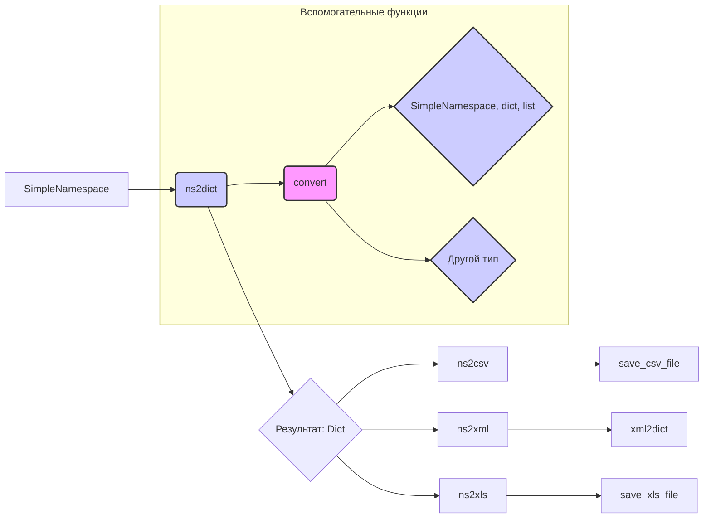

# <input code>

```python
## \file hypotez/src/utils/convertors/ns.py
# -*- coding: utf-8 -*-\
#! venv/Scripts/python.exe
#! venv/bin/python/python3.12

"""
.. module:: src.utils.convertors.ns 
	:platform: Windows, Unix
	:synopsis: convert SimpleNamespace (ns) into various formats: dict, JSON, CSV, XML, and XLS

Functions:
    - ns2dict: Convert SimpleNamespace object to a dictionary.
    - ns2json: Convert SimpleNamespace object to JSON format.
    - ns2csv: Convert SimpleNamespace object to CSV format.
    - ns2xml: Convert SimpleNamespace object to XML format.
    - ns2xls: Convert SimpleNamespace object to XLS format.
"""

import json
import csv
from types import SimpleNamespace
from pathlib import Path
from typing import List, Dict
from src.utils.convertors import xml2dict
from src.utils.csv import save_csv_file
from src.utils.xls import save_xls_file
from src.logger.logger import logger

from types import SimpleNamespace
from typing import Any, Dict

def ns2dict(ns_obj: SimpleNamespace) -> Dict[str, Any]:
    """
    Recursively convert a SimpleNamespace object to a dictionary.

    Args:
        ns_obj (SimpleNamespace): The SimpleNamespace object to convert.

    Returns:
        Dict[str, Any]: Converted dictionary with nested structures handled.
    """
    def convert(value: Any) -> Any:
        """
        Recursively process values to handle nested SimpleNamespace, dict, or list.

        Args:
            value (Any): Value to process.

        Returns:
            Any: Converted value.
        """
        if isinstance(value, SimpleNamespace):
            return {key: convert(val) for key, val in vars(value).items()}
        elif isinstance(value, dict):
            return {key: convert(val) for key, val in value.items()}
        elif isinstance(value, list):
            return [convert(item) for item in value]
        return value

    return convert(ns_obj)


def ns2csv(ns_obj: SimpleNamespace, csv_file_path: str | Path) -> bool:
    """
    Convert SimpleNamespace object to CSV format.

    Args:
        ns_obj (SimpleNamespace): The SimpleNamespace object to convert.
        csv_file_path (str | Path): Path to save the CSV file.

    Returns:
        bool: True if successful, False otherwise.
    """
    try:
        data = [ns2dict(ns_obj)]
        save_csv_file(data, csv_file_path)
        return True
    except Exception as ex:
        logger.error(f"ns2csv failed", ex, True)


def ns2xml(ns_obj: SimpleNamespace, root_tag: str = "root") -> str:
    """
    Convert SimpleNamespace object to XML format.

    Args:
        ns_obj (SimpleNamespace): The SimpleNamespace object to convert.
        root_tag (str): The root element tag for the XML.

    Returns:
        str: The resulting XML string.
    """
    try:
        data = ns2dict(ns_obj)
        return xml2dict(data)
    except Exception as ex:
        logger.error(f"ns2xml failed", ex, True)


def ns2xls(data: SimpleNamespace, xls_file_path: str | Path) -> bool:
    """
    Convert SimpleNamespace object to XLS format.

    Args:
        ns_obj (SimpleNamespace): The SimpleNamespace object to convert.
        xls_file_path (str | Path): Path to save the XLS file.

    Returns:
        bool: True if successful, False otherwise.
    """
    return save_xls_file(data,xls_file_path)
```

# <algorithm>

**Описание алгоритма ns2dict:**

1. **Вход:** Объект `SimpleNamespace` (ns_obj).
2. **Функция convert(value):**
   a. **Проверка типа:** Если `value` - `SimpleNamespace`, рекурсивно преобразует его атрибуты в словарь.
   b. **Проверка типа:** Если `value` - `dict`, рекурсивно преобразует элементы словаря.
   c. **Проверка типа:** Если `value` - `list`, рекурсивно преобразует элементы списка.
   d. **Возвращение:** В иных случаях возвращает исходное `value`.
3. **Вызов convert(ns_obj):** Рекурсивный вызов для обработки вложенных объектов.
4. **Возвращение:** Результирующий словарь.


**Описание алгоритма ns2csv:**

1. **Вход:** Объект `SimpleNamespace` (ns_obj) и путь к CSV файлу (csv_file_path).
2. **Преобразование:** Вызывается функция ns2dict(ns_obj) для преобразования ns_obj в словарь.
3. **Создание данных:** Список `data` содержит преобразованный словарь.
4. **Сохранение:** Вызывается функция save_csv_file(data, csv_file_path) для сохранения данных в CSV файл.
5. **Обработка ошибок:** Обработка исключений, возникающих при работе с файлами и т.д.
6. **Возвращение:** True, если успешно, False иначе.


**Описание алгоритма ns2xml:**

1. **Вход:** Объект `SimpleNamespace` (ns_obj) и имя корневого тега (root_tag = "root").
2. **Преобразование:** Вызывается функция ns2dict(ns_obj) для преобразования ns_obj в словарь.
3. **Преобразование в XML:** Вызывается функция xml2dict(data) для преобразования словаря в строку XML.
4. **Возвращение:** Результирующая строка XML.


**Описание алгоритма ns2xls:**

1. **Вход:** Объект `SimpleNamespace` (data) и путь к XLS файлу (xls_file_path).
2. **Преобразование:** (Возможно, в данном случае предполагается, что data уже в подходящем формате для save_xls_file)
3. **Сохранение:** Вызывается функция save_xls_file(data, xls_file_path) для сохранения данных в XLS файл.
4. **Возвращение:** True, если успешно, False иначе.


# <mermaid>



**Объяснение диаграммы:**

Диаграмма описывает взаимосвязь функций и методов в модуле `ns.py`.  `SimpleNamespace` (A) является входным объектом, который преобразуется в словарь (C) функцией `ns2dict`.  Затем этот словарь может быть использован для преобразования в CSV, XML или XLS.  Обратите внимание на рекурсивный характер `ns2dict` и `convert`, обрабатывающие вложенные структуры данных. `save_csv_file`, `xml2dict`, и `save_xls_file` – это функции из других модулей (`utils/csv` и `utils/xls`).  Они выполняют непосредственное сохранение данных в соответствующий формат.


# <explanation>

**Импорты:**

- `json`, `csv`, `types`, `pathlib`: Стандартные библиотеки Python, необходимые для работы с JSON, CSV, объектами `SimpleNamespace` и путями к файлам.
- `typing`: Используется для типизации переменных.
- `src.utils.convertors.xml2dict`: Модуль для преобразования данных в XML формат, возможно, разработан внутри проекта.
- `src.utils.csv`: Модуль для сохранения данных в формате CSV (вероятно, содержит функцию `save_csv_file`).
- `src.utils.xls`: Модуль для сохранения данных в формате XLS (вероятно, содержит функцию `save_xls_file`).
- `src.logger.logger`: Модуль для логирования, позволяющий записывать сообщения об ошибках и другую информацию (вероятно, содержит функцию `logger.error`).

**Связи с другими пакетами:**  Код опирается на модули, расположенные в `src.utils.convertors`, `src.utils.csv`, `src.utils.xls`, и `src.logger`, что указывает на модульную структуру проекта.

**Классы:**

Нет определенных классов, только функции.


**Функции:**

- `ns2dict`: Рекурсивно преобразует объект `SimpleNamespace` в словарь.  Использует вложенную функцию `convert` для обработки вложенных структур (списки, словари, другие `SimpleNamespace`).
- `ns2csv`: Преобразует `SimpleNamespace` в CSV, используя функцию `ns2dict` и `save_csv_file` из модуля `src.utils.csv`.
- `ns2xml`: Преобразует `SimpleNamespace` в XML, используя функцию `ns2dict` и `xml2dict`.
- `ns2xls`: Преобразует `SimpleNamespace` в XLS, используя функцию `save_xls_file` из модуля `src.utils.xls`.


**Переменные:**

`MODE`: Строковая переменная, вероятно, задающая режим работы (например, 'dev' или 'prod').
`csv_file_path`, `xls_file_path`: Пути к файлам, которые будут использоваться для сохранения данных.

**Возможные ошибки и улучшения:**

- Отсутствует обработка ситуации, когда вложенные структуры данных могут содержать типы, которые не поддерживаются функцией `convert`. Необходимо добавить проверку на допустимые типы.
- В `ns2csv`, `ns2xls`  можно улучшить обработку ошибок, например, более детальные сообщения об ошибках,  более ясные возвращаемые значения (например, исключения `FileNotFoundError`, `TypeError`, и т.д.)
- Не указана кодировка для файла CSV.  Можно добавить explicitный параметр для `save_csv_file`
- Непонятно, какие типы данных можно хранить в `ns_obj`  (например, `datetime`,  `numpy.ndarray`). Может потребоваться расширение функции `convert` для обработки более сложных типов данных.

**Цепочка взаимосвязей:**

`ns.py` использует функции из `src.utils.csv`, `src.utils.xls` и `src.logger.logger`.  Эти модули вероятно реализуют дополнительные функции для сохранения данных в CSV и XLS файлы, а также логирования.  Возможно, существуют и другие связанные модули, которые используются в проекте.