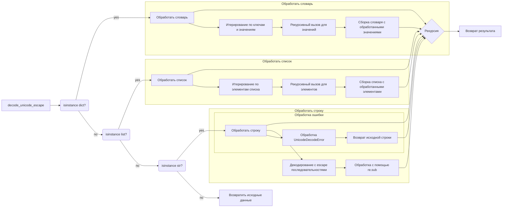

# <input code>

```python
import re
from typing import Dict, Any

def decode_unicode_escape(input_data: Dict[str, Any] | list | str) -> Dict[str, Any] | list | str:
    """Функция декодирует значения в словаре, списке или строке, содержащие юникодные escape-последовательности, в читаемый текст.

    Args:
        input_data (dict | list | str): Входные данные - словарь, список или строка, которые могут содержать юникодные escape-последовательности.

    Returns:
        dict | list | str: Преобразованные данные. В случае строки применяется декодирование escape-последовательностей. В случае словаря или списка рекурсивно обрабатываются все значения.

    Пример использования:
    .. code-block:: python
        input_dict = {
            'product_name': r'\u05de\u05e7"\u05d8 \u05d9\u05e6\u05e8\u05df\nH510M K V2',
            'category': r'\u05e2\u05e8\u05db\u05ea \u05e9\u05d1\u05d1\u05d9\u05dd',
            'price': 123.45
        }

        input_list = [r'\u05e2\u05e8\u05db\u05ea \u05e9\u05d1\u05d1\u05d9\u05dd', r'H510M K V2']

        input_string = r'\u05de\u05e7"\u05d8 \u05d9\u05e6\u05e8\u05df\nH510M K V2'

        # Применяем функцию
        decoded_dict = decode_unicode_escape(input_dict)
        decoded_list = decode_unicode_escape(input_list)
        decoded_string = decode_unicode_escape(input_string)

        print(decoded_dict)
        print(decoded_list)
        print(decoded_string)

    """
    if isinstance(input_data, dict):
        return {key: decode_unicode_escape(value) for key, value in input_data.items()}
    elif isinstance(input_data, list):
        return [decode_unicode_escape(item) for item in input_data]
    elif isinstance(input_data, str):
        try:
            decoded_string = input_data.encode('utf-8').decode('unicode_escape')
        except UnicodeDecodeError:
            decoded_string = input_data
        unicode_escape_pattern = r'\\u[0-9a-fA-F]{4}'
        decoded_string = re.sub(unicode_escape_pattern, lambda match: match.group(0).encode('utf-8').decode('unicode_escape'), decoded_string)
        return decoded_string
    else:
        return input_data
```

# <algorithm>

**Блок-схема:**

```mermaid
graph TD
    A[Входные данные (dict, list, str)] --> B{Тип данных?};
    B -- dict --> C[Рекурсивный вызов decode_unicode_escape для каждого значения словаря];
    C --> D{Результат};
    B -- list --> E[Рекурсивный вызов decode_unicode_escape для каждого элемента списка];
    E --> D;
    B -- str --> F[Обработка строки];
    F -- Успешное декодирование --> G[Возврат закодированной строки];
    F -- Ошибка декодирования --> H[Возврат исходной строки];
    G --> D;
    H --> D;
    D --> I[Результат];
```

**Примеры:**

* **Вход:** `{'key1': '\u0020', 'key2': [1, 2, '\u0061']}`
* **Выход:** `{'key1': ' ', 'key2': [1, 2, 'a']}`

* **Вход:** `['\u0020', '\u0061']`
* **Выход:** `[' ', 'a']`

* **Вход:** `'\u0020'`
* **Выход:** `' '`


# <mermaid>



# <explanation>

**Импорты:**

* `import re`: Импортирует модуль регулярных выражений для работы со строками.
* `from typing import Dict, Any`: Импортирует типы данных `Dict` и `Any` из модуля `typing` для улучшения читаемости и типизации кода.

**Функции:**

* `decode_unicode_escape(input_data)`: Функция обрабатывает входные данные (словарь, список или строку), содержащие юникодные escape-последовательности типа `\uXXXX`, преобразуя их в соответствующие символы.
    * **Аргументы:** `input_data` (dict | list | str): Входные данные, которые могут содержать юникодные escape-последовательности.
    * **Возвращаемое значение:** `dict | list | str`: Преобразованные данные, где строки содержат декодированные escape-последовательности, а словари и списки содержат рекурсивно обработанные значения.
    * **Логика:** Функция проверяет тип входных данных:
        * Если входные данные — словарь, она рекурсивно вызывает `decode_unicode_escape` для каждого значения в словаре.
        * Если входные данные — список, она рекурсивно вызывает `decode_unicode_escape` для каждого элемента в списке.
        * Если входные данные — строка, она пытается декодировать строку с помощью `input_data.encode('utf-8').decode('unicode_escape')`. Если возникает ошибка `UnicodeDecodeError`, то возвращает исходную строку без изменений. Если успешно декодирована - применяет регулярное выражение для поиска и замены оставшихся escape-последовательностей.
        * В остальных случаях возвращает исходные данные без изменений.

**Переменные:**

* `input_data`: Хранит входные данные.
* `decoded_string`: Хранит результат декодирования.


**Возможные ошибки и области для улучшений:**

* **Обработка ошибок:** Хотя функция обрабатывает `UnicodeDecodeError`, можно добавить более подробную обработку ошибок для повышения надежности. Например, логирование или  вывод сообщений об ошибке.
* **Уточнение типов:**  Возможно, было бы полезно добавить проверку типа для аргументов, чтобы функция не работала с неподдерживаемыми типами данных.
* **Регулярные выражения**: использование `re.sub` возможно более затратное, чем прямой поиск и замену. Можно рассмотреть альтернативный подход при больших объемах данных.


**Взаимосвязи с другими частями проекта:**

Функция `decode_unicode_escape` используется в других частях проекта для преобразования данных, содержащих юникодные escape-последовательности, в читаемый формат.  Она может использоваться, например, при чтении данных из файла, которые записаны в этом формате.