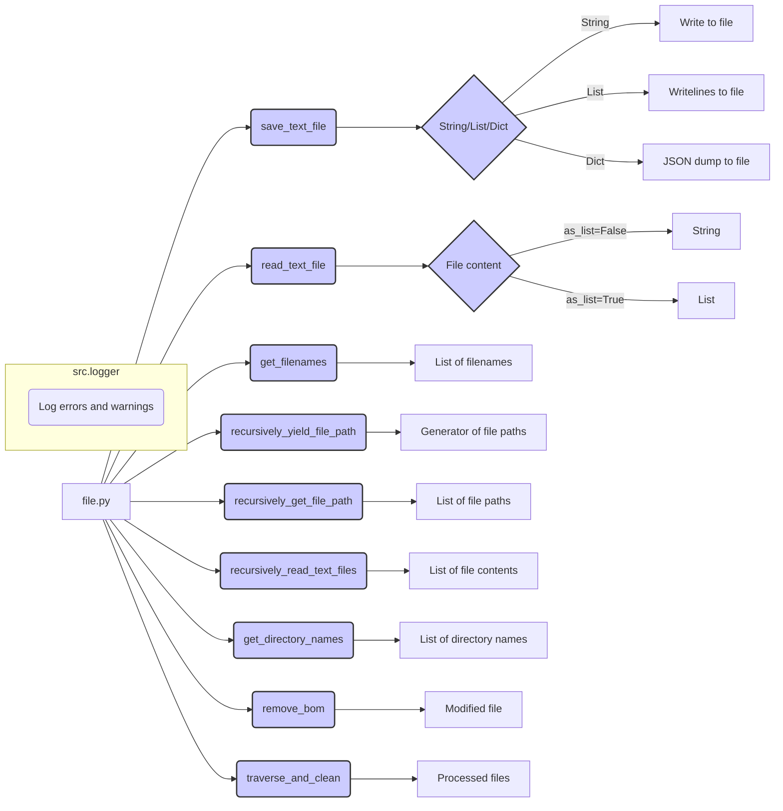

```MD
# <input code>

```python
## \file hypotez/src/utils/file.py
# -*- coding: utf-8 -*-\n#! venv/Scripts/python.exe
#! venv/bin/python/python3.12

"""
.. module: src.utils 
	:platform: Windows, Unix
	:synopsis:  Module for file operations

"""


import os
import json
import fnmatch
from pathlib import Path
from typing import List, Optional, Union, Generator
from src.logger import logger

def save_text_file(
    data: str | list[str] | dict,
    file_path: Union[str, Path],
    mode: str = "w",
    exc_info: bool = True,
) -> bool:
    """
    Save data to a text file.

    Args:
        data (str | list[str] | dict): Data to write (can be string, list of strings, or dictionary).
        file_path (str | Path): Path where the file will be saved.
        mode (str, optional): Write mode (`w` for write, `a` for append). Defaults to 'w'.
        exc_info (bool, optional): If True, logs traceback on error. Defaults to True.

    Returns:
        bool: True if the file was successfully saved, False otherwise.
    """
    try:
        file_path = Path(file_path)
        file_path.parent.mkdir(parents=True, exist_ok=True)

        with file_path.open(mode, encoding="utf-8") as file:
            if isinstance(data, list):
                file.writelines(f"{line}\\n" for line in data)
            elif isinstance(data, dict):
                json.dump(data, file, ensure_ascii=False, indent=4)
            else:
                file.write(data)
        return True
    except Exception as ex:
        logger.error(f"Failed to save file {file_path}.", ex, exc_info=exc_info)
        return False

# ... (rest of the code)
```

# <algorithm>

The code provides functions for various file operations, including saving and reading text files, getting filenames, and recursively traversing directories.

**Algorithm for `save_text_file`:**

1. **Input Validation:** Checks if the input `data` is a string, list, or dictionary.
2. **File Path Handling:** Converts the input `file_path` to a `Path` object for easier file handling.  Creates parent directories if they don't exist.
3. **File Opening:** Opens the file in the specified `mode` ("w" for write, "a" for append) with UTF-8 encoding.
4. **Data Handling:**
    * If `data` is a list, writes each line with a newline character.
    * If `data` is a dictionary, dumps it to JSON format with proper indentation.
    * Otherwise, writes the `data` as is.
5. **Error Handling:** Includes a `try...except` block to catch potential errors (e.g., file not found, permission errors) and log them using the `logger` from `src.logger`. Returns `False` on error and logs relevant information.
6. **Success Return:** Returns `True` if the file is saved successfully.

**Data Flow Example:**

```
Input: data = ["line 1", "line 2"], file_path = "my_file.txt", mode = "w"

1. file_path converted to Path object
2. Parent directory created if necessary
3. file opened in write mode
4. Data written to file (line 1\nline 2)
5. True returned
```

# <mermaid>



# <explanation>

**Imports:**

* `os`: Provides functions for interacting with the operating system, like file system operations.
* `json`: Used for encoding and decoding JSON data.
* `fnmatch`: Enables pattern matching on file names.
* `pathlib`: Offers an object-oriented approach to working with file paths.
* `typing`: Provides type hints for better code readability and maintainability.
* `src.logger`: A custom logger, likely a module or package within the `src` directory, responsible for handling logging messages.  This demonStartes a good modular design.

**Classes:**

The code doesn't define any classes.  It solely uses functions for handling various file operations.

**Functions:**

* **`save_text_file`**: Saves data (string, list, or dictionary) to a file.
    * Takes `data`, `file_path`, `mode` (defaulting to "w"), and `exc_info` (defaulting to True) as input.
    * Handles different data types by writing either strings, list items with newlines, or JSON-formatted dictionaries.
    * Uses `Path` for path manipulation and error handling with `try...except` to log issues effectively and return `False` on failure.  Crucially, creates parent directories if they don't exist (`file_path.parent.mkdir(parents=True, exist_ok=True)`). This is a robust way to deal with file system structures.
* **`read_text_file`**: Reads content from a file or directory.
    * Takes `file_path`, `as_list`, `extensions`, and `exc_info`.
    * Handles file and directory inputs. If `path.is_dir()`, recursively reads files within the directory (optionally with extensions) and joins their content or handles the lines if `as_list`.
    * Logs warnings for invalid paths.  Good error handling and clarity in handling file vs. directory cases.
* **`get_filenames`**: Retrieves filenames in a directory, optionally filtering by extensions.
    * Returns a list of filenames.
* **`recursively_yield_file_path`**: Recursively yields file paths matching given patterns.
    * Returns a generator that yields matching `Path` objects.
* **`recursively_get_file_path`**: Recursively collects file paths matching given patterns.
    * Returns a list of matching `Path` objects.  This function is potentially more useful than the generator-based function when you need all the matches collected into memory at once.
* **`recursively_read_text_files`**: Reads files recursively, handling different patterns.
    * Reads files that match specified patterns and adds their content to a list.
    * Cleverly handles directory existence, normalizes the input patterns, and includes a descriptive example.
* **`get_directory_names`**: Retrieves directory names within a directory.
* **`read_files_content`**: Reads content of files matching patterns recursively.
* **`remove_bom`**: Removes Byte Order Mark (BOM) from a file.
    * Handles errors gracefully.
* **`traverse_and_clean`**: Iterates through the files in a directory and removes BOM from Python files.
* **`main`**: Entry point for BOM removal in Python files.
    * Specifies the root directory for the operation, logs the operation, and calls the `traverse_and_clean` function.

**Variables:**

* `MODE`: A constant string likely for environment configuration, such as development (`'dev'`).
* `logger`: An instance of a logging object, obtained from `src.logger`.
* `data`, `file_path`, etc.: Function arguments with explicitly declared types (`str`, `list`, `dict`, etc.).

**Possible Improvements:**

* **Input Validation:** `get_filenames` could validate `directory` to ensure it's actually a directory.
* **`read_files_content` Clarity:** Could be more descriptive about the return type in the docstring.  More clarity about when `None` is a possible return value.
* **Error Handling consistency:** Maintain a consistent approach for logging errors across all functions.

**Relationships with other parts of the project:**

This code interacts with the `src.logger` module, indicating a clear dependency on logging functionality defined elsewhere in the project.  The code also uses `Path`, a standard library component.  This structure implies a broader system involving file processing and logging.