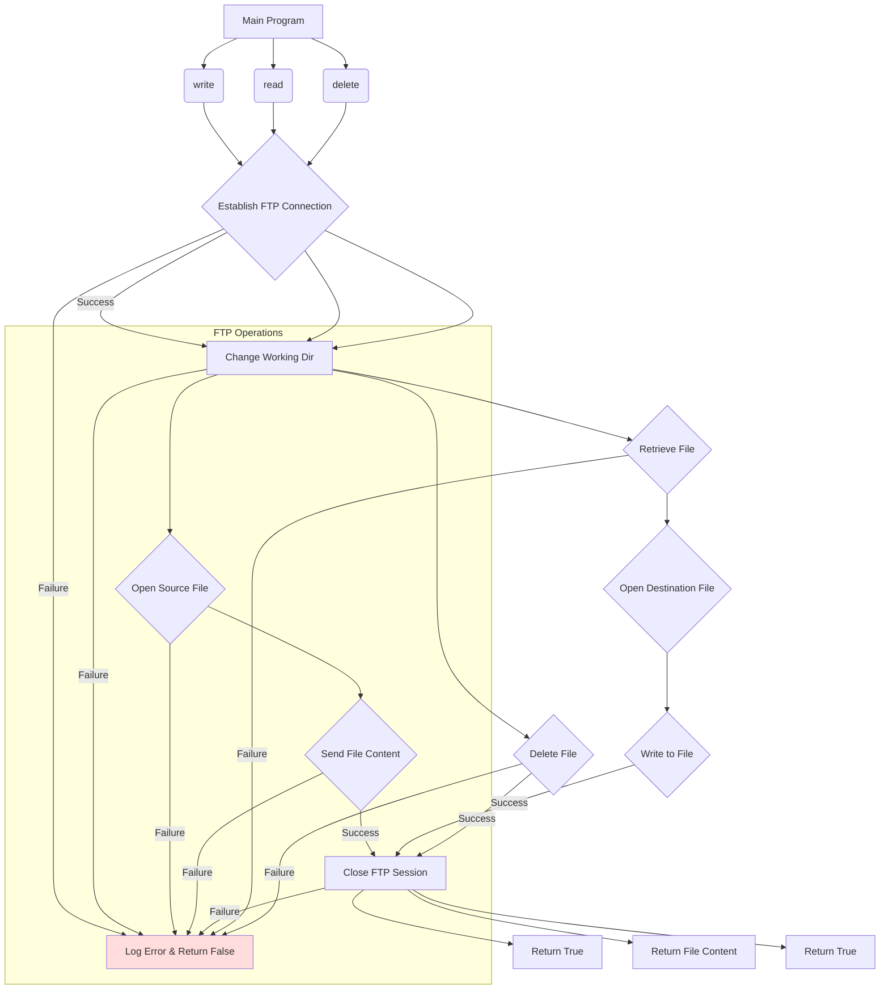

```MD
# <input code>

```python
## \file hypotez/src/utils/ftp.py
# -*- coding: utf-8 -*-\

#! venv/bin/python/python3.12

"""
.. module: src.utils 
	:platform: Windows, Unix
	:synopsis: interface for interacting with FTP servers
This module provides an interface for interacting with FTP servers. It includes functions to send, receive, and delete files from an FTP server.

** Purpose **:
Allows for sending media files (images, videos), spreadsheets, and other files to and from an FTP server. 

** Modules **:
- helpers (local): Local helper utilities for FTP operations.
- typing: Type hints for function parameters and return values.
- ftplib: Provides FTP protocol client capabilities.
- pathlib: For handling file system paths.

Functions:
    - `write`: Sends a file to an FTP server.
    - `read`: Retrieves a file from an FTP server.
    - `delete`: Deletes a file from an FTP server.
"""

from src.logger import logger
from typing import Union
import ftplib
from pathlib import Path

# Connection configuration (assumed to be defined elsewhere)
_connection = {
    'server': 'ftp.example.com',
    'port': 21,
    'user': 'username',
    'password': 'password'
}

def write(source_file_path: str, dest_dir: str, dest_file_name: str) -> bool:
    """
    Sends a file to an FTP server.

    Args:
        source_file_path (str): The path of the file to be sent.
        dest_dir (str): The destination directory on the FTP server.
        dest_file_name (str): The name of the file on the FTP server.

    Returns:
        bool: True if the file is successfully sent, False otherwise.

    Example:
        >>> success = write('local_path/to/file.txt', '/remote/directory', 'file.txt')
        >>> print(success)
        True
    """
    # ... (implementation as shown)
    # ... (error handling and session closing)
    pass

def read(source_file_path: str, dest_dir: str, dest_file_name: str) -> Union[str, bytes, None]:
    """
    Retrieves a file from an FTP server.

    # ... (implementation as shown)
    # ... (error handling and session closing)
    pass

def delete(source_file_path: str, dest_dir: str, dest_file_name: str) -> bool:
    """
    Deletes a file from an FTP server.

    # ... (implementation as shown)
    # ... (error handling and session closing)
    pass
```

# <algorithm>

The code defines functions for interacting with an FTP server.  A high-level algorithm for each function would be:

1. **`write(source_file_path, dest_dir, dest_file_name)`:**
   - Establishes an FTP connection using `ftplib.FTP` with predefined credentials from `_connection`.
   - Changes the working directory on the FTP server to `dest_dir`.
   - Opens the source file in binary read mode (`'rb'`).
   - Uses `session.storbinary` to send the file content to the FTP server.
   - Closes the FTP session.
   - Returns `True` if successful, `False` otherwise, logging errors along the way.

2. **`read(source_file_path, dest_dir, dest_file_name)`:**
   - Establishes an FTP connection.
   - Changes the working directory on the FTP server.
   - Opens the destination file in binary write mode (`'wb'`).
   - Uses `session.retrbinary` to retrieve the file content from the FTP server and write it to the local file.
   - Reads the entire content of the retrieved local file.
   - Closes the FTP session.
   - Returns the file content if successful, `None` otherwise, logging errors along the way.

3. **`delete(source_file_path, dest_dir, dest_file_name)`:**
   - Establishes an FTP connection.
   - Changes the working directory on the FTP server.
   - Uses `session.delete` to delete the file on the FTP server.
   - Closes the FTP session.
   - Returns `True` if successful, `False` otherwise, logging errors along the way.

**Data Flow Example (write):**

```
+-----------------+      +-----------------+      +-----------------+
| Local File      |----->| FTP Connection   |----->| FTP Server     |
+-----------------+      +-----------------+      +-----------------+
| source_file_path |      | _connection     |      | dest_dir       |
|                 |      |                 |      | dest_file_name |
+-----------------+      +-----------------+      +-----------------+
       ^                                        ^
       |                                        |
       |  (Establish connection, change dir)   |   (Write file)
       |                                        |
```


# <mermaid>



**Dependencies:**
- `src.logger`:  For logging errors and information related to FTP operations.  Implied dependency on a logging framework.
- `ftplib`: Provides FTP client functionality.
- `typing`: Needed for type hinting.
- `pathlib`: For handling file paths.


# <explanation>

**Imports:**

- `src.logger`:  This import suggests that the `logger` object is defined in a module within the `src` package (likely for logging).  It's a crucial part of error handling and debugging within the project.  The absence of specifics about the logger's implementation means we don't know how the messages are formatted or where they are sent (e.g., console, file).
- `typing`: Used for type hinting, improving code readability and maintainability.
- `ftplib`: Provides functions for interacting with FTP servers.  This is a standard Python library.
- `pathlib`: Used for representing file paths in a platform-independent manner.

**Classes:**

- There are no classes defined in the provided code.  Only functions are present.

**Functions:**

- `write`: Takes the local file path, destination directory on the FTP server, and the desired file name on the FTP server as arguments.  It returns `True` if the file is successfully sent to the FTP server; otherwise `False`.  Error handling is implemented using `try...except` blocks to catch and log potential issues during connection and file transfer.  Crucially, it closes the FTP session.
- `read`:  Takes the local file path, destination directory on the FTP server, and file name as arguments. It returns the file content if successfully retrieved from the FTP server. Returns `None` upon failure. Handles connection and file retrieval errors. Closes the FTP session.
- `delete`:  Takes the local file path (which is unused), the destination directory on the FTP server, and the file name on the FTP server as arguments. Returns `True` if the file is successfully deleted, otherwise `False`.  Handles errors during the connection and deletion process.  Closes the FTP session.

**Variables:**

- `_connection`: A dictionary holding the FTP server details (host, port, username, password).  This is a critical but potentially vulnerable element if hardcoded like this.  Storing this in a configuration file or other secure location is essential for production code.
- `MODE`: A string variable with the value 'dev', which seems to be a flag/constant indicating the environment (possibly for different connection parameters or logging behaviors in different environments).

**Possible Errors and Improvements:**

- **Hardcoded credentials:** Storing credentials directly in the code is a significant security risk.  Use environment variables or a configuration file to store sensitive information.
- **Error Handling:** The `try...except` blocks are improved by logging specific error messages using `logger`. However, for production code, consider catching more specific exceptions (e.g., `ftplib.error`).
- **Input Validation:** Validate the input arguments (`source_file_path`, `dest_dir`, `dest_file_name`) to prevent potential issues like invalid paths or file names.
- **Robust Connection Handling:** Add a timeout to the FTP connection attempt to prevent indefinite hangs.
- **File Existence Check:** Checking if the source file exists before attempting to send it.

**Relationships with Other Parts of the Project:**

The code interacts with the `src.logger` module, suggesting that the code is part of a larger project with logging functionality.  The `_connection` dictionary might be populated by external configuration.