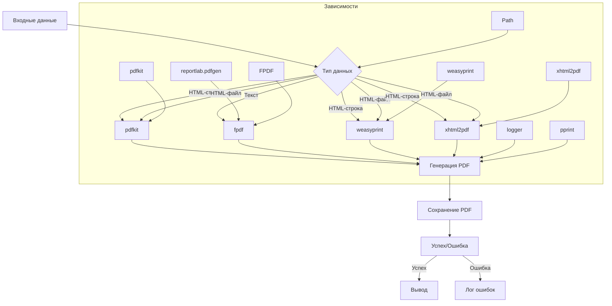

# <input code>

```python
## \file hypotez/src/utils/pdf.py
# -*- coding: utf-8 -*-\
#! venv/Scripts/python.exe
#! venv/bin/python/python3.12

"""
.. module: src.utils.pdf 
    :platform: Windows, Unix
    :synopsis: Модуль для преобразования HTML-контента или файлов в PDF

Модуль для преобразования HTML-контента или файлов в PDF с использованием различных библиотек.
Дополнительная информация:
- https://chatgpt.com/share/672266a3-0048-800d-a97b-c38f647d496b
- https://stackoverflow.com/questions/73599970/how-to-solve-wkhtmltopdf-reported-an-error-exit-with-code-1-due-to-network-err
- https://habr.com/ru/companies/bothub/articles/853490/
"""

import sys
import os
import json

from pathlib import Path
import pdfkit
from reportlab.pdfgen import canvas
from fpdf import FPDF
from weasyprint import HTML
from xhtml2pdf import pisa
from src.logger import logger
from src.utils.printer import pprint

def set_project_root(marker_files=('__root__')) -> Path:
    """
    Finds the root directory of the project starting from the current file's directory,
    searching upwards and stopping at the first directory containing any of the marker files.

    Args:
        marker_files (tuple): Filenames or directory names to identify the project root.
    
    Returns:
        Path: Path to the root directory if found, otherwise the directory where the script is located.
    """
    __root__:Path
    current_path:Path = Path(__file__).resolve().parent
    __root__ = current_path
    for parent in [current_path] + list(current_path.parents):
        if any((parent / marker).exists() for marker in marker_files):
            __root__ = parent
            break
    if __root__ not in sys.path:
        sys.path.insert(0, str(__root__))
    return __root__


# Get the root directory of the project
__root__ = set_project_root()
"""__root__ (Path): Path to the root directory of the project"""


wkhtmltopdf_exe = __root__ / 'bin' / 'wkhtmltopdf' / 'files' / 'bin' / 'wkhtmltopdf.exe'

if not wkhtmltopdf_exe.exists():
    logger.error("Не найден wkhtmltopdf.exe по указанному пути.")
    raise FileNotFoundError("wkhtmltopdf.exe отсутствует")


class PDFUtils:
    """
    Класс для работы с PDF-файлами, предоставляющий методы для сохранения HTML-контента в PDF с использованием различных библиотек.
    """
    # ... (rest of the code)
```

# <algorithm>

**Алгоритм работы модуля:**

1. **Нахождение корневой директории проекта:**
    - Начинает поиск с директории текущего файла.
    - Переходит к родительским директориям, пока не найдет директорию, содержащую файлы `pyproject.toml`, `requirements.txt` или `.git`.
    - Добавляет найденную директорию в `sys.path`.
    - Возвращает путь к корневой директории.

2. **Проверка существования wkhtmltopdf.exe:**
    - Проверяет, существует ли указанный путь к исполняемому файлу wkhtmltopdf.exe.
    - Если не найден, выводит ошибку и завершает выполнение.

3. **Преобразование HTML в PDF:**
    - **pdfkit:** Преобразует HTML-строку или файл в PDF, используя `pdfkit`.
        - Использует конфигурацию `pdfkit`, устанавливая `wkhtmltopdf` из заданного пути.
        - Добавляет опцию `enable-local-file-access`.
    - **fpdf:** Преобразует текст в PDF, используя `fpdf`.
        - Добавляет страницу.
        - Устанавливает автоматическое разбиение страницы.
        - Загружает шрифты из `fonts.json`.
        - Добавляет шрифты в `fpdf`.
        - Устанавливает шрифт по умолчанию.
        - Добавляет текст на страницу.
        - Генерирует PDF.
    - **weasyprint:** Преобразует HTML-строку или файл в PDF, используя `weasyprint`.
        - Преобразует HTML в PDF.
    - **xhtml2pdf:** Преобразует HTML-строку или файл в PDF, используя `xhtml2pdf`.
        - Открывает файл PDF на запись в бинарном режиме.
        - Если входные данные - строка, кодирует ее в UTF-8.
        - Использует `pisa.CreatePDF` для преобразования.
        - Если входные данные - файл, читает его в UTF-8.
        - Использует `pisa.CreatePDF` для преобразования.


В каждом случае возвращается `True`, если преобразование прошло успешно, или `False`, если возникла ошибка.


# <mermaid>



# <explanation>

**Импорты:**

- `sys`, `os`, `json`: Стандартные модули Python для работы с системой, файлами и JSON.
- `pathlib`: Модуль для работы с путями к файлам.
- `pdfkit`: Библиотека для преобразования HTML в PDF с использованием wkhtmltopdf.
- `reportlab.pdfgen`, `fpdf`, `weasyprint`, `xhtml2pdf`: Библиотеки для генерации PDF.
- `src.logger`, `src.utils.printer`: Модули, вероятно, из проекта, используемые для логирования и вывода сообщений.  Важно понимать, что `src.` указывает на структуру проекта, и эти импорты являются зависимостями от других частей проекта.

**Классы:**

- `PDFUtils`: Класс для работы с PDF-файлами. Содержит статические методы для преобразования HTML-контента в PDF с использованием разных библиотек.

**Функции:**

- `set_project_root()`: Находит корневую директорию проекта, начиная с текущего файла.  Это полезно для нахождения зависимостей в проекте.  Аргументы: `marker_files` (кортеж). Возвращает `Path` к корневой директории проекта.


- `save_pdf_pdfkit()`, `save_pdf_fpdf()`, `save_pdf_weasyprint()`, `save_pdf_xhtml2pdf()`: Статические методы для сохранения HTML-контента или файла в PDF с использованием различных библиотек.  У них есть аргументы `data` (HTML-контент или путь к файлу) и `pdf_file` (путь к сохраняемому PDF-файлу). Возвращает `True`, если сохранение прошло успешно, и `False` в противном случае. Обратите внимание на обработку исключений (`try...except`) для повышения устойчивости.

- `html2pdf()`: Статический метод для преобразования HTML-строки в PDF с использованием `WeasyPrint`.  Обрабатывает ошибки и печатает сообщения в консоль.


**Переменные:**

- `__root__`: Переменная, содержащая путь к корневой директории проекта.
- `wkhtmltopdf_exe`: Переменная, содержащая путь к исполняемому файлу wkhtmltopdf.  Критично важная переменная, так как гарантирует правильную работу.


**Возможные ошибки и улучшения:**

- **Обработка исключений:**  Обработка исключений улучшена, но она могла бы быть более специфичной. Например, можно обрабатывать конкретные типы ошибок, возвращать информацию о типе ошибки, а не только сообщение.
- **Проверка входных данных:** Проверка корректности введённых данных `data` и `pdf_file` в функциях.
- **Кодировка файлов:**  Обработка файлов в кодировке UTF-8 (как в методе `save_pdf_xhtml2pdf()`) важна для корректной работы с файлами, содержащими символы разных языков.  Её стоит использовать в других методах.
- **Детализация логирования:**  Логирование ошибок с более подробными сообщениями о том, где именно произошла ошибка, и о контексте ошибки (например, выведенные ошибки из других библиотек).
- **Использование `typing`:**  Использование аннотаций типов (например, `from typing import Union`) для повышения читаемости и обнаружения потенциальных ошибок.
- **Использование аргументов по умолчанию**: можно сделать аргументы `marker_files` и другие, которые принимают значения по умолчанию (если это уместно), чтобы код был более универсальным.
- **Дополнительная валидация**: Нужно добавлять больше проверок корректности входных данных (например, проверять, что файл с HTML содержится в том формате, который ожидается).


**Взаимосвязь с другими частями проекта:**

Модуль `pdf` зависит от `logger` и `printer` из `src` (из `utils`). Это указывает на архитектуру проекта, где `pdf` является частью подмодуля `utils`, а `logger` и `printer` - вспомогательные модули для логирования и вывода данных.  Также модуль зависит от библиотек, которые он использует для преобразования.