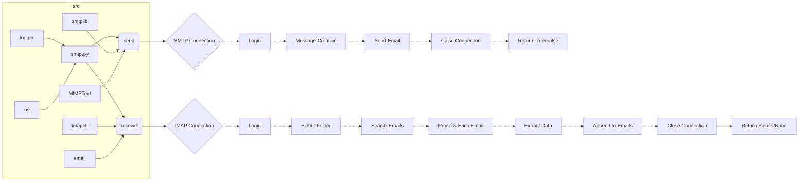

```MD
# <input code>

```python
## \file hypotez/src/utils/smtp.py
# -*- coding: utf-8 -*-
#! venv/Scripts/python.exe
#! venv/bin/python/python3.12

"""
.. module: src.utils 
	:platform: Windows, Unix
	:synopsis: SMTP Email Interface

"""


""" This module provides functionality to send and receive emails using an SMTP or IMAP server.
It includes functions to send emails using SMTP and retrieve emails using IMAP.

Functions:
    - `send(subject: str = '', body: str = '', to: str = 'one.last.bit@gmail.com') -> bool`
      Sends an email using the SMTP server specified in the `_connection` dictionary.  Returns `True` on success, `False` on failure.  Includes error logging.
    
    - `receive(imap_server: str, user: str, password: str, folder: str = 'inbox') -> Optional[List[Dict[str, str]]]`
      Retrieves emails from an IMAP server and returns them as a list of dictionaries.  Returns `None` on error. Includes error logging.


** Important Considerations for Security and Robustness **:

    - **_connection Dictionary:** Do *not* hardcode credentials in this file.  Move the `_connection` dictionary to environment variables (e.g., using `os.environ`). This is crucial for security.  Avoid storing passwords directly in source code.

    - **Error Handling:** The code includes robust error handling, logging exceptions with details (subject, body, etc.).  This is very helpful for debugging.

    - **Email Parsing:** The `receive` function handles various email formats gracefully, preventing potential issues.

    - **MIME Handling:**  The code correctly uses `MIMEText` for constructing the email message, crucial for sending basic text emails.


"""

import smtplib
import imaplib
import email
import os
from email.mime.text import MIMEText
from typing import List, Dict, Optional

from src.logger import logger

# --- Configuration ---
# DO NOT HARDCODE CREDENTIALS HERE!  Use environment variables instead.
_connection = {
    'server': os.environ.get('SMTP_SERVER', 'smtp.example.com'),
    'port': int(os.environ.get('SMTP_PORT', 587)),
    'user': os.environ.get('SMTP_USER'),
    'password': os.environ.get('SMTP_PASSWORD'),
    'receiver': os.environ.get('SMTP_RECEIVER', 'one.last.bit@gmail.com')
}


def send(subject: str = '', body: str = '', to: str = 'one.last.bit@gmail.com') -> bool:
    """Sends an email.  Returns True if successful, False otherwise. Logs errors."""
    try:
        # Create SMTP connection
        smtp = smtplib.SMTP(_connection['server'], _connection['port'])
        smtp.ehlo()
        smtp.starttls()
        smtp.login(_connection['user'], _connection['password'])

        message = MIMEText(body)
        message["Subject"] = subject
        message["From"] = _connection['user']
        message["To"] = to

        smtp.sendmail(_connection['user'], to, message.as_string())
        smtp.quit()
        return True

    except Exception as ex:
        logger.error(f"Error sending email. Subject: {subject}. Body: {body}. Error: {ex}", exc_info=True)
        return False


def receive(imap_server: str, user: str, password: str, folder: str = 'inbox') -> Optional[List[Dict[str, str]]]:
    """Retrieves emails. Returns a list of email dictionaries if successful, None otherwise. Logs errors."""
    try:
        mail = imaplib.IMAP4_SSL(imap_server)
        mail.login(user, password)
        mail.select(folder)

        status, data = mail.search(None, 'ALL')
        email_ids = data[0].split()

        emails = []
        for email_id in email_ids:
            status, data = mail.fetch(email_id, '(RFC822)')
            raw_email = data[0][1]
            msg = email.message_from_bytes(raw_email)

            email_data = {
                'subject': msg['subject'],
                'from': msg['from'],
                'body': msg.get_payload(decode=True, _charset="utf-8").decode("utf-8", "ignore")  # Decode & handle potential errors
            }
            emails.append(email_data)

        mail.close()
        mail.logout()
        return emails

    except Exception as ex:
        logger.error(f"Error occurred while retrieving emails: {ex}", exc_info=True)
        return None
```

# <algorithm>

**Функция send()**

1. **Подключение к SMTP серверу:** Устанавливается соединение с SMTP сервером, используя предоставленные параметры из словаря `_connection`.
2. **Проверка соединения:** Выполняется `ehlo()` и `starttls()` для проверки и настройки соединения.
3. **Вход в систему:** Пользователь и пароль авторизуются.
4. **Создание сообщения:** Создается сообщение email, используя `MIMEText` для тела, заголовков `Subject`, `From`, и `To`.
5. **Отправка сообщения:** Сообщение отправляется с указанием отправителя и получателя.
6. **Закрытие соединения:** SMTP соединение закрывается.
7. **Возврат результата:** Возвращает `True` при успешной отправке, `False` при ошибке.
8. **Обработка ошибок:** В `try...except` блоке обрабатываются ошибки, и происходит логирование.


**Функция receive()**

1. **Подключение к IMAP серверу:** Устанавливается соединение с IMAP сервером, используя предоставленные параметры.
2. **Вход в систему:** Пользователь и пароль авторизуются.
3. **Выбор папки:** Выбирается нужная папка (по умолчанию - inbox).
4. **Поиск писем:** Выполняется поиск всех писем в выбранной папке.
5. **Обработка каждого письма:** Для каждого письма:
   a) Извлекается сырое содержимое письма.
   b) Создается объект `email.message` для обработки письма.
   c) Извлекаются заголовок `Subject`, `From` и тело.
   d) Тело кодируется в UTF-8, чтобы справиться с потенциальными кодировками.
   e) Данные о письме сохраняются в словаре.
   f) Списки `email_data` добавляются в список `emails`.
6. **Закрытие соединения:** IMAP соединение закрывается.
7. **Возврат результата:** Возвращает список словарей с данными о письмах при успешном выполнении, `None` при ошибке.
8. **Обработка ошибок:** В `try...except` блоке обрабатываются ошибки, и происходит логирование.

Примеры данных:

* `_connection`: {'server': 'smtp.example.com', 'port': 587, 'user': 'user@example.com', 'password': 'password', 'receiver': 'recipient@example.com'}
* `subject`: 'Test email'
* `body`: 'Hello, this is a test email.'
* `to`: 'recipient@example.com'


# <mermaid>



**Подключаемые зависимости:**

* `src.logger`: модуль для логирования, предположительно, использует библиотеку `logging`. Необходимо для записи сообщений об ошибках.
* `smtplib`:  для взаимодействия с SMTP серверами.
* `imaplib`: для взаимодействия с IMAP серверами.
* `email`: для работы с email сообщениями.
* `os`: для доступа к операционной системе и переменным среды.
* `typing`:  для типизации (List, Dict, Optional).

# <explanation>

**Импорты:**

* `smtplib`, `imaplib`, `email`:  стандартные библиотеки Python, предоставляющие функционал для работы с SMTP и IMAP серверами и обработкой email сообщений.
* `os`: используется для доступа к переменным окружения, что критично для безопасности, так как не нужно хранить пароли прямо в коде.
* `MIMEText`: из `email.mime.text`, используется для создания email сообщений.
* `logger`: импортируется из `src.logger`, предположительно, пользовательского модуля, который предоставляет инструменты для логирования.  Это важная часть архитектуры, так как позволяет отслеживать ошибки и отлаживать код.

**Классы:**

Нет явных классов, только функции.

**Функции:**

* `send(subject, body, to)`: Отправляет email с указанным телом, темой и адресатом. Возвращает `True` при успехе, `False` - при ошибке.  КЛЮЧЕВОЙ АСПЕКТ – `try...except` блок обрабатывает потенциальные ошибки, такие как проблемы с подключением или авторизацией, и записывает их в лог. Это гарантирует, что приложение не упадет из-за ошибки отправки письма.
* `receive(imap_server, user, password, folder)`: Получает письма из IMAP папки. Возвращает список словарей с данными о письмах или `None` в случае ошибки. Аналогично `send`, содержит надежный `try...except` блок для обработки ошибок при подключении, авторизации и чтении писем.


**Переменные:**

* `_connection`: Словарь, содержащий настройки SMTP сервера (сервер, порт, пользователь, пароль, получатель), полученные из переменных окружения, что критически важно для безопасности.


**Возможные ошибки и улучшения:**

* **Безопасность:**  Замена хардкодированных данных (пароли, сервера) на переменные окружения (`os.environ`) является *обязательной* мерой для предотвращения утечки конфиденциальной информации.
* **Обработка ошибок:** Обработка исключений в `try...except` блоках позволяет логгировать все ошибки и отлаживать приложение, если что-то пойдет не так. Это очень хорошо.
* **Типизация:** Использование аннотаций типов (`typing`) делает код более понятным и помогает в статическом анализе.
* **Добавление валидации:**  Проверка входных данных на корректность (например, валидация адреса электронной почты) сделала бы функцию еще надежнее.
* **Обработка больших писем:** Если ожидается, что письма будут содержать большое количество данных, нужно будет добавить механизмы обработки больших объектов и предотвращения ошибок из-за недостаточного объема памяти.

**Взаимосвязи с другими частями проекта:**

Функции в `smtp.py` взаимодействуют с `src.logger` для записи сообщений об ошибках.  Зависимость явно указана в импорте.  В коде нет явных зависимостей от других частей проекта, но он может использоваться в других модулях для отправки/получения писем.