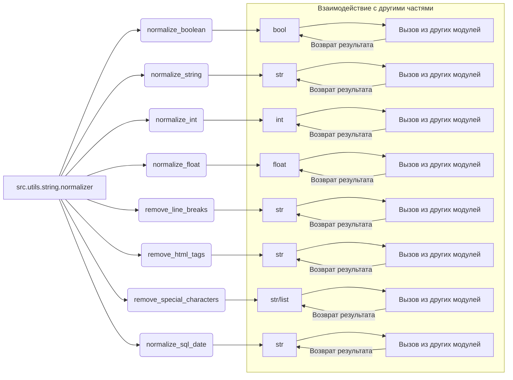

# <input code>

```rst
.. module:: src.utils.string.normalizer
```
Документация модуля нормализации данных
=========================================

Модуль `normalizer` предоставляет функциональность для нормализации различных типов данных, включая строки, булевы значения, целые числа и числа с плавающей запятой. Он также включает вспомогательные функции для обработки текста.

---

## Содержание

1. [Обзор](#обзор)
2. [Функции модуля](#функции-модуля)
   - [normalize_boolean](#normalize_boolean)
   - [normalize_string](#normalize_string)
   - [normalize_int](#normalize_int)
   - [normalize_float](#normalize_float)
   - [remove_line_breaks](#remove_line_breaks)
   - [remove_html_tags](#remove_html_tags)
   - [remove_special_characters](#remove_special_characters)
   - [normalize_sql_date](#normalize_sql_date)
3. [Пример использования](#пример-использования)
4. [Требования](#требования)

---

## Обзор

Модуль предоставляет удобные утилиты для нормализации и обработки данных. Его можно использовать для:
- Удаления HTML тегов из строк.
- Преобразования строк в числовые или булевы значения.
- Очистки строк от специальных символов.
- Преобразования списков строк в одну нормализованную строку.

---

## Функции модуля

### `normalize_boolean`

**Описание:**  
Преобразует входное значение в булево значение.

**Аргументы:**  
- `input_data (Any)`: Данные, которые могут представлять булево значение (строка, число, булев тип).

**Возвращает:**  
- `bool`: Преобразованное булево значение.

**Пример:**  
```python
normalize_boolean('yes')  # Результат: True
normalize_boolean(0)      # Результат: False
```

---

... (остальной код документации)
```

# <algorithm>

Пошаговая блок-схема алгоритма работы модуля отсутствует, так как предоставлен только фрагмент документации.  Для создания блок-схемы нужен исходный код Python-модуля.  Однако, на основе документации можно описать общий принцип работы функций.

Функции `normalize_boolean`, `normalize_int`, `normalize_float` выполняют преобразование входных данных к определённому типу.  `normalize_string` и подобные функции обрабатывают входные данные (строки или списки строк), выполняя очистку, удаление ненужных элементов и форматирование.  `normalize_sql_date` преобразует дату в строковый формат.

# <mermaid>



**Объяснение диаграммы:**

* **src.utils.string.normalizer:** Это модуль, содержащий функции нормализации.
* **normalize_boolean, ..., normalize_sql_date:** Функции модуля, выполняющие различные преобразования.
* **bool, str, int, float:** Типы данных, которые обрабатываются функциями.
* **Взаимодействие с другими частями:** Показывает, что функции модуля могут вызываться из других частей проекта.  Стрелки `-- Возврат результата` показывают, что функции возвращают результаты в вызывающий код.

# <explanation>

**Импорты**:  В примере использования показано, что модуль `src.logger` используется, но его код не представлен.  В примере также импортируются нужные функции нормализации.

**Классы**: В предоставленной документации нет описания классов.  Все функции являются глобальными функциями.

**Функции**:  
Каждая функция, описанная в документации, имеет своё назначение.  Функции `normalize_boolean`, `normalize_int`, `normalize_float` преобразуют входные данные к соответствующему типу. Функции `normalize_string`, `remove_line_breaks`, `remove_html_tags`, `remove_special_characters` предназначены для обработки строк. `normalize_sql_date` преобразует дату в строку определенного формата.

**Переменные**: Переменные (например, `input_data`, `value`) представляют входные данные для функций.

**Возможные ошибки или области для улучшений**:

* **Обработка ошибок:**  Документация упоминает о логировании ошибок, но не показывает, как это делается.  В реальном коде желательно добавить обработку исключений (try-except блоки) для предотвращения аварийных ситуаций (например, если введено некорректное значение для преобразования).
* **Документация:** Документация написана хорошо, но для полного понимания потребовался бы код.
* **Типы данных:** При использовании `normalize_float` необходимо учитывать потенциальные проблемы с некорректными входными данными, которые могут привести к исключениям.
* **Локализация:** Если нормализация предполагает работу с данными на разных языках, стоит предусмотреть возможность локализации.
* **Область применения:** Необходимо рассмотреть области применения этих функций и оптимизировать их для определенных условий, если это требуется.

**Цепочка взаимосвязей**: Функции нормализации, вероятно, используются в других частях приложения (например, в модулях обработки данных, отображения данных или баз данных), где требуется получение чистых и стандартных данных.


**Важный момент:** Необходимо видеть исходный код Python файла, чтобы построить полную блок-схему и точно описать алгоритм работы.  Данная информация основана только на документации.