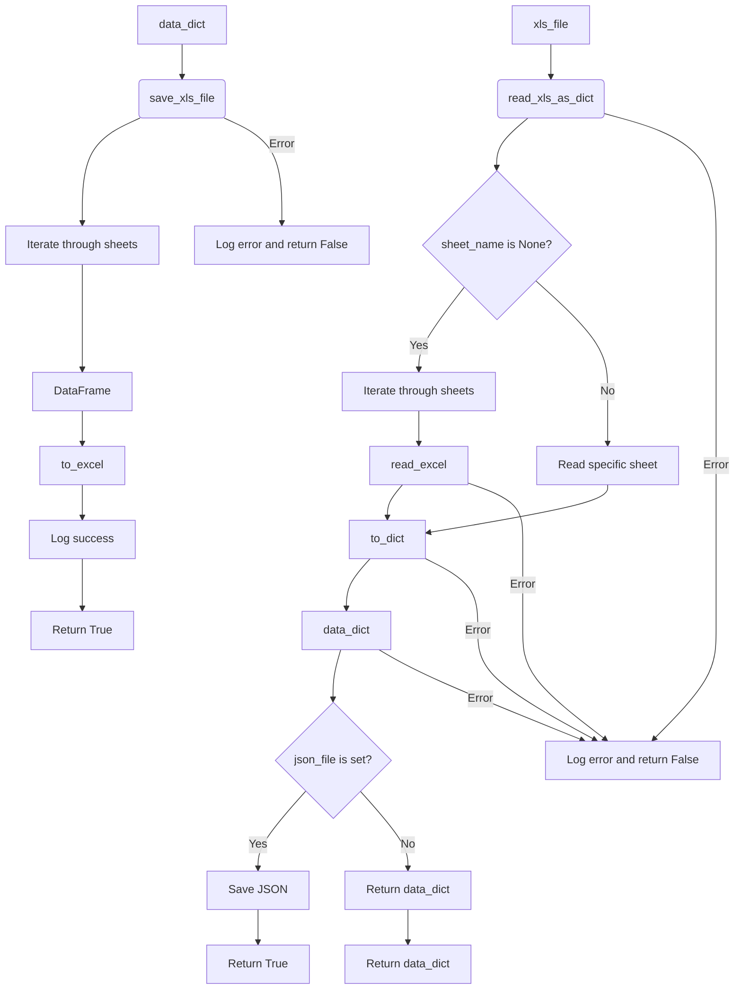

# <input code>

```python
## \file hypotez/src/utils/xls.py
# -*- coding: utf-8 -*-\
#! venv/Scripts/python.exe
#! venv/bin/python/python3.12

"""
.. module: src.utils 
	:platform: Windows, Unix
	:synopsis: Converter for Excel (`xls`) to JSON and JSON to Excel (`xls`)

"""


""" This module provides functions to convert Excel files to JSON format, handle multiple sheets, and save JSON data back to Excel files.

Functions:
    read_xls_as_dict(xls_file: str, json_file: str = None, sheet_name: Union[str, int] = None) -> Union[Dict, List[Dict], bool]:
        Reads an Excel file and converts it to JSON.  Optionally, converts a specific sheet and saves the result to a JSON file.  Handles errors gracefully.

    save_xls_file(data: Dict[str, List[Dict]], file_path: str) -> bool:
        Saves JSON data to an Excel file.  The data should be a dictionary where keys are sheet names and values are lists of dictionaries representing rows. Handles errors gracefully.

Examples:
    # Reading and optionally saving to JSON
    data = read_xls_as_dict('input.xlsx', 'output.json', 'Sheet1')  # Reads sheet named 'Sheet1'
    if data:
        print(data)  # Output will be {'Sheet1': [{...}]}

    # Saving from JSON data
    data_to_save = {'Sheet1': [{'column1': 'value1', 'column2': 'value2'}]}
    success = save_xls_file(data_to_save, 'output.xlsx')
    if success:
        print("Successfully saved to output.xlsx")
"""

import pandas as pd
import json
from typing import List, Dict, Union
from pathlib import Path
import logging

# Configure logging
logging.basicConfig(level=logging.INFO, format='%(asctime)s - %(levelname)s - %(message)s')


def read_xls_as_dict(
    xls_file: str,
    json_file: str = None,
    sheet_name: Union[str, int] = None
) -> Union[Dict, List[Dict], bool]:
    """
    Reads an Excel file and converts it to JSON.  Optionally, converts a specific sheet and saves the result to a JSON file.
    Handles errors gracefully.
    """
    try:
        xls_file_path = Path(xls_file)
        if not xls_file_path.exists():
            logging.error(f"Excel file not found: {xls_file}")
            return False  # Indicate failure

        xls = pd.ExcelFile(xls_file)

        if sheet_name is None:
            data_dict = {}
            for sheet in xls.sheet_names:
                try:
                    df = pd.read_excel(xls, sheet_name=sheet)
                    data_dict[sheet] = df.to_dict(orient='records')
                except Exception as e:
                    logging.error(f"Error processing sheet '{sheet}': {e}")
                    return False

        else:
            try:
                df = pd.read_excel(xls, sheet_name=sheet_name)
                data_dict = df.to_dict(orient='records')
            except Exception as e:
                logging.error(f"Error processing sheet '{sheet_name}': {e}")
                return False


        if json_file:
            with open(json_file, 'w', encoding='utf-8') as f:
                json.dump(data_dict, f, ensure_ascii=False, indent=4)
                logging.info(f"JSON data saved to {json_file}")

        return data_dict

    except FileNotFoundError as e:
        logging.error(f"File not found: {e}")
        return False
    except Exception as e:
        logging.error(f"An error occurred: {e}")
        return False


def save_xls_file(data: Dict[str, List[Dict]], file_path: str) -> bool:
    """Saves JSON data to an Excel file. Handles errors gracefully."""
    try:
        with pd.ExcelWriter(file_path, engine='xlsxwriter') as writer:
            for sheet_name, rows in data.items():
                df = pd.DataFrame(rows)
                df.to_excel(writer, sheet_name=sheet_name, index=False)
                logging.info(f"Sheet '{sheet_name}' saved to {file_path}")
        return True
    except Exception as e:
        logging.error(f"Error saving Excel file: {e}")
        return False
```

# <algorithm>

**Шаг 1:**  **`read_xls_as_dict` функция:**
* Принимает путь к файлу Excel (`xls_file`).
* Проверяет существование файла. Если файл не найден, возвращает `False` и записывает ошибку в журнал.
* Считывает Excel файл с помощью `pd.ExcelFile`.
* Если `sheet_name` не указан, обрабатывает все листы.
* Для каждого листа, считывает данные в `pandas.DataFrame` и преобразует в словарь Python (`to_dict(orient='records')`).
* Сохраняет результат в `data_dict`. Обрабатывает исключения, возникающие при считывании листа.
* Если `json_file` задан, сохраняет `data_dict` в JSON файл.
* Возвращает `data_dict` или `False`.


**Пример:** `read_xls_as_dict('input.xlsx')`  - возвращает словарь со всеми листами Excel файла.

**Шаг 2:** **`save_xls_file` функция:**
* Принимает данные (`data`) в формате `Dict[str, List[Dict]]` и путь к выходному файлу (`file_path`).
* Использует `pd.ExcelWriter` для создания Excel файла.
* Для каждого листа в `data`, создаёт `pandas.DataFrame` и сохраняет его в Excel файл. Обрабатывает исключения.
* Возвращает `True`, если сохранение прошло успешно, иначе `False`.


**Пример:** `save_xls_file({'Sheet1': [{'A': 1, 'B': 2}], 'Sheet2': [{'C': 3, 'D': 4}]}, 'output.xlsx')` - сохраняет данные в Excel файл `output.xlsx`.


# <mermaid>




# <explanation>

**Импорты:**

* `pandas as pd`: Библиотека для работы с данными в формате таблиц. Используется для чтения и записи Excel файлов.
* `json`: Библиотека для работы с JSON форматом. Используется для преобразования и сохранения данных.
* `typing`: Модуль для типизации данных. Используется для явного указания типов аргументов и возвращаемых значений функций.
* `pathlib`: Модуль для работы с путями к файлам. Используется для более удобного обращения с файлами.
* `logging`: Модуль для ведения логов. Используется для записи сообщений об ошибках и успешных операциях.


**Классы:**

В коде нет классов. Есть только функции для работы с файлами Excel и JSON.

**Функции:**

* **`read_xls_as_dict`**: Читает Excel файл, преобразует его в JSON.  Возможна опция сохранения результата в JSON файл. Обрабатывает исключения и сообщает об ошибках в журнал.
    * Аргументы: `xls_file` (путь к Excel файлу), `json_file` (путь для сохранения JSON файла, необязательный), `sheet_name` (название листа, необязательный).
    * Возвращаемое значение: словарь с данными или `False` при ошибке.
* **`save_xls_file`**: Сохраняет данные в формате JSON в Excel файл.
    * Аргументы: `data` (словарь, содержащий данные, ключи - имена листов, значения - список словарей), `file_path` (путь к выходному Excel файлу).
    * Возвращаемое значение: `True` при успешном сохранении, `False` при ошибке.


**Переменные:**

* `MODE`: Строковая переменная со значением 'dev'. Не используется в текущем коде.
* `xls_file_path`: Путь к файлу excel.
* `xls`: Объект Excel файла pandas.
* `data_dict`: Словарь, хранящий данные, считанные из excel.
* `df`:  `pandas.DataFrame` объект, используется для хранения считываемых данных.
* `sheet_name`: Наименование обрабатываемого листа.

**Возможные ошибки и улучшения:**

* **Обработка ошибок:** Обработка ошибок в `try...except` блоках достаточно хороша.
* **Типизация:** Используется `typing`, что повышает читаемость и  возможность статической проверки кода.
* **Логирование:** Использование `logging` улучшает отладку и анализ ошибок.
* **Документация:** Документация в виде docstrings  хороша, но можно добавить более подробные пояснения к функциям и аргументам.

**Взаимосвязь с другими частями проекта:**

Модуль `xls.py` предполагает использование в других частях проекта для работы с Excel данными.  Например, его можно использовать в других модулях, где необходимо прочитать или записать данные в формате Excel.  Взаимодействие реализуется через вызовы функций `read_xls_as_dict` и `save_xls_file`.