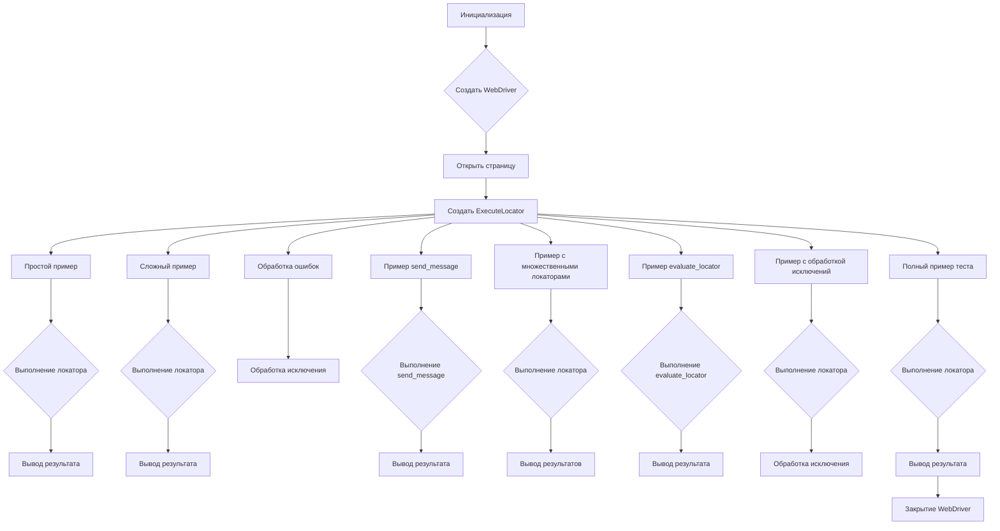

# <input code>

```python
## \file hypotez/src/webdriver/_examples/_example_executor_2.py
# -*- coding: utf-8 -*-\n
#! venv/bin/python/python3.12

"""
.. module:: src.webdriver._examples 
	:platform: Windows, Unix
	:synopsis:

"""


"""
	:platform: Windows, Unix
	:synopsis:

"""


"""
	:platform: Windows, Unix
	:synopsis:

"""


"""
  :platform: Windows, Unix

"""
"""
  :platform: Windows, Unix
  :platform: Windows, Unix
  :synopsis:
"""
  
""" module: src.webdriver._examples """


""" Примеры использования класса `ExecuteLocator` для различных сценариев тестирования.
@details В этом файле приведены примеры создания экземпляра `ExecuteLocator` и выполнения различных задач с его помощью.
"""

from selenium import webdriver
from src.webdriver.executor import ExecuteLocator
from src import gs
from src.logger.exceptions import ExecuteLocatorException

# Создание экземпляра WebDriver (например, Chrome)
driver = webdriver.Chrome(executable_path=gs['chrome_driver_path'])
driver.get("https://example.com")  # Переход на сайт

# Создание экземпляра ExecuteLocator
locator = ExecuteLocator(driver)

# ... (остальной код)
```

# <algorithm>

**Блок-схема алгоритма:**



**Описание блоков:**

* **Инициализация (A):** Загрузка необходимых библиотек (Selenium, ExecuteLocator, gs, ExecuteLocatorException).
* **Создать WebDriver (B):** Создание экземпляра WebDriver и настройка пути к драйверу Chrome.
* **Открыть страницу (C):** Переход на целевую страницу.
* **Создать ExecuteLocator (D):** Создание экземпляра класса `ExecuteLocator` и передача ему объекта WebDriver.
* **Простой пример (E):**  Инициализация данных для простого локатора.
* **Выполнение локатора (F):** Вызов метода `execute_locator` для выполнения локатора.
* **Вывод результата (G):** Вывод результата выполнения локатора.
* **Сложный пример (H):** Инициализация данных для сложного локатора (с вложенными локаторами).
* **Обработка ошибок (K):** Обработка исключений при выполнении сложного локатора.
* **Пример send_message (M):** Инициализация данных для отправки сообщения.
* **Выполнение send_message (N):** Вызов метода `send_message` для отправки сообщения.
* **Пример с множественными локаторами (P):** Инициализация данных для множественных локаторов.
* **Выполнение локатора (Q):** Вызов метода `execute_locator` для выполнения множественных локаторов.
* **Вывод результата (AA):** Вывод результатов выполнения множества локаторов.
* **Пример evaluate_locator (S):** Инициализация данных для оценки локатора.
* **Выполнение evaluate_locator (T):** Вызов метода `evaluate_locator` для оценки локатора.
* **Закрытие WebDriver (BB):** Закрытие объекта WebDriver, освобождение ресурсов.


# <mermaid>

```mermaid
graph LR
    subgraph Selenium
        A[webdriver.Chrome] --> B(driver);
        B --> C{get("https://example.com")};
    end
    subgraph ExecuteLocator
        C --> D[ExecuteLocator];
        D --> E(execute_locator);
        E --> F(result);
        D --> G(evaluate_locator);
        G --> H(attribute_value);
        D --> I(send_message);
    end
    subgraph src
        B --> J(gs);
        J --> K['chrome_driver_path'];
    end
    subgraph src.logger
        D --> L(ExecuteLocatorException);
    end
    F --> M[Вывод результата];
    H --> N[Вывод результата];
    I --> O[Вывод результата];
```

# <explanation>

**Импорты:**

* `from selenium import webdriver`: Импортирует класс `webdriver` из библиотеки Selenium, используемый для взаимодействия с браузером.
* `from src.webdriver.executor import ExecuteLocator`: Импортирует класс `ExecuteLocator` из модуля `executor` в пакете `webdriver` внутри проекта. Это указывает на то, что `ExecuteLocator` определен в отдельном файле/модуле в структуре пакета `src.webdriver`, где определены классы и функции, связанные с управлением WebDriver.
* `from src import gs`: Импортирует модуль `gs` из корневого пакета `src`. Вероятно, этот модуль содержит конфигурационные данные, такие как пути к драйверам браузера.
* `from src.logger.exceptions import ExecuteLocatorException`: Импортирует класс `ExecuteLocatorException` из модуля `exceptions` внутри пакета `logger` внутри проекта.  Это говорит о наличии структуры пакетов для организации кода и обработки исключений, связанных с `ExecuteLocator`.


**Классы:**

* `webdriver.Chrome`: Класс из Selenium, который создает экземпляр WebDriver для взаимодействия с браузером Chrome.
* `ExecuteLocator`: Класс из `src.webdriver.executor`, содержащий логику для выполнения локаторов.  Учитывая приведённый код, этот класс содержит методы для:  выполнения локатора (учитывая разные сценарии), отправки сообщений, обработки ошибок, и получения значения атрибута.

**Функции:**

* `execute_locator`: Метод класса `ExecuteLocator`.  Принимает словарь с настройками локатора и выполняет операции поиска и взаимодействия с элементом. Возвращает результат выполнения (строка, список, значение атрибута).
* `send_message`: Метод класса `ExecuteLocator`.  Отправляет текст в элемент. Принимает данные и параметры для отправки.
* `evaluate_locator`: Метод класса `ExecuteLocator` для получения атрибута элемента.

**Переменные:**

* `driver`: Экземпляр класса `webdriver.Chrome`.  Представляет текущий браузерный сеанс.
* `locator`: Экземпляр класса `ExecuteLocator`, используемый для поиска и взаимодействия с элементами на веб-странице.
* `simple_locator`, `complex_locator`, `message_locator`, `multi_locator`, `attribute_locator`, `test_locator`: Словари, содержащие данные для определения элементов на веб-странице.  Внутри них содержатся ключи: `by`, `selector`, `attribute` и др., которые используются для поиска элементов.

**Возможные ошибки и улучшения:**

* **Жёсткие ссылки на ресурсы:** Используются жёсткие ссылки на `gs['chrome_driver_path']`.  Было бы лучше получить путь к драйверу из конфигурационного файла или переменной окружения, чтобы код был более портативным и поддерживаемым.
* **Увеличение понятности:** Добавление более подробных комментариев к сложным локаторам.
* **Обработка таймаутов:**  Лучше явно определять таймауты (например, в `execute_locator`) для предотвращения бесконечного ожидания.
* **Выделение логики:**  В коде много примеров, было бы полезно выделить общую функцию для инициализации локаторов.
* **Использование pytest:**  Для более эффективного тестирования, стоит рассмотреть использование `pytest`.


**Цепочка взаимосвязей:**

Код напрямую взаимодействует с библиотекой Selenium для управления браузером. Класс `ExecuteLocator` использует Selenium WebDriver для поиска и взаимодействия с элементами.  Модуль `gs` содержит внешние данные (например, путь к драйверу), и `ExecuteLocatorException` используется для обработки возможных ошибок при взаимодействии.  Есть зависимость от `src.logger.exceptions` для обработки исключений.  Вся логика тестирования и поиска элементов проходит через `ExecuteLocator`.