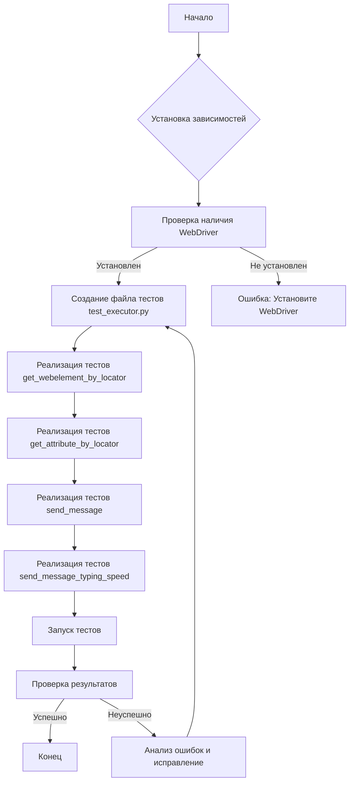
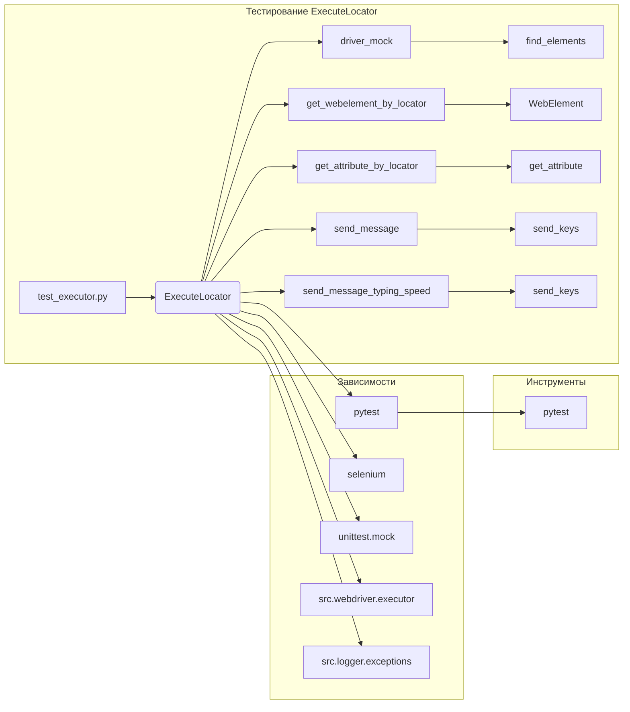

# Руководство по тестированию класса `ExecuteLocator`

## <input code>

```python
import pytest
from unittest.mock import MagicMock, patch
from selenium.webdriver.remote.webelement import WebElement
from selenium.webdriver.common.by import By

from src.webdriver.executor import ExecuteLocator
from src.logger.exceptions import ExecuteLocatorException

@pytest.fixture
def driver_mock():
    return MagicMock()

@pytest.fixture
def execute_locator(driver_mock):
    return ExecuteLocator(driver_mock)

# Примеры тестов для методов класса ExecuteLocator
def test_get_webelement_by_locator_single_element(execute_locator, driver_mock):
    pass  # Реализация теста

def test_get_webelement_by_locator_multiple_elements(execute_locator, driver_mock):
    pass  # Реализация теста

def test_get_webelement_by_locator_no_element(execute_locator, driver_mock):
    pass  # Реализация теста

def test_get_attribute_by_locator(execute_locator, driver_mock):
    pass  # Реализация теста

def test_send_message(execute_locator, driver_mock):
    pass  # Реализация теста

def test_send_message_typing_speed(execute_locator, driver_mock):
    pass  # Реализация теста
```

```
## <algorithm>

**Блок-схема** (неполная, т.к. реализации тестов не предоставлены):



**Пример перемещения данных:**

1. Тест `test_get_webelement_by_locator_single_element` получает `execute_locator` и `driver_mock` из фикстур.
2. Внутри теста создается mock-объект `element` и настраивается `driver_mock.find_elements` для возврата этого элемента.
3. `execute_locator.get_webelement_by_locator` вызывает `driver_mock.find_elements`, передавая ему локатор.
4. Результат (`element` или `False`) возвращается из метода и сравнивается с ожидаемым значением в тесте.


## <mermaid>



## <explanation>

**Импорты:**

- `pytest`: Библиотека для написания и запуска тестов.
- `unittest.mock`: Библиотека для создания mock-объектов, необходимых для имитации поведения объектов.
- `selenium.webdriver.remote.webelement`: Модуль Selenium WebDriver для работы с веб-элементами.
- `selenium.webdriver.common.by`: Модуль Selenium WebDriver для определения способов поиска веб-элементов (например, по XPath).
- `src.webdriver.executor`:  Это класс `ExecuteLocator`, который находится в пакете `webdriver` в подпапке `src` проекта.
- `src.logger.exceptions`: содержит классы исключений, используемые для обработки ошибок.


**Классы:**

- `ExecuteLocator`:  Класс для работы с веб-элементами через Selenium WebDriver.  Атрибуты (возможно) - ссылка на объект webdriver. Методы - для поиска элементов, получения атрибутов, отправки сообщений. Взаимодействие происходит с объектом `driver_mock` (моком `webdriver`).

**Функции:**

- `test_get_webelement_by_locator_single_element`:  Тест для метода `get_webelement_by_locator` для случая поиска одного элемента.
- `test_get_webelement_by_locator_multiple_elements`: Тест для метода `get_webelement_by_locator` для случая поиска нескольких элементов.
- `test_get_webelement_by_locator_no_element`: Тест для метода `get_webelement_by_locator` для случая, когда элемент не найден.
- `test_get_attribute_by_locator`: Тест для метода `get_attribute_by_locator`.
- `test_send_message`: Тест для метода `send_message`.
- `test_send_message_typing_speed`: Тест для метода `send_message` с определенной скоростью.
- `driver_mock`, `execute_locator`:  Фикстуры для создания и подготовки объектов для тестов (mock webdriver и экземпляра `ExecuteLocator`).

**Переменные:**

- `locator`: Словарь, содержащий информацию о локаторе элемента (тип поиска и селектор).
- `message`: Строка, которую нужно отправить в качестве текста.
- `typing_speed`: Скорость ввода (задержка между символами).
- `continue_on_error`:  Флаг, указывающий, нужно ли продолжать выполнение при ошибке.

**Возможные ошибки или улучшения:**

- **Не реализованы методы:** Тесты для методов `get_webelement_by_locator`, `get_attribute_by_locator` и `send_message` просто заполнены `pass` и не содержат логики проверки.
- **Зависимости от `driver_mock`:** Тесты полагаются на `MagicMock` для подмены реального `WebDriver`.  Это хорошо для изоляции тестов, но требует реализации mock-объектов.
- **Не хватает документации:** Не хватает детального описания самих методов `ExecuteLocator`.


**Цепочка взаимосвязей:**

Тесты `test_executor.py` в папке `tests` напрямую взаимодействуют с классом `ExecuteLocator` из пакета `src.webdriver.executor`, использую фикстуры `driver_mock` и `execute_locator` для создания mock-объекта `WebDriver` и его инициализации. Также в тестах используются методы из пакета `src.logger.exceptions` для обработки возможных ошибок. `pytest` используется для запуска тестов.