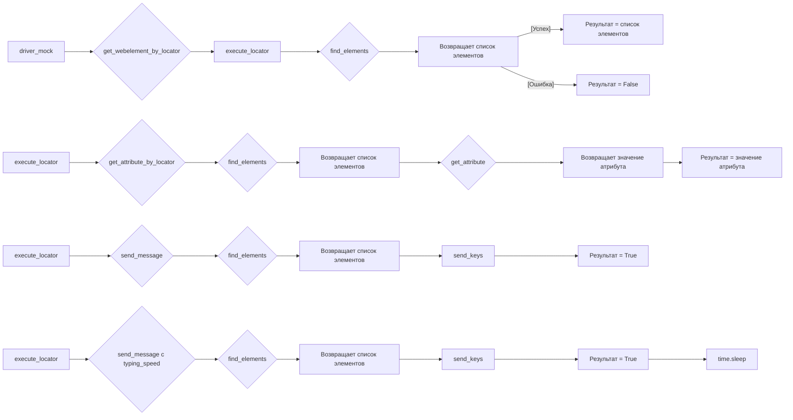

# <input code>

```python
## \file hypotez/src/webdriver/_pytest/test_executor.py
# -*- coding: utf-8 -*-
#! venv/Scripts/python.exe
#! venv/bin/python/python3.12

"""
.. module:: src.webdriver._pytest 
	:platform: Windows, Unix
	:synopsis:

"""


"""
	:platform: Windows, Unix
	:synopsis:

"""


"""
	:platform: Windows, Unix
	:synopsis:

"""


"""
  :platform: Windows, Unix

"""
"""
  :platform: Windows, Unix
  :platform: Windows, Unix
  :synopsis:
"""
  
""" module: src.webdriver._pytest """


""" Фикстуры:
driver_mock: создает фиктивный объект веб-драйвера.
execute_locator: создает экземпляр класса ExecuteLocator с фиктивным веб-драйвером.
#Тесты:
 - test_get_webelement_by_locator_single_element: Проверяет получение одного элемента.
 - test_get_webelement_by_locator_multiple_elements: Проверяет получение нескольких элементов.
 - test_get_webelement_by_locator_no_element: Проверяет случай, когда элемент не найден.
 - test_get_attribute_by_locator: Проверяет получение атрибута элемента.
 - test_send_message: Проверяет отправку сообщения элементу.
 - test_send_message_typing_speed: Проверяет отправку сообщения элементу с задержкой между символами.
"""

import pytest
from unittest.mock import MagicMock, patch, create_autospec
from selenium.webdriver.remote.webelement import WebElement
from selenium.webdriver.common.by import By
from selenium.webdriver.common.action_chains import ActionChains
from selenium.common.exceptions import NoSuchElementException, TimeoutException

from src.webdriver.executor import ExecuteLocator
from src.logger.exceptions import ExecuteLocatorException

@pytest.fixture
def driver_mock():
    return MagicMock()

@pytest.fixture
def execute_locator(driver_mock):
    return ExecuteLocator(driver_mock)

# ... (тесты)
```

# <algorithm>

Этот код представляет собой набор тестов для класса `ExecuteLocator`.  Алгоритм работы тестов основан на проверке поведения метода `get_webelement_by_locator` и `send_message` при разных входных данных, используя мокинг для имитации веб-драйвера и элементов.

**1. Инициализация:**

* Создается фикстура `driver_mock`, которая имитирует веб-драйвер.
* Создается фикстура `execute_locator`, которая инициализируется с `driver_mock`.

**2. Проверка `get_webelement_by_locator` с одним элементом:**

* Метод `find_elements` мока `driver_mock` возвращает список из одного элемента.
* Тест проверяет, что `find_elements` был вызван с корректным локатором.
* Проверяется, что возвращаемый элемент соответствует ожидаемому.

**3. Проверка `get_webelement_by_locator` с множеством элементов:**

* Метод `find_elements` мока `driver_mock` возвращает список из нескольких элементов.
* Тест проверяет, что `find_elements` был вызван с корректным локатором.
* Проверяется, что возвращаемый список элементов соответствует ожидаемому.

**4. Проверка `get_webelement_by_locator` с отсутствием элементов:**

* Метод `find_elements` мока `driver_mock` возвращает пустой список.
* Тест проверяет, что `find_elements` был вызван с корректным локатором.
* Проверяется, что возвращаемое значение равно `False`.

**5. Проверка `get_attribute_by_locator`:**

* Метод `find_elements` возвращает список, содержащий один элемент.
* Метод `get_attribute` возвращает заданную строку.
* Тест проверяет, что `find_elements` и `get_attribute` были вызваны с корректными параметрами.
* Проверяется, что возвращаемое значение соответствует ожидаемому.

**6. Проверка `send_message`:**

* Метод `find_elements` возвращает список, содержащий один элемент.
* Тест проверяет, что `find_elements` был вызван с корректным локатором.
* Метод `send_keys` был вызван с переданным сообщением.
* Проверяется, что возвращаемое значение равно `True`.


**7. Проверка `send_message` с `typing_speed`:**

* Метод `find_elements` возвращает список, содержащий один элемент.
* Тест проверяет, что `find_elements` был вызван с корректным локатором.
* Метод `send_keys` был вызван с переданным сообщением с использованием `patch` для имитации задержек.
* Тест проверяет, что `time.sleep` был вызван с заданной скоростью ввода.
* Проверяется, что возвращаемое значение равно `True`.

Данные передаются между фикстурами и методами, используя аргументы и возвращаемые значения.


# <mermaid>




# <explanation>

**Импорты:**

* `pytest`: Для написания тестов.
* `unittest.mock`: Для создания моков (фиктивных объектов) для тестирования.
* `selenium.webdriver.remote.webelement`:  Для работы с элементами веб-страницы.
* `selenium.webdriver.common.by`: Для определения локаторов элементов (XPATH, CSS, и др).
* `selenium.webdriver.common.action_chains`: Для работы с действиями над элементами (например, наведение курсора).
* `selenium.common.exceptions`:  Для обработки исключений, связанных с Selenium.
* `src.webdriver.executor`: Импортирует класс `ExecuteLocator`, который, вероятно, отвечает за взаимодействие с веб-драйвером и выполнение действий над элементами.
* `src.logger.exceptions`: Вероятно, содержит классы исключений, используемые для обработки ошибок при взаимодействии с веб-драйвером.

**Классы:**

* `ExecuteLocator`:  Этот класс отвечает за взаимодействие с веб-драйвером и выполнение действий над элементами. В данном файле показаны только тесты, а не сам класс.


**Функции:**

* `driver_mock()`:  Фикстура, возвращает мок объекта `webdriver` для тестирования.
* `execute_locator(driver_mock)`: Фикстура, создаёт экземпляр `ExecuteLocator` с переданным `driver_mock`.
* Тесты (например, `test_get_webelement_by_locator_single_element`):  Это тесты, проверяющие работу методов класса `ExecuteLocator`. Они принимают `execute_locator` и `driver_mock` в качестве аргументов и проверяют, что методы класса вызываются правильно и возвращают ожидаемые результаты.

**Переменные:**

* `MODE`: Строковая константа, которая определяет режим работы (например, 'dev' или 'prod').
* `locator`: Словарь, содержащий информацию о локаторе элемента (например, тип локатора и селектор).
* `message`: Строка, содержащая текст, который должен быть отправлен элементу.
* `typing_speed`: Вещественное число, определяющее скорость набора текста.


**Возможные ошибки или области для улучшений:**

* **Отсутствие документации:** Класс `ExecuteLocator` и его методы могут нуждаться в подробной документации, чтобы разработчики могли лучше понять их назначение и работу.
* **Сложные логеры:**  Текущий код не использует логгирование.  Добавление логгирования в `ExecuteLocator` позволило бы отслеживать выполнение кода и отлавливать ошибки.


**Цепочка взаимосвязей:**

`hypotez/src/webdriver/_pytest/test_executor.py` тестирует `src.webdriver.executor.ExecuteLocator` и использует `pytest`, `selenium` и `unittest.mock` для этого.  Эти инструменты и класс  `ExecuteLocator` могут использоваться в других частях проекта, где требуется автоматизировать взаимодействие с веб-браузерами.