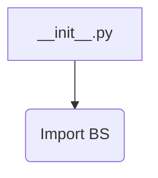
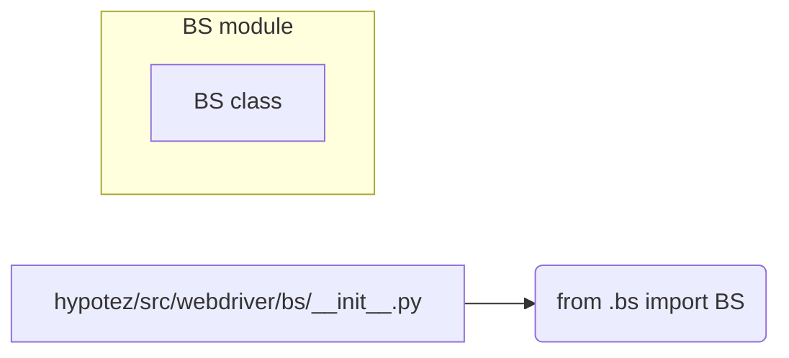

# <input code>

```python
## \file hypotez/src/webdriver/bs/__init__.py
# -*- coding: utf-8 -*-\

#! venv/bin/python/python3.12

"""
.. module:: src.webdriver.bs 
	:platform: Windows, Unix
	:synopsis:

"""


from .bs import BS
```

# <algorithm>

Поскольку файл `__init__.py` представляет собой инициализацию модуля, в нем нет сложной логики.  Он просто импортирует класс `BS` из подмодуля `bs`.  Блок-схема будет очень простой:



В данном случае, данные не перемещаются между функциями или классами, так как файл содержит лишь одну операцию импорта.

# <mermaid>



# <explanation>

* **Импорты**: Файл `__init__.py` в папке `hypotez/src/webdriver/bs` отвечает за инициализацию подмодуля `bs`. `from .bs import BS` импортирует класс `BS` из файла `hypotez/src/webdriver/bs/bs.py`.  Символ `.` перед именем модуля указывает, что импортируется модуль из текущей папки. Это стандартный подход для организации модулей в Python.

* **Классы**:  Класс `BS` определен в файле `bs.py` (который не показан, но подразумевается). Роль этого класса не может быть определена без просмотра его реализации в `bs.py`.  Например, это может быть класс для взаимодействия с браузером, работы с веб-страницей,  или что-то другое, связанное с веб-драйвером.

* **Функции**: В `__init__.py` нет собственных функций.  Все функции, которые могут быть доступны, находятся в классе `BS` (из `bs.py`).


* **Переменные**: `` - это константа, хранящая строку 'dev'. Вероятно, используется для настройки режима работы (например, 'dev', 'prod').  Значение этой константы доступно в подмодуле `bs` и, возможно, используется в методах класса `BS` для управления поведением.

* **Возможные ошибки или области для улучшений**: Нет явных ошибок в данном коде.  Однако, без реализации класса `BS` нельзя оценить потенциал для улучшений.  Например, если класс `BS` содержит методы, принимающие аргументы, то в `__init__.py` не хватает комментариев, которые объяснили бы, как класс `BS` может быть использован. Также не хватает описания того, для чего именно нужен `MODE`.

* **Взаимосвязи с другими частями проекта**:  `bs.py`, а значит и  `__init__.py`,  вероятно, используется как часть более сложного проекта, связанного с автоматизацией веб-тестирования или работой с веб-драйвером (например, Selenium). Файл `__init__.py` служит для организации доступа к классу `BS` из других частей проекта. Подключаемые зависимости, которые являются необходимыми для работы данного кода, зависят от реализации класса `BS` (например, Selenium или другая библиотека веб-драйвера).  Без доступа к исходному коду `hypotez/src/webdriver/bs/bs.py` нельзя точно указать все зависимости.


В целом, код `__init__.py` выполняет базовые функции модуля: импортирует нужные классы и константы, что способствует организации кода и его модульности. Для более глубокой оценки, необходимо изучить код класса `BS` в файле `bs.py`.