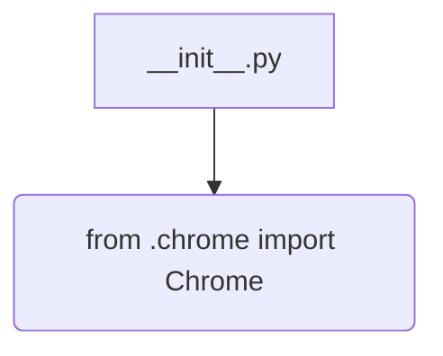
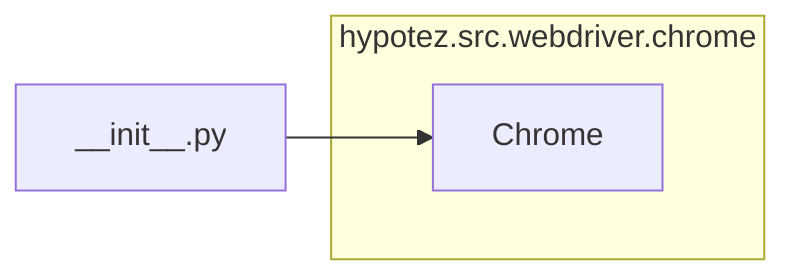

```MD
# Анализ кода hypotez/src/webdriver/chrome/__init__.py

## <input code>

```python
## \file hypotez/src/webdriver/chrome/__init__.py
# -*- coding: utf-8 -*-\

#! venv/bin/python/python3.12

"""
.. module:: src.webdriver.chrome 
	:platform: Windows, Unix
	:synopsis:

"""

from .chrome import Chrome
```

## <algorithm>

Этот код представляет собой модуль инициализации для пакета `webdriver/chrome`.  Он не содержит сложного алгоритма.  В нем только импортируется класс `Chrome` из подмодуля `chrome`.  Поскольку это `__init__.py` файл, он играет роль точки входа для использования модуля `chrome` в других частях проекта.  Блок-схема простая:



* **Шаг 1**: Модуль `__init__.py` импортирует класс `Chrome`.

* **Пример**:  Если в другом модуле проекта нужно использовать класс `Chrome`, он будет импортирован через `from hypotez.src.webdriver.chrome import Chrome`.


## <mermaid>




## <explanation>

**Импорты:**

* `from .chrome import Chrome`: Этот импорт подключает класс `Chrome` из подмодуля `chrome` того же пакета. Символ `.` перед `chrome` указывает, что `chrome` находится в текущем пакете `webdriver/chrome`. Это стандартный способ импортировать ресурсы из вложенных модулей Python.  Это ключевая часть структуры пакета, облегчающая организацию и повторное использование кода.

**Классы:**

* `Chrome`:  Этот класс, определенный в `hypotez/src/webdriver/chrome/chrome.py`,  предполагает реализацию работы с браузером Chrome.  Без просмотра кода `chrome.py`, мы можем лишь предположить, что он содержит атрибуты для управления браузером, настройки, или взаимодействия с различными инструментами веб-драйвера.

**Функции:**

Нет функций в этом файле, только импорт.

**Переменные:**

Нет переменных.

**Возможные ошибки или области для улучшений:**

* **Документация:**  Дополнительно к текущей `docstring`, рекомендуется добавить более детальную документацию (например, использование типа `sphinx`)  к классу `Chrome` в `chrome.py`.  Это позволит другим разработчикам понять его назначение и использование.

* **Проверка зависимостей:**  Нет явных зависимостей, но в реальном проекте, следует учитывать, что  `Chrome` может зависеть от библиотек веб-драйвера.  В этом случае, необходимо учитывать эти зависимости.

**Цепочка взаимосвязей:**

Этот модуль `__init__.py` служит связующим звеном между другими частями проекта, использующими webdriver.  Например, если в другом модуле будет импортирован класс `Chrome` через `from hypotez.src.webdriver.chrome import Chrome`,  это укажет на использование модуля WebDriver для Chrome. Далее, при выполнении кода, происходит импорт самого `Chrome` класса из файла `hypotez/src/webdriver/chrome/chrome.py`. Этот файл, вероятно, имеет зависимости от библиотек веб-драйвера (например, Selenium), и от других модулей, содержащих логику работы с веб-страницами.