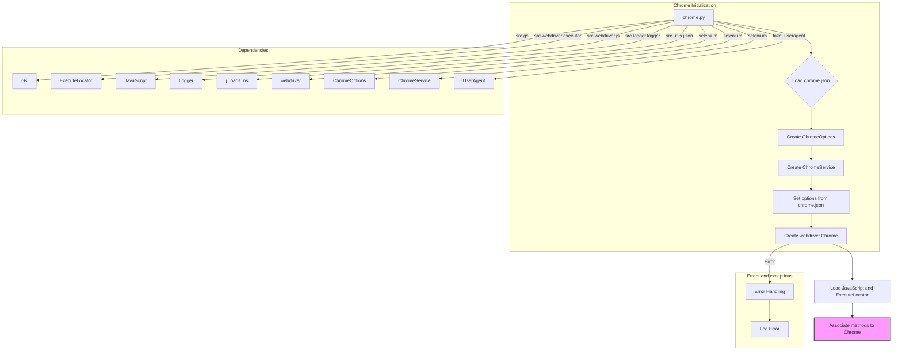

# <input code>

```python
## \file hypotez/src/webdriver/chrome/chrome.py
# -*- coding: utf-8 -*-\

#! venv/bin/python/python3.12

"""
Module for Chrome WebDriver
=========================================================================================

This module contains a custom implementation of the Chrome WebDriver using Selenium. It integrates
configuration settings defined in the `chrome.json` file, such as user-agent and browser profile settings,
to enable flexible and automated browser interactions.

Key Features:
    - Centralized configuration via JSON files.
    - Support for multiple browser profiles.
    - Enhanced logging and error handling.

Example usage
--------------------

Example of using the `Chrome` class:

.. code-block:: python

    from src.webdriver.chrome import Chrome

    # Initialize Chrome WebDriver with user-agent settings
    browser = Chrome(user_agent='Mozilla/5.0...')
    browser.get("https://www.example.com")
    browser.quit()
"""


import os
import sys
from pathlib import Path
from typing import Optional
from types import SimpleNamespace
from selenium import webdriver
from selenium.webdriver.chrome.service import Service as ChromeService
from selenium.webdriver.chrome.options import Options as ChromeOptions
from fake_useragent import UserAgent
from selenium.common.exceptions import WebDriverException

import header
from src import gs
from src.webdriver.executor import ExecuteLocator
from src.webdriver.js import JavaScript
from src.utils.jjson import j_loads_ns
from src.logger.logger import logger


class Chrome(webdriver.Chrome):
    """Class for Chrome WebDriver."""

    _instance = None
    driver_name: str = 'chrome'
    config: SimpleNamespace

    def __new__(cls, *args, **kwargs):
        """Ensure a single instance of Chrome WebDriver.

        If an instance already exists, it calls `window_open()`.

        Returns:
            Chrome: The singleton instance of the Chrome WebDriver.
        """
        if cls._instance is None:
            cls._instance = super().__new__(cls)
        else:
            cls._instance.window_open()  # Open a new window if instance already exists
        return cls._instance

    def __init__(self, user_agent: Optional[str] = None, *args, **kwargs):
        """Initializes the Chrome WebDriver with specified options and profile.

        Args:
            user_agent (Optional[str]): The user-agent string to be used. Defaults to a random user agent.
        """
        # ... (rest of the code)
```

# <algorithm>

**Шаг 1: Инициализация**
1. Проверяется, существует ли уже экземпляр класса `Chrome`. Если нет, создается новый экземпляр с помощью `super().__new__(cls)`.  В противном случае вызывается метод `window_open()` на существующем экземпляре.
2. Выполняется загрузка настроек из файла `chrome.json` с помощью `j_loads_ns()`.
3. Создается объект `ChromeOptions()` для настройки параметров браузера.
4. Создается объект `ChromeService()` для управления Chrome WebDriver. Если указан `binary_location`, то используется путь из настроек.

**Шаг 2: Настройка опций**
1. Если задан `user_agent`, используется он, иначе генерируется случайный `user_agent` с помощью `UserAgent()`.
2. Если в `chrome.json` есть настройки, задаются параметры браузера (`options`, `headers`).
3. Устанавливается `user-data-dir` из настроек.
4. Устанавливается `binary_location` из настроек.

**Шаг 3: Создание драйвера**
1. Создается экземпляр `webdriver.Chrome` с заданными `options` и `service`.
2. Обработка исключений `WebDriverException` и общих ошибок при инициализации.

**Шаг 4: Загрузка дополнительных функций**
1. Создаются экземпляры `JavaScript` и `ExecuteLocator`.
2. Назначаются методы `JavaScript` и `ExecuteLocator` текущему экземпляру `Chrome` для доступа к их функциональности.

**Пример данных:**

*   `chrome.json`: `{"options": {"headless": true}, "profile_directory": {"testing": "%APPDATA%/chrome_profile"}, "binary_location": {"binary": "%LOCALAPPDATA%/chrome/Application"}}`
*   Входные данные: `user_agent = "Custom User-Agent"`
*   Выходные данные: Экземпляр класса `Chrome` с настроенными параметрами, и связанными JavaScript/Locator методами.

# <mermaid>



# <explanation>

**Импорты:**

*   `os`, `sys`, `pathlib`: Стандартные модули Python для работы с операционной системой и файлами.
*   `typing`, `types`, `Optional`: Типы данных и инструменты для типов Python.
*   `selenium`, `selenium.webdriver.chrome.service`, `selenium.webdriver.chrome.options`: Библиотека Selenium для работы с веб-драйверами, в частности, с Chrome.
*   `fake_useragent`:  Библиотека для генерации случайных user-agent строк.
*   `header`: Возможно, содержит собственные определения для проекта (необходимо уточнение).
*   `gs`, `src.webdriver.executor`, `src.webdriver.js`, `src.utils.jjson`, `src.logger.logger`: Модули из других частей проекта.  Они предоставляют инструменты, вероятно, связанные с конфигурацией, логгированием, выполнением скриптов JavaScript и обработкой locators.

**Классы:**

*   `Chrome(webdriver.Chrome)`: Наследуется от Selenium `webdriver.Chrome`.  Реализует singleton паттерн, гарантируя, что создается только один экземпляр WebDriver.  Инициализирует WebDriver с настройками из `chrome.json`, включая user-agent и профиль браузера. Добавляет дополнительные методы для взаимодействия с браузером, например,  js-вызовы, обработку locator-ов.
*   `JavaScript`, `ExecuteLocator`: Классы,  вероятно, обеспечивающие методы для выполнения JavaScript-кода в браузере и работы с `locators` соответственно. Они предоставляют интерфейс для взаимодействия с драйвером Chrome.

**Функции:**

*   `__new__(cls, *args, **kwargs)`: Статический метод класса, который реализует singleton паттерн, гарантируя, что создается только один экземпляр класса. Если экземпляр уже существует, возвращает его, в противном случае создает новый.
*   `__init__(self, user_agent=None, *args, **kwargs)`:  Инициализирует экземпляр класса `Chrome`. Загружает настройки из `chrome.json`, создает экземпляры `ChromeOptions` и `ChromeService`.
*   `normalize_path(path: str) -> str`:  Функция для обработки строк путей, которые могут содержать переменные окружения (например, %APPDATA%).
*   `_payload(self) -> None`: Назначает методы JavaScript и ExecuteLocator экземпляру Chrome.

**Переменные:**

*   `config`: Содержит настройки, загруженные из файла `chrome.json`.
*   `driver_name`:  Название драйвера, используется в логике (например, 'chrome').
*   `user_agent`:  Строка user-agent браузера.

**Возможные ошибки и улучшения:**

*   **Обработка ошибок:**  Код содержит много `try...except` блоков, но некоторые части обработкой ошибок, по-видимому, недостаточно ясны. Нужно более точно указать, какие типы исключений ожидаются и как они обрабатываются.

*   **Чтение из файлов:** Должна быть логика проверки существования и корректности файла `chrome.json`.

*   **Документация:** Документация может быть улучшена, более подробные комментарии к функциям и классам.

*   **Логирование:** Логирование, возможно, не максимально эффективно. Рассмотреть использование уровней логов (debug, info, warning, error, critical) для различения важности сообщений.

*   **Переменные окружения:** Используются переменные окружения (`%APPDATA%`, `%LOCALAPPDATA%`).  Необходимо убедиться, что эти переменные определены на всех системах, где будет использоваться код, или найти альтернативы, чтобы код был более портативным.


**Взаимосвязи с другими частями проекта:**

Код использует различные модули из `src` (например, `gs`, `JavaScript`, `ExecuteLocator`, `j_loads_ns`, `logger`), что указывает на его интеграцию в более крупный проект.  Конкретные взаимосвязи зависят от функциональности `gs`, `JavaScript`, `ExecuteLocator`, `j_loads_ns` и `logger`.