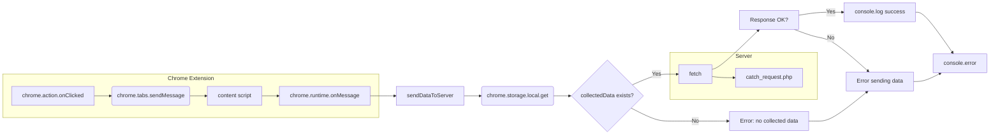

```MD
# Анализ кода background.js

## <input code>

```javascript
// background.js

chrome.action.onClicked.addListener((tab) => {
    chrome.tabs.sendMessage(tab.id, { action: 'collectData', url: tab.url });
});

/**
 * This function listens for messages sent from other parts of the extension, 
 * such as content scripts or other background scripts, using the `chrome.runtime.sendMessage()` method.
 * 
 * Here's a breakdown of what each part does:
 * 
 * - `chrome.runtime.onMessage.addListener()`: This function sets up a listener for messages sent from other parts of the extension.
 * - `(message, sender, sendResponse) => { ... }`: This is an arrow function that defines what should happen when a message is received. It takes three parameters:
 *   - `message`: The message object sent from the sender.
 *   - `sender`: Information about the sender of the message, such as its ID and whether it is a tab or another extension.
 *   - `sendResponse`: A function that can be used to send a response back to the sender if needed.
 * - `if (message.action === 'collectData') { ... }`: This condition checks if the received message has a property named `action` with a value of `'collectData'`. This is often used to determine the purpose or type of the message.
 * - `sendDataToServer(message.url)`: If the received message has an action of `'collectData'`, this function calls another function named `sendDataToServer()` and passes the URL from the message as an argument. This typically triggers some action or behavior in response to the received message.
 * 
 * In summary, this function listens for messages with the action `'collectData'`, and when such a message is received, it triggers the `sendDataToServer()` function, presumably to collect data and send it to a server.
 */
chrome.runtime.onMessage.addListener((message, sender, sendResponse) => {
    if (message.action === 'collectData') {
        sendDataToServer(message.url);
    }
});

function sendDataToServer(url) {
    const serverUrl = 'http://127.0.0.1/hypotez/catch_request.php'; // Change to your server endpoint
    chrome.storage.local.get('collectedData', (result) => {
        const collectedData = result.collectedData;
        if (collectedData) {
            fetch(serverUrl, {
                method: 'POST',
                headers: {
                    'Content-Type': 'application/json'
                },
                body: JSON.stringify(collectedData)
            })
                .then(response => {
                    if (!response.ok) {
                        throw new Error('Failed to send data to server');
                    }
                    console.log('Data sent to server successfully');
                })
                .catch(error => {
                    console.error('Error sending data to server:', error);
                });
        } else {
            console.error('No collected data found');
        }
    });
}
```

## <algorithm>

**Блок-схема:**

```mermaid
graph TD
    A[Клик по иконке расширения] --> B{Проверка наличия URL};
    B -- Да -> C[Отправка сообщения в активную вкладку];
    B -- Нет -> D[Ошибка];
    C --> E[Прием сообщения в активной вкладке];
    E --> F{Проверка типа сообщения};
    F -- "collectData" -> G[Вызов sendDataToServer];
    F -- Другое -> H[Отклонение];
    G --> I[Получение данных из хранилища];
    I --> J{Данные существуют?};
    J -- Да -> K[Отправка данных на сервер];
    J -- Нет -> L[Ошибка - нет данных];
    K --> M[Успех];
    M --> N[Вывод в консоль];
    K -- Ошибка -> O[Вывод ошибки в консоль];
    L --> P[Вывод ошибки в консоль];
    D --> Q[Вывод ошибки в консоль];
    H --> Q;
```

**Примеры:**

- Если пользователь кликнул по иконке расширения на странице с URL `https://example.com`, то в активную вкладку будет отправлено сообщение `collectData` с URL.
- Если в хранилище `collectedData` нет данных, то на сервер ничего не будет отправлено.
- Если при отправке на сервер произойдёт ошибка, то об этом будет выведено сообщение об ошибке в консоль.


## <mermaid>



## <explanation>

**Импорты:**

В данном коде отсутствуют импорты в традиционном понимании. Используются API расширений Chrome:
- `chrome.action.onClicked`: Обработчик кликов по иконке расширения.
- `chrome.tabs.sendMessage`: Отправка сообщений в активные вкладки.
- `chrome.runtime.onMessage`: Обработчик сообщений, отправленных из других частей расширения.
- `chrome.storage.local`: Доступ к хранилищу расширения.
- `fetch`:  Для отправки запросов на сервер.

**Классы:**

Нет явных классов.

**Функции:**

- `chrome.action.onClicked.addListener((tab) => { ... })`:  Обрабатывает клик по иконке расширения. Отправляет сообщение `collectData` в активную вкладку. Аргумент `tab` содержит информацию о вкладке.
- `chrome.runtime.onMessage.addListener((message, sender, sendResponse) => { ... })`:  Обрабатывает сообщения, полученные из других частей расширения. Если тип сообщения `'collectData'`, вызывает `sendDataToServer`.
- `sendDataToServer(url)`: Отправляет данные на сервер. Аргумент `url` используется для определения места отправки.
   - Внутри функции используется `chrome.storage.local.get('collectedData', (result) => { ... })`, чтобы получить данные из хранилища расширения.
   - Если данные существуют (`collectedData`), делает POST-запрос на сервер с этими данными, используя `fetch`.
   - Включает обработку ошибок (`then`/`catch`) для проверки успешности отправки.

**Переменные:**

- `serverUrl`: Строка, содержащая URL сервера.
- `collectedData`: Данные, полученные из хранилища.


**Возможные ошибки/улучшения:**

- **Отсутствие валидации данных:**  Код не проверяет формат данных, которые приходят из хранилища или передаются в `fetch`. Важно убедиться, что данные соответствуют ожидаемому формату на сервере.
- **Обработка ошибок в `fetch`:**  Обработка ошибок при отправке запроса на сервер (например, сетевые ошибки) неполная.  Можно добавить более подробную обработку ошибок.
- **Без проверки успешности отправки данных в storage:** Непонятно, откуда берутся данные в `collectedData`. Нужно добавить логику сбора данных.
- **Изменение адреса сервера:** Желательно использовать константу или переменную для хранения адреса сервера. Изменение адреса сервера в одном месте.
- **Логирование:** Улучшить логирование, чтобы отследить, когда данные были отправлены, и когда произошла ошибка.
- **Отправка ответа:** Добавить  `sendResponse` в `chrome.runtime.onMessage.addListener`. Для подтверждения  что сообщение было обработано.


**Взаимосвязь с другими частями проекта:**

Этот код взаимодействует с `content.js` (или похожим скриптом в вкладке), который отвечает за сбор данных и передачу их в background.js посредством сообщения.  `catch_request.php` (на сервере) обрабатывает полученные данные.  Необходимы скрипты для сбора данных и записи в `collectedData` в `chrome.storage.local`.