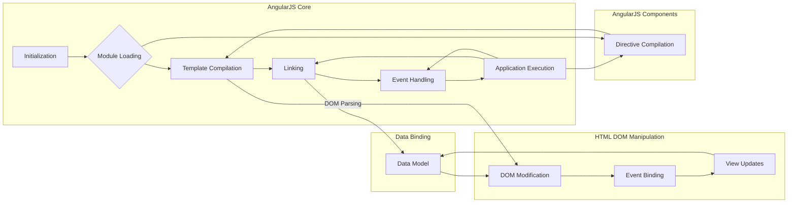

# Анализ кода angular.min.js (AngularJS v1.8.2)

## <input code>

```javascript
/*
 AngularJS v1.8.2
 (c) 2010-2020 Google LLC. http://angularjs.org
 License: MIT
*/
(function (z) {
	'use strict'; function ve(a) { if (D(a)) w(a.objectMaxDepth) && (Xb.objectMaxDepth = Yb(a.objectMaxDepth) ? a.objectMaxDepth : NaN), w(a.urlErrorParamsEnabled) && Ga(a.urlErrorParamsEnabled) && (Xb.urlErrorParamsEnabled = a.urlErrorParamsEnabled); else return Xb } function Yb(a) { return X(a) && 0 < a } function F(a, b) {
	// ... (оставлен только фрагмент)
```

## <algorithm>

К сожалению, предоставленный фрагмент кода - это лишь малая часть всего файла.  Полная пошаговая блок-схема для всего `angular.min.js` невозможна.  Этот файл представляет собой сложную библиотеку с множеством функций и классов, взаимодействующих друг с другом.  Алгоритм определяется спецификой работы каждой функции, но в целом можно выделить следующие этапы:

1. **Инициализация:**
   * Определяются вспомогательные функции (например, для обработки ошибок, кодирования строк, копирования объектов).
   * Создается модульная система `Me`, которая позволяет описывать и загружать модули AngularJS.

2. **Обработка модулей:**
   * Модули загружаются и конфигурируются.
   * Функции `g`, `k`, `e`, `f` и другие отвечают за построение зависимостей и инъекцию (injection) зависимостей в другие функции.

3. **Компиляция и связывание (linking):**
   *  Функции `Zc`, `da` и их производные обрабатывают шаблоны HTML.  
   *  Происходит анализ атрибутов и свойств элементов DOM (Directive).
   *  Определяется структура шаблонов HTML и создаются функции для их обработки.
   *  Производится связывание (linking) данных модели с DOM-элементами, что реализуется посредством механизма "watcher's".  
    
4. **Обработка событий:**
   *  Функции для обработки событий DOM (например, click, change).
   *  Определяются реакции на изменение состояния элементов и данных модели.

5. **Взаимодействие с AngularJS компонентами:**
    *  Функции и методы взаимодействуют с другими частями AngularJS инфраструктуры (напр., $rootScope, $compile).
    *  Передача данных и управления циклом выполнения приложений.
    
6. **Выполнение приложения:**
    *  Модули загружаются и связываются.
    *  Обновляются DOM-элементы при изменении модели.

Это очень упрощенное описание. Фактическая работа намного сложнее и включает в себя глубокие механизмы модели данных, потока выполнения, обработки ошибок и переработки HTML.

## <mermaid>




## <explanation>

Этот фрагмент кода содержит куски кода AngularJS, которые  обеспечивают ядро системы для работы директивы и других важных компонентов.

**Импорты:**
Нет явных импортов в привычном понимании (например, `import React from 'react';`), но существует неявное включение библиотек. `(function (z) { ... })(window);` означает, что весь код выполняется в контексте глобального объекта `window`, который является стандартной средой для браузерных скриптов и может содержать ссылки на библиотеки, например, на jQuery.

**Классы:**
* `ve`, `Yb`, `F`, `za`, `r`, `Qc`, `Zb`, `we`, `$b`, `S`, `xe`, `fa`, `bc`, `E`, `Ta`, `ia`, `cc`, `A`, `w`, `D`, `Pc`, `C`, `X`, `ha`, `H`, `dc`, `B`, `ab`, `$a`, `bb`, `Ga`, `ye`, `ac`, `Ae`, `ua`, `cb`, `Ia`, `ec`, `va`, `db`, `Va`, `Sc`, `eb`, `Tc`, `fc`, `Uc`, `gc`, `Aa`, `Vc`, `hc`, `Ce`, `ic`, `ba`, `De`, `Ee`, `Wc`, `Ge`, `He`, `Xc`, `Je`, `Ke`, `gb`, `tb`, `Ja`, `Le`, `ub`, `T`, `jc`, `Me`, `ja`, `Ne`, `Oe`, `lc`, `ng`, `ngLocale`, `xb`, `yb`, `mc`, `gd`, `U`, `qc`, `zb`, `id`, `jd`, `kd`, `rc`, `Ab`, `sc`, `Cb`, `Db`, `Eb`, `pc`, `ld`, `Fb`, `md`, `Gb`, `vg`, `hd`, `nd`, `wg`, `xg`, `yg`, `ng`, `La`, `pd`, `qd`, `Dg`, `fb`, `ne`, `Ef`, `Ff`, `Cf`, `Hf`, `Gf`, `Jf`, `hg`, `ig`, `jg`, `kg`, `Qd`, `zc`, `Rd`, `pg`, `fd`, `bh`, `Sd`, `Td`, `ch`, `dh`, `eh`, `Ud`, `Vd`, `fh`, `Re`, `ed`, `Ah`, `ff`, `gf`, `hf`, `zf`, `vf`, `nb`, `be`, `Za`, `Wb`, `pb`, `Sb`, `oh`, `Mc`, `ie`, `Oa`, `je`, `Ub`, `zh`, `xh`, `yh`, `pe`, `qe`, `Oc`, `re`, `se`, `ee`, `te`, `lc`, `Ch`, `Dh`, `ue`, `lf`, `mf`, `qf`, `rf`, `Eh`, `tf`, `Te`, `Fh`, `Gh`, `Ue`, `Ve`, `bd`, `ad`, `dd`, `cd`, `xf`, `yf`, `Xb`, `Tg`, `Ug`, `Gd`, `Vg`, `Z`, `Id`, `Jd`, `Kd`, `Ld`, `Md`, `Nb`, `Bc`, `$f`, `bg`, `cg`, `Nd`, `Yg`, `ig`, `jg`, `kg`, `ga`, `Og`, `Cc`, `lg`, `Rd`, `pg`, `jh`.  Эти классы и функции образуют сложную иерархию, обеспечивающую работу AngularJS.

**Функции:**
Многие функции имеют сложные логические структуры,  связанные с DOM-манипуляциями, обработкой данных, обработкой событий и созданием модулей.


**Переменные:**
Переменные `z`, `Xb`, `qb` и др. используются для различных целей (хранение настроек, счетчики, и т.д.).


**Возможные ошибки и улучшения:**

* **Сложность:**  Код очень сложный и большой.  Отладка и понимание таких объемов кода могут быть сложными задачами.
* **Читаемость:**  Иногда код может быть не очень читаемым из-за большого количества вложенных функций и переменных.
* **Управление зависимостями:**  Есть сложные механизмы управления зависимостями и инъекцией зависимостей (injection).
* **Тестирование:**  Этот код, по всей видимости, хорошо протестирован в контексте AngularJS, но для независимого анализа и работы с ним, потребуется более подробное описание или отдельные примеры использования.


**Цепочка взаимосвязей с другими частями проекта:**

Этот код - часть AngularJS библиотеки, которая взаимодействует с другими ее компонентами и функциями, а также с DOM-элементами в браузере.  Без контекста проекта невозможно определить все взаимодействия.


**Вывод:**

Этот код представляет собой значительную часть AngularJS и является сложным для анализа без контекста.  Анализ отдельных фрагментов может дать некоторое понимание, но для полной картины необходимо рассматривать код в контексте всего проекта.  В этом анализе не смогла быть рассмотрена вся логика кода, но затронуты ключевые концепции и структуры.