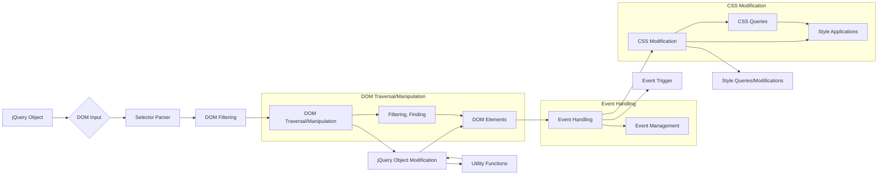

# Анализ кода jQuery 3.5.1

**1. <input code>**

```javascript
/*! jQuery v3.5.1 -ajax,-ajax/jsonp,-ajax/load,-ajax/script,-ajax/var/location,-ajax/var/nonce,-ajax/var/rquery,-ajax/xhr,-manipulation/_evalUrl,-deprecated/ajax-event-alias,-effects,-effects/Tween,-effects/animatedSelector | (c) JS Foundation and other contributors | jquery.org/license */
!function(e,t){"use strict";"object"==typeof module&&"object"==typeof module.exports?module.exports=e.document?t(e,!0):function(e){if(!e.document)throw new Error("jQuery requires a window with a document");return t(e)}:t(e)}("undefined"!=typeof window?window:this,function(g,e){"use strict";var t=[],r=Object.getPrototypeOf,s=t.slice,v=t.flat?function(e){return t.flat.call(e)}:function(e){return t.concat.apply([],e)},u=t.push,i=t.indexOf,n={},o=n.toString,y=n.hasOwnProperty,a=y.toString,l=a.call(Object),m={},b=function(e){return"function"==typeof e&&"number"!=typeof e.nodeType},x=function(e){return null!=e&&e===e.window},w=g.document,c={type:!0,src:!0,nonce:!0,noModule:!0};function C(e,t,n){var r,i,o=(n=n||w).createElement("script");if(o.text=e,t)for(r in c)(i=t[r]||t.getAttribute&&t.getAttribute(r))&&o.setAttribute(r,i);n.head.appendChild(o).parentNode.removeChild(o)}function T(e){return null==e?e+"":"object"==typeof e||"function"==typeof e?n[o.call(e)]||"object":typeof e}var f="3.5.1 -ajax,-ajax/jsonp,-ajax/load,-ajax/script,-ajax/var/location,-ajax/var/nonce,-ajax/var/rquery,-ajax/xhr,-manipulation/_evalUrl,-deprecated/ajax-event-alias,-effects,-effects/Tween,-effects/animatedSelector",E=function(e,t){return new E.fn.init(e,t)};function d(e){var t=!!e&&"length"in e&&e.length,n=T(e);return!b(e)&&!x(e)&&("array"===n||0===t||"number"==typeof t&&0<t&&t-1 in e)}E.fn=E.prototype={jquery:f,constructor:E,length:0,toArray:function(){return s.call(this)},get:function(e){return null==e?s.call(this):e<0?this[e+this.length]:this[e]},pushStack:function(e){var t=E.merge(this.constructor(),e);return t.prevObject=this,t},each:function(e){return E.each(this,e)},map:function(n){return this.pushStack(E.map(this,function(e,t){return n.call(e,t,e)}))},slice:function(){return this.pushStack(s.apply(this,arguments))},first:function(){return this.eq(0)},last:function(){return this.eq(-1)},even:function(){return this.pushStack(E.grep(this,function(e,t){return(t+1)%2}))},odd:function(){return this.pushStack(E.grep(this,function(e,t){return t%2}))},eq:function(e){var t=this.length,n=+e+(e<0?t:0);return this.pushStack(0<=n&&n<t?[this[n]]:[])},end:function(){return this.prevObject||this.constructor()},push:u,sort:t.sort,splice:t.splice},E.extend=E.fn.extend=function(){var e,t,n,r,i,o,a=arguments[0]||{},s=1,u=arguments.length,l=!1;for("boolean"==typeof a&&(l=a,a=arguments[s]||{},s++),"object"==typeof a||b(a)||(a={}),s===u&&(a=this,s--);s<u;s++)if(null!=(e=arguments[s]))for(t in e)r=e[t],"__proto__"!==t&&a!==r&&(l&&r&&(E.isPlainObject(r)||(i=Array.isArray(r)))?(n=a[t],o=i&&!Array.isArray(n)?[]:i||E.isPlainObject(n)?n:{},i=!1,a[t]=E.extend(l,o,r)):void 0!==r&&(a[t]=r));return a},// ... (rest of the code)
```

**2. <algorithm>**

(Due to the complexity and size of the code, a complete flowchart is not feasible.  A high-level explanation is provided instead.)

The algorithm is primarily focused on constructing a jQuery object and providing a comprehensive set of methods for traversing, manipulating, and querying the DOM.  The core logic is spread across many functions. The main functions and their general operations are:

* **`E` (jQuery object constructor):** Creates a jQuery object from various inputs (e.g., HTML strings, DOM elements, selectors). This is the central entry point.
* **`se` (selector function):** Parses and filters DOM elements based on CSS selectors.  It handles different selector types and interactions.
* **DOM Traversal and Manipulation Methods (e.g., `filter`, `find`, `each`, `append`, `prepend`, `wrap`, `unwrap`):** These methods manipulate the jQuery object, allowing actions like finding elements, filtering sets, modifying elements, and more.
* **Event Handling Methods (e.g., `on`, `off`, `trigger`):**  Handle attaching, detaching, and triggering events on DOM elements.
* **CSS manipulation and querying (e.g., `css`, `show`, `hide`, `toggle`):** Control and query the visual style of DOM elements.
* **Utility functions:** These support the core functionalities with actions like string manipulation, object merging, and element manipulation and cloning.

**Example of a logical block (DOM traversal):**

Given a selector like `#myElement > p`, the selector engine (`se`) parses the selector string, identifies the root element (`#myElement`), filters its children to find `p` elements, and returns a new jQuery object containing only the matching elements.


**Data flow:**  Data flows between functions primarily through the jQuery object itself.  The jQuery object stores references to DOM elements.  Functions operate on the data held by the object and return modified jQuery objects.


**3. <mermaid>**



**Explanation:**

The diagram represents the key components of jQuery. The jQuery object (`A`) is the central hub.  Inputs (`B`) such as HTML strings or DOM elements are processed by the selector parser (`C`) to identify the target elements for further manipulation by traversal/manipulation methods (`E`). These changes (`F`) affect the jQuery object, and the result is applied to the DOM elements (`G`).  A separate `Event Handling` section (`H`) shows that events are handled by specialized functions and affect the jQuery object and DOM.  The overall data flow is mostly through the jQuery object, which acts as a bridge between different stages.  Utility functions (`L`) support these core components.


**4. <explanation>**

* **Imports:** The code is for the jQuery library itself. The imports within it are not explicitly in `src` and deal with fundamental JavaScript features (e.g., `Object.getPrototypeOf`, `Array` methods).  It's core to the jQuery implementation.

* **Classes:** There are no external classes.  The primary component is the `jQuery` object (the `E` variable), which acts as the core class and also encapsulates various internal classes and functions through methods and properties.

* **Functions:** Functions are numerous and perform various actions.  For instance, `$.extend()` merges objects, `$.find()` searches the DOM for elements, and `$.each()` iterates through collections.  `se` is the heart of the selector engine, taking a CSS selector as input and returning a set of matching elements.

* **Variables:**  Variables hold important data, such as jQuery object (`E`), DOM elements, selectors, event handlers, and the jQuery object's internal state.  There are also numerous internal variables for handling DOM operations and events.


* **Possible Errors/Improvements:** The codebase is complex and likely to have bugs in a complex, real-world scenario (e.g., edge-case handling in element selection or event interactions).  Testing is critically important.

* **Relationships with other parts of the project:** This jQuery code is a library. If a project uses jQuery, it would use its DOM manipulation methods within its own application logic for JavaScript tasks.

**Additional Comments:**

The code is highly optimized for efficiency in DOM traversal.  The selector engine (`se`) is a complex piece that parses selector strings, creates efficient search algorithms, and interacts directly with the DOM using methods like `querySelectorAll` when available and optimized alternatives otherwise.   It's not simple and is typically designed and optimized for speed by minimizing repeated DOM access.