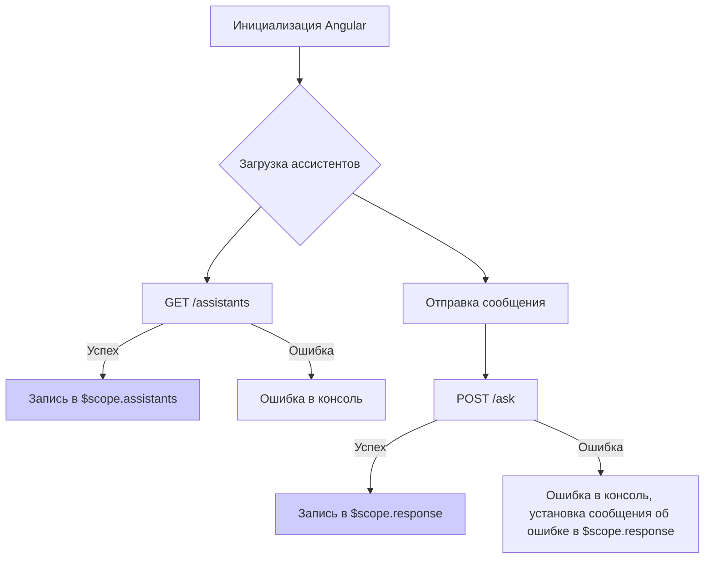

```MD
# Анализ кода popup.js

## <input code>

```javascript
// Инициализируем Angular приложение
const app = angular.module('openaiApp', []);

// Контроллер для обработки логики
app.controller('MainController', function ($scope, $http) {
    $scope.message = '';
    $scope.response = '';
    $scope.assistants = [];
    $scope.selectedAssistant = null;

    // Функция для получения списка ассистентов
    function loadAssistants() {
        const url = 'http://localhost:8000/assistants';  // Создай новый endpoint для получения списка ассистентов
        alert("ASST")
        $http.get(url)
            .then(function (response) {
                $scope.assistants = response.data;  // Список ассистентов
            })
            .catch(function (error) {
                console.error('Ошибка загрузки ассистентов:', error);
            });
    }

    // Загружаем список ассистентов при инициализации
    loadAssistants();

    // Функция для отправки сообщения модели
    $scope.sendMessage = function () {
        const url = 'http://localhost:8000/ask';  // Адрес FastAPI сервера

        const data = {
            message: $scope.message,
            system_instruction: "You are a helpful assistant.",
            assistant_id: $scope.selectedAssistant.id  // Добавляем ID ассистента
        };

        // Отправка POST-запроса через $http (AJAX)
        $http.post(url, data)
            .then(function (response) {
                $scope.response = response.data.response;  // Ответ от сервера
            })
            .catch(function (error) {
                console.error('Ошибка:', error);
                $scope.response = 'Произошла ошибка. Попробуйте позже.';
            });
    };
});
```

## <algorithm>

**Шаг 1:** Инициализируется Angular приложение с модулем `openaiApp`.
**Пример:**  `const app = angular.module('openaiApp', []);`

**Шаг 2:** Создается контроллер `MainController`.
**Пример:** `app.controller('MainController', ...)`

**Шаг 3:**  В контроллере инициализируются переменные: `$scope.message`, `$scope.response`, `$scope.assistants`, `$scope.selectedAssistant`.
**Пример:**  `$scope.message = '';`

**Шаг 4:** Вызывается функция `loadAssistants` для загрузки списка ассистентов с сервера `http://localhost:8000/assistants`.
**Пример:** `loadAssistants();`

**Шаг 5:** Функция `loadAssistants` делает GET-запрос к `/assistants` используя `$http`.
**Пример:** `$http.get(url) ...`

**Шаг 6:** Если запрос успешен, список ассистентов записывается в `$scope.assistants`.
**Пример:** `$scope.assistants = response.data;`

**Шаг 7:** Если запрос неудачен, выводится ошибка в консоль.
**Пример:** `console.error('Ошибка загрузки ассистентов:', error);`

**Шаг 8:** Функция `sendMessage` отправляет POST-запрос к `/ask` с данными о сообщении, системной инструкции и ID выбранного ассистента.
**Пример:** `$scope.sendMessage();`

**Шаг 9:** Функция `sendMessage` формирует объект данных для отправки на сервер.
**Пример:** `const data = {...};`

**Шаг 10:** `$http.post(url, data)` отправляет POST-запрос на `/ask`.
**Пример:** `$http.post(url, data)...`

**Шаг 11:** Если запрос успешен, ответ записывается в `$scope.response`.
**Пример:**  `$scope.response = response.data.response;`

**Шаг 12:** Если запрос неудачен, выводится ошибка и в `$scope.response` устанавливается сообщение об ошибке.
**Пример:**  `$scope.response = 'Произошла ошибка. Попробуйте позже';`


## <mermaid>



## <explanation>

**Импорты:**  В коде нет прямых импортов из других файлов, но используется AngularJS. Это означает, что код предполагает доступность `angular`, `$http` и `$scope` в контексте выполнения.

**Классы:** Нет явных классов. Используется подход с контроллером AngularJS, где данные и логика взаимодействуют через `$scope`.

**Функции:**

* `loadAssistants()`: Загружает список ассистентов с сервера. Принимает на вход URL `/assistants`. Возвращает Promise, обрабатывающий успешное и неудачное завершение запроса.
* `sendMessage()`: Отправляет сообщение на сервер для обработки моделью. Принимает на вход `message` пользователя, `system_instruction` и `assistant_id`. Возвращает Promise, обрабатывающий успешное и неудачное завершение POST-запроса.

**Переменные:**

* `$scope.message`: Хранит сообщение пользователя.
* `$scope.response`: Хранит ответ модели.
* `$scope.assistants`: Массив, хранящий данные о доступных ассистентах.
* `$scope.selectedAssistant`: Хранит выбранного ассистента.

**Возможные ошибки и улучшения:**

* **`http://localhost:8000`:**  Код жестко завязан на локальный сервер. Рекомендуется использование переменной для конфигурации.
* **Обработка ошибок:** Обработка ошибок `$http` должна быть более детальной (например, проверка статусных кодов).
* **`$scope.selectedAssistant`:** Не описано, как этот объект получает значение. Необходимо добавить код, отвечающий за выбор ассистента.
* **Валидация данных:** Необходимо добавить валидацию данных, которые приходят с сервера, чтобы предотвратить ошибки.

**Взаимосвязи с другими частями проекта:**

Код взаимодействует с сервером FastAPI на порту 8000 через API-эндпоинты `/assistants` и `/ask`.  Функция `loadAssistants` получает список доступных ассистентов, а функция `sendMessage` отправляет сообщение для обработки. Подключение к `FastAPI` необходимо для обработки данных на серверной стороне, в том числе для валидации входящих данных.  Необходима связь с UI, где будет возможность отображать и выбирать ассистентов, а также вводить сообщения.