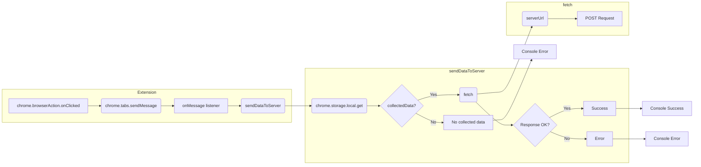

```MD
# Анализ кода background.js

## <input code>

```javascript
// background.js

chrome.browserAction.onClicked.addListener(tab => {
    chrome.tabs.sendMessage(tab.id, { action: 'collectData', url: tab.url });
});

/**
 * 
 * This function listens for messages sent from other parts of the extension, 
 * such as content scripts or other background scripts, using the `chrome.runtime.sendMessage()` method.
*
chrome.runtime.onMessage.addListener((message, sender, sendResponse) => {
    if (message.action === 'collectData') {
        sendDataToServer(message.url);
    }
});

function sendDataToServer(url) {
    const serverUrl = 'http://127.0.0.1/hypotez.online/api/'; // Change to your server endpoint
    chrome.storage.local.get('collectedData', (result) => {
        const collectedData = result.collectedData;
        if (collectedData) {
            fetch(serverUrl, {
                method: 'POST',
                headers: {
                    'Content-Type': 'application/json'
                },
                body: JSON.stringify(collectedData)
            })
                .then(response => {
                    if (!response.ok) {
                        throw new Error('Failed to send data to server');
                    }
                    console.log('Data sent to server successfully');
                })
                .catch(error => {
                    console.error('Error sending data to server:', error);
                });
        } else {
            console.error('No collected data found');
        }
    });
}
```

## <algorithm>

**Блок-схема:**

```mermaid
graph TD
    A[Клик на значок расширения] --> B{Получить текущую вкладку};
    B --> C[Отправить сообщение вьюпорту];
    C --> D{Получить сообщение 'collectData'};
    D -- Да --> E[Вызвать sendDataToServer];
    D -- Нет --> F[Продолжить];
    E --> G[Получить данные из хранилища (collectedData)];
    G -- Да --> H[Отправить POST запрос на сервер];
    H --> I{Успешный ответ?};
    I -- Да --> J[Вывести сообщение об успешной отправке];
    I -- Нет --> K[Вывести сообщение об ошибке];
    G -- Нет --> L[Вывести сообщение об отсутствии данных];
    F --> M[Ожидание сообщений];
```

**Примеры:**

* **Клик на значок:** Пользователь нажимает на значок расширения в браузере.
* **Получить текущую вкладку:** Функция получает информацию о текущей открытой вкладке.
* **Отправить сообщение вьюпорту:** Функция отправляет в текущую вкладку сообщение с действием 'collectData' и URL текущей страницы.
* **Получить сообщение 'collectData':**  Функция ожидает получения сообщения из вкладки.
* **Вызвать sendDataToServer:** Если получено сообщение 'collectData', выполняется функция `sendDataToServer` с полученным URL.
* **Получить данные из хранилища:** Функция извлекает данные, сохранённые в хранилище `chrome.storage.local`.
* **Отправить POST запрос на сервер:** Функция отправляет POST запрос на сервер, используя `fetch` с данными из хранилища.
* **Успешный ответ?**: Проверяется успешность ответа сервера.
* **Вывести сообщение об успешной отправке/ошибке:** Выводятся соответствующие сообщения в консоль.
* **Вывести сообщение об отсутствии данных:** В случае отсутствия данных в хранилище выводится сообщение.


## <mermaid>



**Описание зависимостей:**

* `chrome.browserAction.onClicked`:  Обрабатывает клики на значок расширения.
* `chrome.tabs.sendMessage`:  Отправляет сообщения вьюпорту текущей вкладки.
* `chrome.runtime.onMessage.addListener`:  Принимает сообщения из других частей расширения.
* `chrome.storage.local`:  Доступ к хранилищу данных расширения.
* `fetch`:  Отправка HTTP запросов (в данном случае POST).

## <explanation>

**Импорты:**

В данном коде нет прямых импортов модулей, все функции и объекты предоставляются API Chrome Extension.

**Классы:**

Нет определенных классов.

**Функции:**

* `chrome.browserAction.onClicked.addListener(tab => ...)`: Обработчик клика на значок расширения.  При клике, отправляет сообщение вьюпорту с `action: 'collectData'` и `url` текущей вкладки.
* `chrome.runtime.onMessage.addListener((message, sender, sendResponse) => ...)`: Слушатель сообщений.  Принимает сообщения из других частей расширения, проверяет `message.action === 'collectData'` и если true, вызывает функцию `sendDataToServer` с URL из сообщения. 
* `sendDataToServer(url)`:  Отправляет POST запрос на сервер с данными, извлеченными из хранилища `chrome.storage.local`. Функция принимает URL в качестве аргумента.
    * Использует `chrome.storage.local.get('collectedData', (result) => ...)` для получения данных из хранилища.
    * Использует `fetch` для отправки POST запроса на сервер.
    * Обрабатывает успешный и неуспешный ответ с помощью `then` и `catch`, соответственно, выводит соответствующие сообщения.


**Переменные:**

* `serverUrl`: строка, содержащая URL сервера.
* `collectedData`: данные из хранилища,  которые будут отправлены на сервер.

**Возможные ошибки/улучшения:**

* **Обработка ошибок:**  Важно добавить более подробную обработку ошибок при отправке данных на сервер (например, проверка статуса ответа).
* **Обработка пустых данных:** В коде присутствует проверка `if (collectedData)`, но она должна быть расширена. Необходимо определить, что делать, если `collectedData` не определено или пустое.
* **Асинхронность:** В коде используется `fetch`, который асинхронный, поэтому стоит использовать `async/await` для лучшей читаемости и возможности обработки ошибок в цепочке.
* **Защита от XSS:** Необходимо убедиться, что передаваемые данные очищаются для предотвращения XSS-атак, так как URL может содержать данные от пользователя.

**Взаимосвязи с другими частями проекта:**

Функция `sendDataToServer` предполагает, что  в другом месте расширения (вероятно, в content script или другом background script) данные собираются и сохраняются в `collectedData` в хранилище `chrome.storage.local`.


**Рекомендации по улучшению:**

1. Добавить `async/await` для обработки асинхронных операций.
2. Проверить корректность данных, получаемых из хранилища.
3. Добавить `try...catch` блоки для более детальной обработки ошибок `fetch` и `chrome.storage.local`.
4. Продумать механизм проверки того, что данные корректны.