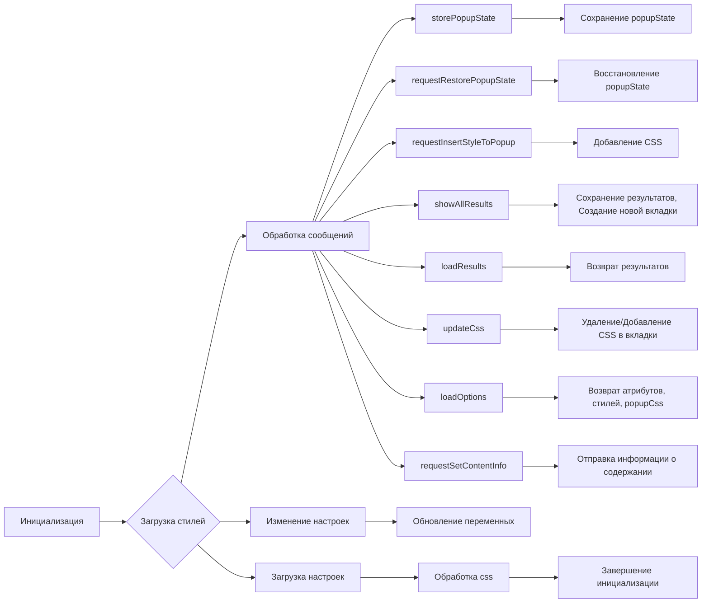

# Анализ кода try_xpath_background.js

## <input code>

```javascript
/* This Source Code Form is subject to the terms of the Mozilla Public
 * License, v. 2.0. If a copy of the MPL was not distributed with this
 * file, You can obtain one at http://mozilla.org/MPL/2.0/. */

(function (window, undefined) {
    "use strict";

    // alias
    var tx = tryxpath;
    var fu = tryxpath.functions;

    var popupState = null;
    var popupCss = "body{width:367px;height:auto;}";
    var results = {};
    var css = "";
    var attributes = {
        "element": "data-tryxpath-element",
        "context": "data-tryxpath-context",
        "focused": "data-tryxpath-focused",
        "focusedAncestor": "data-tryxpath-focused-ancestor",
        "frame": "data-tryxpath-frame",
        "frameAncestor": "data-tryxpath-frame-ancestor"
    };

    function loadDefaultCss() {
        return new Promise((resolve, reject) => {
            var req = new XMLHttpRequest();
            req.open("GET",
                     browser.runtime.getURL("/css/try_xpath_insert.css"));
            req.responseType = "text";
            req.onreadystatechange = function () {
                if (req.readyState === XMLHttpRequest.DONE) {
                    resolve(req.responseText);
                }
            };
            req.send();
        });
    }

    // ... (rest of the code)
```

## <algorithm>

Этот код представляет собой обработчик сообщений для расширения браузера.  Алгоритм работы включает в себя:

1. **Инициализация:**  Определяются глобальные переменные (`popupState`, `popupCss`, `results`, `css`, `attributes`).  Создаётся `genericListener` для обработки сообщений.
2. **Загрузка стилей:** Вызывается `loadDefaultCss()`, который асинхронно загружает CSS из файла `try_xpath_insert.css`.  Используется `XMLHttpRequest` для загрузки.
3. **Обработка сообщений:**  `browser.runtime.onMessage.addListener` регистрирует обработчик `genericListener` для различных событий, полученных от вкладки (всплывающего окна, или других частей расширения).  `genericListener` проверяет `listeners` на соответствие имени события и вызывает соответствующую функцию.
4. **Обработка событий:**  Различные `listeners` в `genericListener.listeners` отвечают за различные действия:
   * `storePopupState`: Сохраняет состояние всплывающего окна.
   * `requestRestorePopupState`: Восстанавливает состояние всплывающего окна.
   * `requestInsertStyleToPopup`: Добавляет CSS в всплывающее окно.
   * `showAllResults`: Сохраняет результаты, создаёт новую вкладку для отображения результатов.
   * `loadResults`: Возвращает результаты запроса.
   * `updateCss`:  Удаляет и добавляет CSS стили в открытые вкладки.
   * `loadOptions`: Возвращает атрибуты, стили и стили всплывающего окна.
   * `requestSetContentInfo`: Устанавливает информацию о содержании.
5. **Изменение настроек:**  `browser.storage.onChanged.addListener` следит за изменениями в хранилище настроек. Если изменяются атрибуты, `css`, или `popupCss`, эти значения обновляются в соответствующих переменных.
6. **Загрузка настроек:** `browser.storage.sync.get` загружает значения `attributes`, `css`, и `popupCss` из хранилища. Если `css` не задано, то загружает из файла по умолчанию.
7. **Завершение инициализации:**  После загрузки, `css` становится доступным.


## <mermaid>



## <explanation>

**Импорты:**

Код использует `tryxpath` и `tryxpath.functions` - скорее всего, это внутренние переменные и функции самого расширения `tryxpath`.  Они не привязаны к определённым пакетам `src.`, а скорее представляют собой внутренние переменные или функции модуля.

**Классы:**

Нет явных классов, только функции.

**Функции:**

*   `loadDefaultCss()`: Загружает CSS из файла `/css/try_xpath_insert.css` с использованием `XMLHttpRequest` и возвращает `Promise`.  Этот метод важен, так как загружает необходимые стили для работы.
*   `genericListener()`: Это основной обработчик сообщений, он проверяет и вызывает другие обработчики на основании типа события.
*   `genericListener.listeners.<событие>`:  Функции-обработчики для различных событий, которые приходят от других частей расширения браузера. (Пример: `genericListener.listeners.showAllResults`).

**Переменные:**

*   `popupState`: Сохраняет состояние всплывающего окна (вероятно, данные об открытых элементах).
*   `popupCss`: CSS для стилизации всплывающего окна.
*   `results`: Хранит результаты поиска XPath.
*   `css`: CSS, который будет применяться к странице.
*   `attributes`: Атрибуты, используемые для взаимодействия с DOM.

**Возможные ошибки/улучшения:**

*   **Обработка ошибок:**  `catch(fu.onError)` используется для обработки ошибок, но не очень понятно, что делает `fu.onError()`.  Следует использовать более подробную обработку ошибок (например, выводить сообщения об ошибках, записывать их в логи).
*   **Переменная `genericListener.listeners`:**  Элементы `genericListener.listeners` не инициализируются с использованием `const`, что может привести к непредвиденному поведению. Использование `const` сделало бы код более безопасным.
*   **Ожидание ответа `browser.storage.sync.get`**:  После `browser.storage.sync.get`, код ожидает `Promise`, но не обрабатывает возможные ошибки при получении данных. Это может привести к непредсказуемому поведению.
*   **Асинхронная операция `loadDefaultCss`**:  Процесс ожидания `loadDefaultCss` не обрабатывает возможные ошибки.
*   **Жесткая кодировка значений:** `popupCss` задано жестко, вместо того, чтобы брать из настроек.


**Взаимосвязь с другими частями проекта:**

Код взаимодействует с другими частями расширения браузера через `browser.runtime.sendMessage` и `browser.tabs.sendMessage`,  получает данные из браузерного хранилища (`browser.storage.sync`).  Функции `browser.runtime.*` и `browser.tabs.*` предполагают, что существуют связанные компоненты расширения, ответственные за отправку и получение сообщений. Файл `/css/try_xpath_insert.css` вероятно содержит стили, используемые расширением. Код ожидает наличие других частей проекта, таких как сервер или backend, которые посылают сообщения о событиях и принимают сообщения о действиях. Код ожидается как часть большей системы, где другие части обеспечивают данные и функциональность, которые он использует.