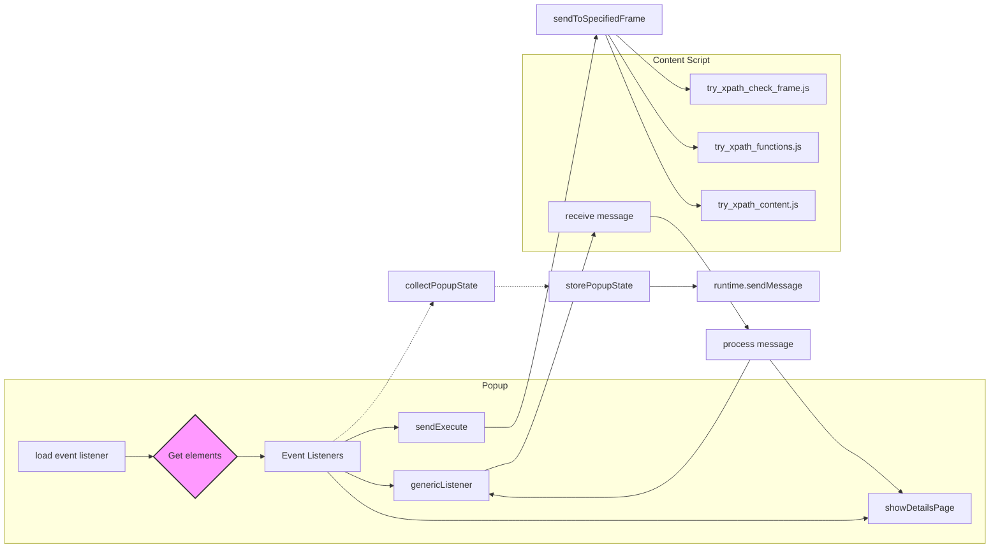

```MD
# Анализ кода popup.js

**1. <input code>**

```javascript
/* This Source Code Form is subject to the terms of the Mozilla Public
 * License, v. 2.0. If a copy of the MPL was not distributed with this
 * file, You can obtain one at http://mozilla.org/MPL/2.0/. */

(function (window) {
    "use strict";

    // alias
    var tx = tryxpath;
    var fu = tryxpath.functions;

    var document = window.document;

    // ... (остальной код)
```

**2. <algorithm>**

К сожалению, построить полную блок-схему для такого большого фрагмента кода затруднительно.  Главный алгоритм - обработка событий, приходящих из контекста (вкладка браузера), и отправка команд/запросов в контекст.  Внутри есть много функций, отвечающих за взаимодействие с DOM, обработку состояний и отправку данных через `browser.tabs.sendMessage`.  Примеры:

* **Обработка клика по кнопке:** При нажатии на кнопку "sendExecute", вызывается функция `sendExecute`, которая отправляет данные (содержащие запросы XPath) в активную вкладку.
* **Обновление таблицы результатов:** Функция `showDetailsPage` обновляет таблицу результатов на основе данных `resultedDetails` (предварительно полученных из контекста).
* **Обработка событий:**  События `onMessage` обрабатываются функцией `genericListener`, которая вызывает соответствующие функции в зависимости от типа сообщения.

Данные перемещаются между функциями и классами через переменные, такие как `resultedDetails`, `relatedTabId`, `executionId`, и передаются в сообщения, которые отправляются в контекст.

**3. <mermaid>**




**4. <explanation>**

* **Импорты:** Нет прямых импортов, но предполагается наличие `tryxpath` и `tryxpath.functions`, которые являются внешними зависимостями (вполне вероятно, что это подключаемый модуль расширения или внутренняя библиотека).

* **Классы:** Нет явных классов, код использует функции и глобальные переменные.

* **Функции:**
    * `sendToActiveTab`: Отправляет сообщение в активную вкладку.
    * `sendToSpecifiedFrame`: Отправляет сообщение в указанную вкладку/кадр. (`getSpecifiedFrameId` используется для выбора кадра).
    * `collectPopupState`: Собрать и вернуть текущее состояние полей ввода.
    * `changeContextVisible`, `changeResolverVisible` и т.д.: Изменение видимости элементов UI.
    * `makeExecuteMessage`: Сборка сообщения, которое содержит данные XPath.
    * `execContentScript`: Выполняет скрипты в контексте страницы.
    * `showError`: Обработка ошибок и обновление сообщений на странице.
    * `showDetailsPage`: Обновляет отображение результатов в таблице.
    * `genericListener`: Обработчик сообщений, полученных из контекста.
    * Все функции, начинающиеся с `change*Visible`, скрывают/отображают блоки контента в зависимости от состояния соответствующего флажка.  `handleExprEnter` обрабатывает нажатие Enter в полях ввода.

* **Переменные:**  `mainWay`, `mainExpression`, `resultedDetails` и т.д. хранят данные, связанные с XPath, результатами, текущим состоянием и конфигурацией.   `invalidTabId`, `invalidFrameId` и т.д. — константы для обозначения отсутствия значения.  `detailsPageSize` задает размер страницы результатов.

* **Возможные ошибки/улучшения:**
    * **Неявные зависимости:** Код полагается на внешние модули `tryxpath` и `tryxpath.functions`. Их отсутствие может привести к ошибкам.
    * **Обработка ошибок:** Функция `showError` существует, но для более надежной работы нужно добавить проверку на существование элементов DOM перед обращением к ним.
    * **Переменные с общими именами:** В коде много однотипных переменных, начинающихся на `context`, `resolver` и т.д. Их можно группировать в объекты для улучшения читабельности и уменьшения вероятности конфликтов имен.
    * **Недостаточная валидация входных данных:**  Функции, работающие с `frameIdExpression` и `frameIdList` могли бы использовать `parseInt` с лучшей обработкой некорректных входных данных.
    * **Кэширование:** Для повышения производительности можно кешировать данные или вызовы функций.
    * **Типизация:** Код мог бы быть более типизированным, чтобы предупреждать о возможных ошибках при использовании.
    * **Обработка пустых массивов:** При обновлении таблицы стоит добавить проверку на пустоту `resultedDetails`.

**Цепочка взаимосвязей:**

Расширение Chrome (popup) получает запросы XPath от пользователя. Оно отправляет их в активную вкладку (в контекст). Контент скрипты (TryXPath), выполняемые в активной вкладке,  обрабатывают запросы, выполняют XPath и возвращают результаты в расширение. Результаты отображаются в popup-окне.