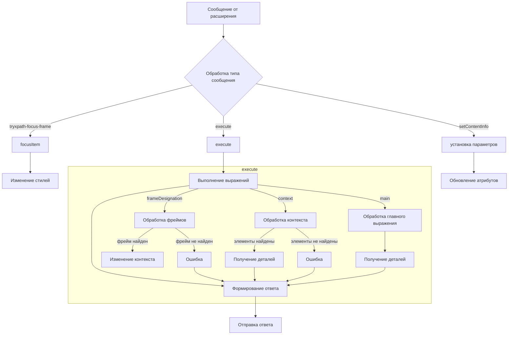

```MD
# Анализ кода try_xpath_content.js

## <input code>

```javascript
/* ... (комментарии) */

(function (window, undefined) {
    // ... (код)
});
```

## <algorithm>

К сожалению, построить полноценную блок-схему для всего кода в формате markdown не представляется возможным.  Код представляет собой сложную функцию, управляющую обработкой сообщений из расширения браузера и взаимодействующую с DOM-элементами.

**Основные блоки алгоритма:**

* **Обработка сообщений:**
    * При получении сообщения, код анализирует его тип.
    * Для разных типов сообщений (например, `tryxpath-focus-frame`, `execute`, `setContentInfo`) вызываются соответствующие обработчики.
* **`execute`:**
    * Обновление стиля.
    * Построение ответа для расширения (создание объекта `sendMsg`).
    * Обработка `frameDesignation`:
        * Находит указанные фреймы, проверяет их существование и состояние (не пустые ли).
        * Если фрейм найден, изменяет `contextItem` на документ соответствующего фрейма.
    * Обработка `context`:
        * Выполняет выражение, полученное в `context` для получения элементов.
        * Если элементов нет, отправляет сообщение об ошибке.
    * Обработка `main`:
        * Выполняет выражение, полученное в `main` для получения элементов.
        * Собирает детальную информацию об элементах и отправляет её в расширение.
    * Отправка результата в расширение.
* **`focusItem`:**
    * Выделение элемента на странице.
    * Изменение стилей для выделенного элемента.
* **`updateCss`:**
    * Отправка запроса в расширение для обновления стилей.
* **`updateStyleElement`:**
    * Обновляет стили на странице.

**Пример для обработки сообщения:**

1. Расширение отправляет сообщение `execute` с запросом к странице.
2. Код обрабатывает это сообщение.
3. Код выполняет выражение `main` и `context`.
4. Код формирует и отправляет результат выполнения в расширение.
5. Расширение отображает результат.


## <mermaid>



## <explanation>

**Импорты:**
- `tryxpath` и `tryxpath.functions` — это, вероятно, локальные алиасы или модули, определенные в другом файле (например, `try_xpath.js`).  Они используются для доступа к функциям и обработке данных, связанных с xpath.  Знание структуры `src` необходимо для более точного определения.

**Классы:**
- Нет явных классов. Код использует функции и глобальные переменные для управления состоянием и обработкой.


**Функции:**
- `setAttr`, `setIndex`: Устанавливают атрибуты элементам DOM.  `fu.saveAttrForItem` и `fu.setAttrToItem` — предположительно внутренние функции для управления хранением/изменением атрибутов.  Аргументы: атрибут, значение, элемент.
- `isFocusable`: Проверяет, является ли элемент фокусируемым.
- `focusItem`: Выделяет элемент на странице, включая установку атрибутов `data-tryxpath-focused` и `data-tryxpath-focused-ancestor`.
- `setMainAttrs`: Устанавливает атрибуты `data-tryxpath-element` и `data-tryxpath-context` для элементов.
- `restoreAttrs`: Сбрасывает атрибуты.
- `resetPrev`: Сбрасывает состояние перед новым запросом, в частности, переустанавливает `prevMsg` и счетчик `executionCount`.
- `updateCss`: Обновляет стили на странице, отправляя сообщение в расширение.
- `getFrames`: Парсит JSON для получения индексов фреймов.
- `traceBlankWindows`: Проверяет фреймы на пустоту.
- `findFrameByMessage`: Находит фрейм по сообщению.
- `setFocusFrameListener`: Устанавливает обработчик сообщений для фокусировки фреймов.
- `initBlankWindow`: Инициализирует обработку для пустых фреймов.
- `updateStyleElement`, `updateAllStyleElements`, `removeStyleElement`, `removeAllStyleElements`: Управляют стилями в документе.
- `createResultMessage`: Создает шаблон сообщения для ответа расширению.
- `genericListener`:  Обработчик сообщений, который вызывает соответствующую функцию в зависимости от типа сообщения.  Ключевая функция для взаимодействия с расширением.


**Переменные:**
- `attributes`: Хранит имена атрибутов для использования в HTML.
- `tx`, `fu`:  Локальные переменные-алиасы, вероятно, для сокращения записи.
- `currentCss`:  Текущие стили.
- `currentItems`: Список элементов, полученных в результате xpath запроса.
- `contextItem`: Текущий контекст.
- `inBlankWindow`: Флаг, показывающий, находится ли обработка в фрейме.
- `originalAttributes`: Хранит исходные атрибуты элементов, необходимые для восстановления.


**Возможные ошибки и улучшения:**
- Недостаточно документирован код.  Не хватает комментариев внутри функций, пояснений сложных логических решений.
- Код может быть более читаемым и поддерживаемым с использованием ES6 синтаксиса (например, стрелочных функций).
- Обработка ошибок в `genericListener` могла бы быть более структурированной (использование try-catch blocks, исключение `Error` вместо `throw` для улучшенной локализации места ошибки).
- Отсутствие проверки типов входных данных в некоторых функциях (например, `parseFrameDesignation`, `traceBlankWindows`) может приводить к неожиданному поведению.

**Взаимосвязи с другими частями проекта:**
- Код напрямую взаимодействует с расширением браузера (`browser.runtime.sendMessage`, `window.postMessage`) для обмена данными и управления.
- Зависимости от `tryxpath` и `tryxpath.functions` требуют наличия соответствующих модулей.  Подробная информация о локализации (структура папок) необходима для понимания взаимосвязей с `src`.

**Вывод:**
Код реализует сложную функциональность, связанную с обработкой xpath выражений и управлением DOM-элементами внутри расширения браузера. Для лучшей поддерживаемости и понимания необходима улучшенная документация и более тщательная проверка входных данных.