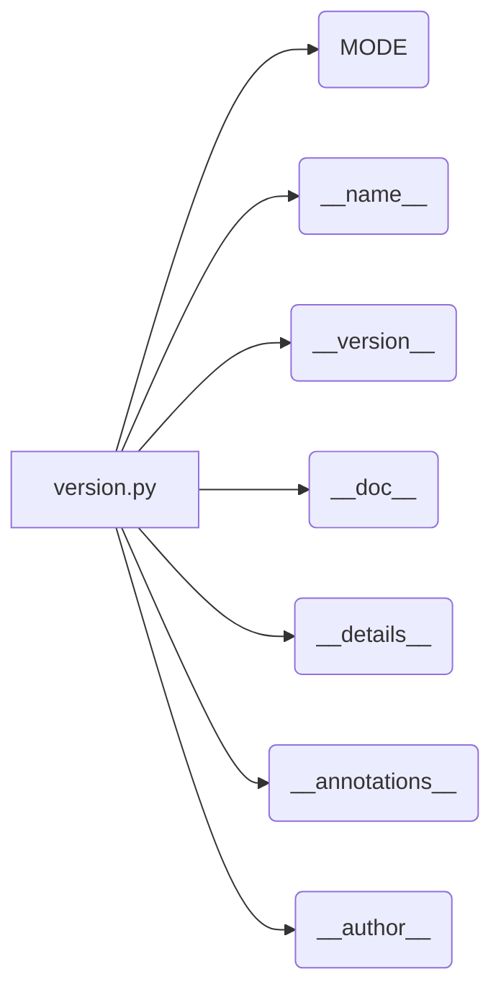

# <input code>

```python
## \file hypotez/src/webdriver/chrome/extentions/version.py
# -*- coding: utf-8 -*-\
#! venv/Scripts/python.exe
#! venv/bin/python/python3.12

"""
.. module:: src.webdriver.chrome.extentions 
	:platform: Windows, Unix
	:synopsis:

"""


"""
	:platform: Windows, Unix
	:synopsis:

"""


"""
	:platform: Windows, Unix
	:synopsis:

"""


"""
  :platform: Windows, Unix

"""
"""
  :platform: Windows, Unix
  :platform: Windows, Unix
  :synopsis:
"""
  
""" module: src.webdriver.chrome.extentions """


"""
- `__version__`: This variable holds the version of the module or package.
- `__name__`: Contains the name of the module. If the script is being run directly, the value will be `"__main__"`.
- `__doc__`: The module's documentation string.
- `__details__`: This variable likely contains additional details about the module, but the exact purpose depends on the specific module or package.
- `__annotations__`: Contains type annotations for variables and functions in the module.
- `__author__`: The name(s) of the author(s) of the module.
"""
__name__:str
__version__="3.12.0.0.0.4"
__doc__:str
__details__:str="Details about version for module or class"
__annotations__

__author__='hypotez '
```

# <algorithm>

Этот код не содержит алгоритма в привычном понимании.  Это скорее файл конфигурации или метаданных модуля.  Он определяет имя модуля (`__name__`), его версию (`__version__`), описание (`__doc__`), дополнительные детали (`__details__`), имя автора (`__author__`), а также  константу (`MODE`). Пошаговая блок-схема не применима.


# <mermaid>



# <explanation>

Этот файл (`version.py`) в структуре проекта `hypotez` содержит метаданные для модуля `src.webdriver.chrome.extentions`.  Он не содержит вычислительного алгоритма, но является частью системы сборки или управления версиями.

* **Комментарии:** Файл содержит множество многострочных комментариев, которые описывают предназначение модуля, а также его атрибутов.  Важно, что такие комментарии используются для автоматической генерации документации (например, с помощью Sphinx).

* **Переменные:**
    * ``:  Вероятно, константа, определяющая режим работы (например, 'dev', 'prod'). Важно для настройки поведения других частей проекта.
    * `__version__ = "3.12.0.0.0.4"`:  Версия модуля.  Обычно используется для контроля версий и взаимодействия с другими модулями.
    * `__name__`, `__doc__`, `__details__`, `__annotations__`, `__author__`:  Стандартные атрибуты модуля Python. Описывают имя, описание, детали, типы данных и автора, соответственно.  Эти атрибуты обычно не используются напрямую, но они могут быть использованы для интроспекции, генерации документации или других целей.

* **Связь с другими частями проекта:**
    Файл `version.py` не содержит прямого вызова функций или классов из других частей проекта.  Его основное назначение – предоставление информации о модуле, которая может быть использована другими модулями при импорте или использовании.


* **Возможные ошибки или улучшения:**

    * Неопределённое использование `__annotations__`: В данном коде атрибут `__annotations__` не инициализирован.  Это может быть намеренным или означать что-то другое в контексте всей системы.

* **Общий вывод:**  Код представляет собой  описание метаданных.  Он важен для организации проекта, документации и контроля версий, но не выполняет каких-либо действий.   Чтобы увидеть алгоритм, нужно смотреть на другие файлы проекта, где эти данные будут использованы.