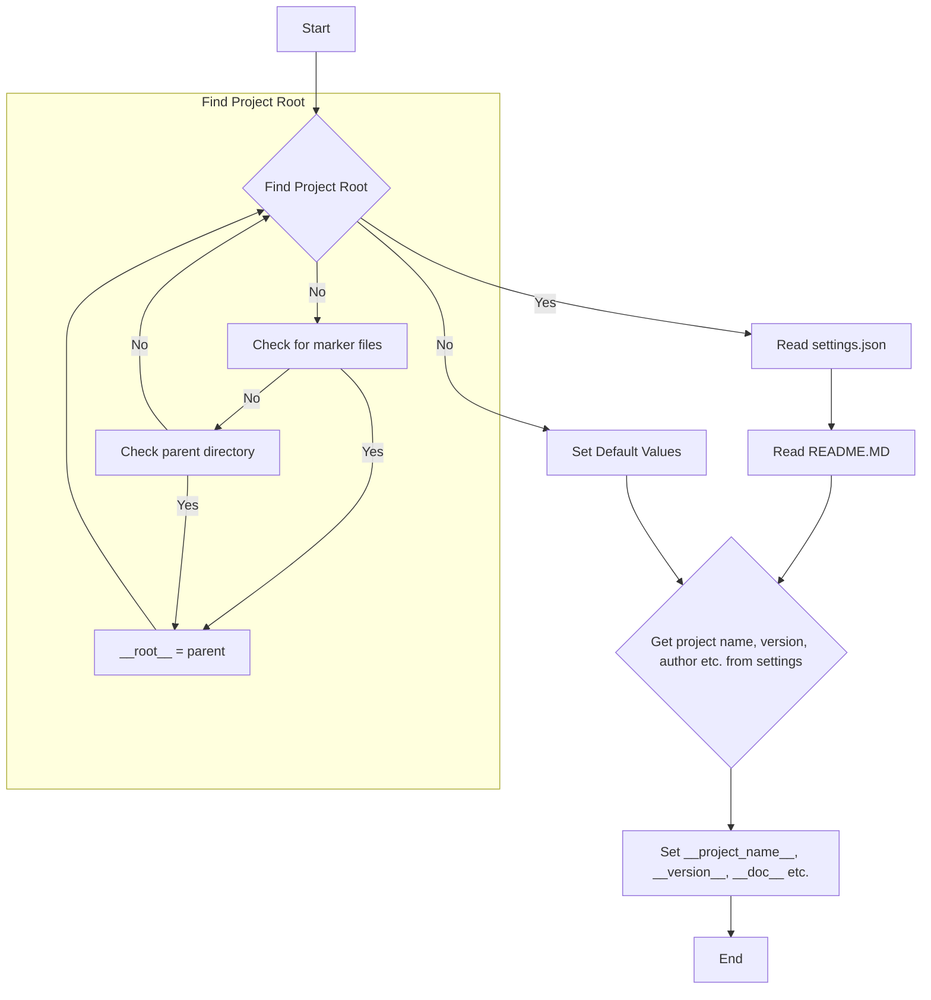
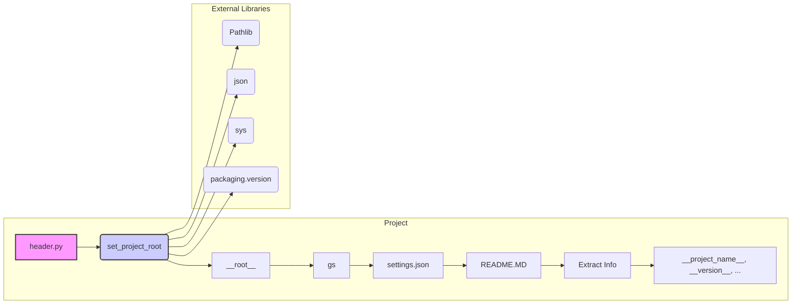

# <input code>

```python
## \file hypotez/src/webdriver/crawlee_python/header.py
# -*- coding: utf-8 -*-\n#! venv/Scripts/python.exe
#! venv/bin/python/python3.12
"""
.. module:: src.webdriver.crawlee_python 
	:platform: Windows, Unix
	:synopsis:

"""
MODE = 'dev'


import sys
import json
from packaging.version import Version

from pathlib import Path
def set_project_root(marker_files=('pyproject.toml', 'requirements.txt', '.git')) -> Path:
    """
    Finds the root directory of the project starting from the current file's directory,
    searching upwards and stopping at the first directory containing any of the marker files.

    Args:
        marker_files (tuple): Filenames or directory names to identify the project root.
    
    Returns:
        Path: Path to the root directory if found, otherwise the directory where the script is located.
    """
    __root__:Path
    current_path:Path = Path(__file__).resolve().parent
    __root__ = current_path
    for parent in [current_path] + list(current_path.parents):
        if any((parent / marker).exists() for marker in marker_files):
            __root__ = parent
            break
    if __root__ not in sys.path:
        sys.path.insert(0, str(__root__))
    return __root__


# Get the root directory of the project
__root__ = set_project_root()
"""__root__ (Path): Path to the root directory of the project"""

from src import gs

settings:dict = None
try:
    with open(gs.path.root / 'src' / 'settings.json', 'r') as settings_file:
        settings = json.load(settings_file)
except (FileNotFoundError, json.JSONDecodeError):
    ...

doc_str:str = None
try:
    with open(gs.path.root / 'src' / 'README.MD', 'r') as settings_file:
        doc_str = settings_file.read()
except (FileNotFoundError, json.JSONDecodeError):
    ...


__project_name__ = settings.get("project_name", 'hypotez') if settings  else 'hypotez'
__version__: str = settings.get("version", '')  if settings  else ''
__doc__: str = doc_str if doc_str else ''
__details__: str = ''
__author__: str = settings.get("author", '')  if settings  else ''
__copyright__: str = settings.get("copyrihgnt", '')  if settings  else ''
__cofee__: str = settings.get("cofee", "Treat the developer to a cup of coffee for boosting enthusiasm in development: https://boosty.to/hypo69")  if settings  else "Treat the developer to a cup of coffee for boosting enthusiasm in development: https://boosty.to/hypo69"
```

# <algorithm>



**Example:** If `pyproject.toml` is found in the `C:\Users\User\project` directory and the script is located in a subdirectory. The algorithm will stop at `C:\Users\User\project`, set `__root__` to that directory, and add it to `sys.path`.


# <mermaid>



**Explanation of Dependencies:**

* `pathlib`: Used for working with file paths in a platform-independent manner.
* `json`: Used for reading and parsing the `settings.json` file.
* `sys`: Used to manipulate the Python path (`sys.path`).
* `packaging.version`: Used for working with software versions.
* `gs`: Likely a custom module from the project (`src.gs`). It's crucial for the determination of the project root directory, which is why the `gs.path.root` access is important in setting up the correct paths to read config files and other related resources. This dependency is not immediately visible, but its role as a tool to deal with project-relative paths is essential.


# <explanation>

**Imports:**

* `sys`: Provides access to system-specific parameters and functions, like manipulating the Python path.
* `json`: Used for working with JSON data, essential for loading the `settings.json` file.
* `packaging.version`: Used for comparing and handling software versions.
* `pathlib`: Used for creating and manipulating file paths.
* `src.gs`: This is a custom module within the project's `src` folder (likely handling file system operations and paths).

**Classes:**

No classes are defined in this file.

**Functions:**

* `set_project_root(marker_files=...)`: This function determines the project root directory. It starts from the current file's location and traverses up the directory tree. It searches for marker files (`pyproject.toml`, `requirements.txt`, `.git`).  The function modifies `sys.path` by adding the project root to the path. This is very important for the script to find modules in the project's structure, particularly modules in folders within the project.
  * **Arguments:** A tuple of filenames or directories to locate the project root.
  * **Returns:** A `Path` object representing the project root directory.


**Variables:**

* `MODE`: A string variable likely used for configuration modes (e.g., 'dev', 'prod').
* `__root__`: A `Path` object storing the path to the project root, calculated by `set_project_root()`.
* `settings`: A dictionary containing the settings from `settings.json`.
* `doc_str`: A string containing the content of the `README.MD` file.
* `__project_name__`, `__version__`, `__doc__`, `__details__`, `__author__`, `__copyright__`, `__cofee__`: These variables store information about the project, populated from the `settings` dictionary or with default values.  These are crucial for meta-data about the application.

**Error Handling:**

The `try...except` blocks around the `settings` and `doc_str` file reading handle potential `FileNotFoundError` and `json.JSONDecodeError` exceptions, preventing the script from crashing if these files are missing or invalid.

**Possible Improvements:**

* **More robust error handling:** The current error handling could be enhanced by providing more specific error messages in the `except` blocks to aid in debugging.
* **Configuration file validation:** Validate the structure and content of `settings.json` to ensure that it meets the expected format.
* **Type hinting consistency:** Use more consistent type hinting throughout the code, like adding type hints for `__root__`.
* **Logging:** Integrate a logging mechanism to log operations for debugging or monitoring purposes.

**Relationship to other parts of the project:**

This file is crucial in providing the foundational context for other modules in the project by ensuring that the project root directory and its modules are found.  Modules like `gs` are explicitly imported, establishing a clear dependence on the functions that `gs` provides for handling file system operations.