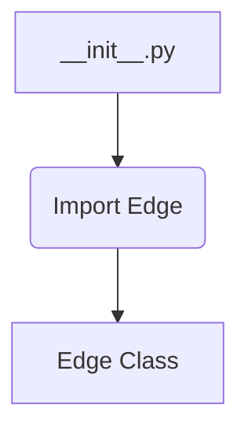
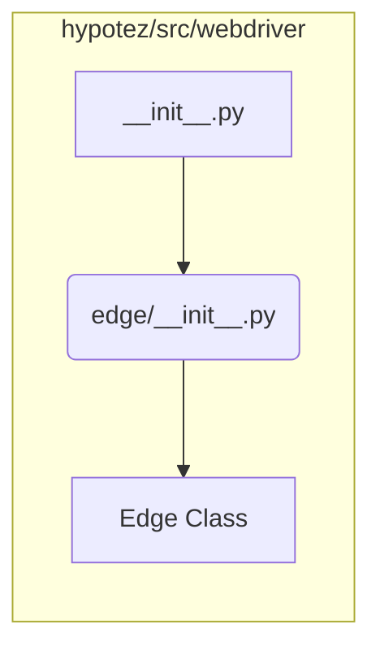

# <input code>

```python
## \file hypotez/src/webdriver/edge/__init__.py
# -*- coding: utf-8 -*-

#! venv/bin/python/python3.12

"""
.. module:: src.webdriver.edge 
	:platform: Windows, Unix
	:synopsis:

"""


from .edge import Edge
```

# <algorithm>

Этот код представляет собой инициализационный модуль для подмодуля `edge` внутри пакета `webdriver`.  Алгоритм работы очень прост: он импортирует класс `Edge` из подмодуля `edge`.  Нет циклов, условий или сложной логики.  По существу, это всего лишь один шаг - импорт.


В этом примере:
* `__init__.py` - файл, который инициализирует подмодуль `edge`.
* `Edge` - предполагаемый класс, содержащий логику взаимодействия с браузером Edge.

# <mermaid>



# <explanation>

* **Импорты**: Файл `__init__.py` в папке `edge` внутри `webdriver` импортирует класс `Edge` из файла `edge.py` внутри того же подкаталога.  Это типичная практика для организации кода в Python, позволяющая импортировать классы и функции из других файлов.  Связь идет внутри пакета `hypotez`.

* **Классы**: Класс `Edge` (предположительно) содержит методы для управления экземпляром веб-драйвера браузера Edge.  Без доступа к `edge.py`, детали работы класса неизвестны.

* **Функции**: Нет функций в представленном коде.  Все находится в рамках импорта класса.

* **Переменные**: `` - переменная, вероятно, задающая режим работы (например, режим разработки `dev`, или production `prod`).  Это конфигурационная переменная, которая может влиять на поведение последующих частей кода.


* **Возможные ошибки или области для улучшений**:
    * Не указано назначение `MODE` в примере кода.
    * Отсутствует документация внутри класса.  Важно документировать методы и атрибуты для лучшей читаемости и понимания.
    *  Отсутствует указание на то, откуда `python.exe`  и `python3.12`  находятся. Это должно быть указано в документации.


**Цепочка взаимосвязей:**

Инициализация подмодуля `edge` происходит через `__init__.py`.  Далее `Edge` класс (который ожидаемо реализует необходимую логику работы с драйвером Edge) используется в других частях проекта, где требуется работа с браузером Edge.  Взаимодействие происходит через импорт.  Без дополнительного кода сложно определить точные взаимосвязи и использование `Edge` классом.


**Пример предполагаемой структуры проекта:**

```
hypotez/
├── src/
│   └── webdriver/
│       └── edge/
│           └── __init__.py
│           └── edge.py
│           └── ... (другие файлы)
└── ... (другие папки)
```
```python
# Пример edge.py (предположительно)
from selenium import webdriver

class Edge:
    def __init__(self, options=None):
        # ... инициализация драйвера Edge ...
        self.driver = webdriver.Edge(options=options)  # Подключение к драйверу

    def get(self, url):
        self.driver.get(url)

    def quit(self):
        self.driver.quit()
```
В данном примере `edge.py`  предполагает использование Selenium.  Без доступа к полному проекту невозможно точно определить зависимость и  цепочки взаимосвязей.