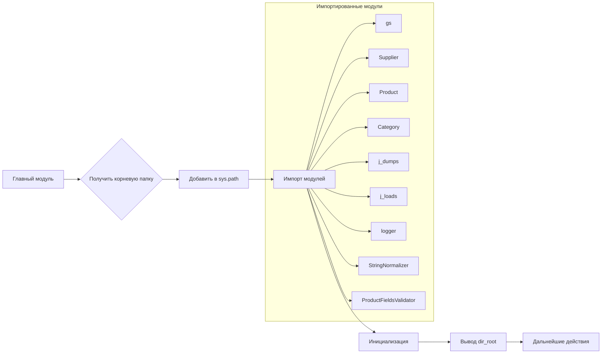

# <input code>

```python
## \file hypotez/src/webdriver/edge/_examples/header.py
# -*- coding: utf-8 -*-\

#! venv/bin/python/python3.12

"""
.. module:: src.webdriver.edge._examples 
	:platform: Windows, Unix
	:synopsis:

"""


"""
	:platform: Windows, Unix
	:synopsis:

"""


"""
	:platform: Windows, Unix
	:synopsis:

"""


"""
  :platform: Windows, Unix

"""
"""
  :platform: Windows, Unix
  :platform: Windows, Unix
  :synopsis:
"""
  
""" module: src.webdriver.edge._examples """


import sys
import os
from pathlib import Path

dir_root : Path = Path (os.getcwd()[:os.getcwd().rfind('hypotez')+11])
sys.path.append (str (dir_root) )  # Добавляю корневую папку в sys.path
dir_src = Path (dir_root, 'src')
sys.path.append (str (dir_root) ) 
...

print(dir_root)
# ----------------
from pathlib import Path
import json
import re
# ----------------

from src import gs
from src.suppliers import Supplier
from src.product import Product, ProductFields, ProductFieldsLocators
from src.category import Category
from src.utils.jjson import j_dumps, j_loads,   pprint, save_text_file
from src.logger.logger import logger
, StringNormalizer, ProductFieldsValidator
...
```

# <algorithm>

К сожалению, поставляемого фрагмента кода недостаточно для построения полной блок-схемы. Код содержит много `...`, что указывает на отсутствие полного контекста.  Для построения блок-схемы необходим код после `...`.

Очевидно, что код настраивает пути для импорта модулей, добавляя корневую папку проекта в `sys.path`, и импортирует необходимые модули из подпапок `src`.  В дальнейшем, возможно, будет выполняться чтение или обработка данных.

# <mermaid>




# <explanation>

**Импорты:**

- `sys`, `os`, `pathlib`: стандартные библиотеки Python для работы с системами и путями.
- `json`, `re`: библиотеки для работы с JSON-данными и регулярными выражениями.
- `gs`, `Supplier`, `Product`, `ProductFields`, `ProductFieldsLocators`, `Category`: предполагаемые пользовательские классы и модули из пакета `src`, связанные с обработкой данных.
- `j_dumps`, `j_loads`, `pprint`, `save_text_file`, `logger`: предполагаемые функции и классы из пакета `src.utils.jjson` и `src.logger.logger` для работы с JSON, форматирования вывода и логирования.
- `StringNormalizer`, `ProductFieldsValidator`: предполагаемые классы, предназначенные для обработки и валидации данных о продуктах (возможно, находятся в `src.utils` или `src.product`).


**Классы (неполные):**

- `Supplier`, `Product`, `ProductFields`, `ProductFieldsLocators`, `Category`:  Эти классы, вероятно, представляют сущности (поставщики, продукты, поля продуктов, категории) и  их свойства. Без кода классов сложно дать точную характеристику.
- `StringNormalizer`:  Вероятно, предназначен для нормализации строк (например, приведение к нижнему регистру, удаление пробелов).
- `ProductFieldsValidator`: Предназначен для валидации полей продуктов.


**Функции (неполные):**

Без определения функций, сложно описать их действия и логику.


**Переменные:**

- `MODE`: Строковая переменная, вероятно, определяющая режим работы (например, 'dev', 'prod').
- `dir_root`: Переменная типа `Path`, хранящая путь к корневой папке проекта.
- `dir_src`: Переменная типа `Path`, хранящая путь к папке `src`.


**Возможные ошибки и улучшения:**

- Недостающие `...` в коде затрудняют понимание полного функционала.
- Прямое добавление корневой директории в `sys.path`  может привести к проблемам при работе с проектом из разных папок и иметь побочные эффекты, лучше использовать `importlib.util.find_spec` или `importlib.import_module`.
- Недостаточно комментариев к коду для понимания его назначения.
- Отсутствует логика обработки данных.


**Взаимосвязи с другими частями проекта:**

Код импортирует модули из пакета `src`. Это указывает на то, что он является частью большего проекта, ориентированного на работу с данными (продуктами, поставщиками, категориями).  Связь кода с другими модулями проекта может быть сложной и зависит от других файлов, которые отсутствуют в примере.

**Заключение:**

Код является частью скрипта, который, вероятно, использует веб-драйвер для взаимодействия с веб-сайтом, для обработки данных о продуктах. Без последующего кода сложно дать более точное объяснение.