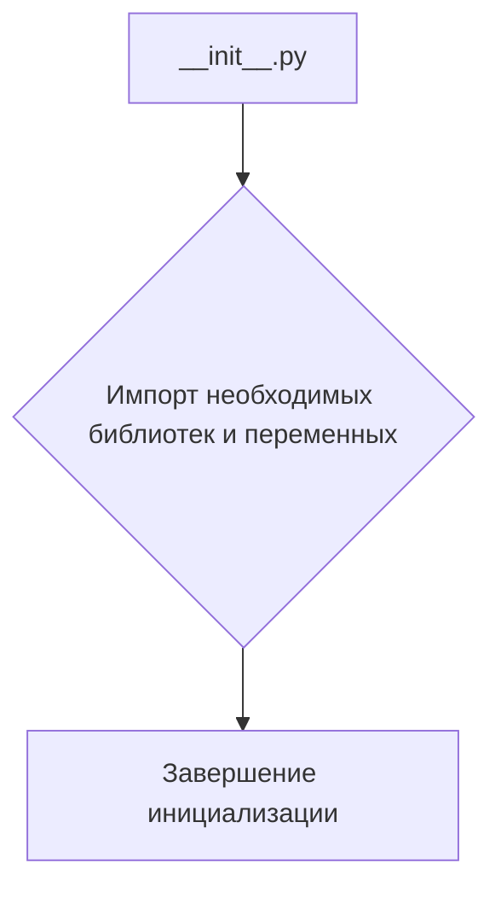

# <input code>

```python
## \file hypotez/src/webdriver/edge/extentions/__init__.py
# -*- coding: utf-8 -*-\
#! venv/Scripts/python.exe
#! venv/bin/python/python3.12

"""
.. module:: src.webdriver.edge.extentions 
	:platform: Windows, Unix
	:synopsis:

"""


"""
	:platform: Windows, Unix
	:synopsis:

"""

"""
	:platform: Windows, Unix
	:synopsis:

"""


"""
  :platform: Windows, Unix

"""
"""
  :platform: Windows, Unix
  :platform: Windows, Unix
  :synopsis:
"""
  
""" module: src.webdriver.edge.extentions """


from packaging.version import Version
from .version import __version__, __doc__, __details__
```

# <algorithm>

Этот код представляет собой инициализационный модуль (`__init__.py`) для пакета `extentions` внутри проекта `hypotez`.  Алгоритм работы крайне прост. Модуль импортирует необходимые функции и переменные из подмодуля `version`.  Нет циклов, условных операторов и сложных вычислений.

**Блок-схема:**



**Пример:**

```
// Пример импорта из подмодуля version:
from .version import __version__  # Получаем версию
```


# <mermaid>

```mermaid
graph LR
    subgraph "Модуль __init__.py"
        A[hypotez/src/webdriver/edge/extentions/__init__.py] --> B();
        B --> C[from packaging.version import Version];
        C --> D[from .version import __version__, __doc__, __details__];
    end
    
    subgraph "Взаимосвязь с .version"
        D --> E(.version);
        E -- __version__ --> D;
        E -- __doc__ --> D;
        E -- __details__ --> D;
    end
```


# <explanation>

**Импорты:**

- `from packaging.version import Version`: Импортирует класс `Version` из пакета `packaging`. Этот пакет используется для работы с версиями пакетов,  часто используется для проверки совместимости версий. Связь с `src` опосредованная, через зависимость проекта от внешней библиотеки.
- `from .version import __version__, __doc__, __details__`: Импортирует переменные `__version__`, `__doc__`, `__details__` из модуля `version.py`.  `.` в начале пути указывает, что искомый модуль находится в текущем каталоге (пакет `extentions`).  Явно указывает на зависимость от подмодуля `version`.

**Классы:**

Нет определённых классов в этом коде.

**Функции:**

Нет определённых функций в этом коде.

**Переменные:**

- ``:  Переменная глобального уровня, скорее всего, определяет режим работы.   `dev` вероятно, указывает на режим разработки.   Переменная используется для конфигурирования в других частях кода.

**Возможные ошибки или улучшения:**

- **Недостаточная документация:**  Строки документации (`"""Docstring"""`) в коде не содержат полезной информации. Необходимо описать назначение переменной `MODE` и других деталей, если они существуют.


**Цепочка взаимосвязей:**

Этот файл является частью пакета `extentions`, который вероятно, содержит драйверы для работы с браузером Edge в проекте `hypotez`. Пакет `hypotez` содержит компоненты для различных задач или функций, например, для автотестирования, взаимодействия с внешними сервисами и т.п.  Без большей информации о проекте  `hypotez` сложно представить точную взаимосвязь с другими частями, но можно предположить, что эта часть отвечает за инициализацию драйвера для браузера Edge или за управление  его расширениями. Модуль `version.py`, из которого импортируются переменные, вероятно, содержит информацию о версии расширения.