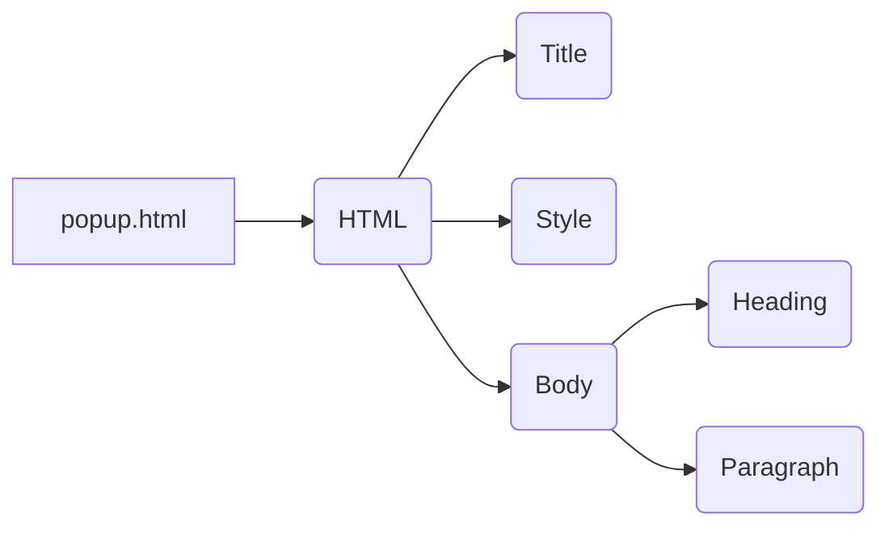

```MD
# Анализ кода popup.html

**1. <input code>**

```html
## \file hypotez/src/webdriver/edge/extentions/test_extention/html/popup.html
# -*- coding: utf-8 -*-\


""" module: src.webdriver.edge.extentions.test_extention.html """
MODE = 'debug'
<!-- popup.html -->

<!DOCTYPE html>
<html>
<head>
    <title>hypotez</title>
    <style>
        body {
            width: 200px;
            padding: 10px;
        }
    </style>
</head>
<body>
    <h1>hypotez</h1>
    <p>Click the extension icon to collect data from the current webpage.</p>
</body>
</html>
```

**2. <algorithm>**

Этот код представляет собой HTML-документ, который формирует страницу всплывающего окна расширения браузера.  Алгоритма в традиционном смысле нет, так как это статический HTML.  Данный код не содержит логики, а только описывает визуальное представление.

**Пример:**

Нет специфических шагов алгоритма.

**Перемещение данных:**

Данные не перемещаются, так как нет динамических функций или процессов.


**3. <mermaid>**



**4. <explanation>**

* **Импорты:** Нет импортов Python-модулей. Это чисто HTML-файл.

* **Классы:** Нет классов.

* **Функции:** Нет функций.

* **Переменные:** `MODE = 'debug'` -  переменная, хранящая строковое значение, вероятно, конфигурационное для режима работы (debug или release).

* **Комментарии:** Код содержит комментарии, которые описывают файл и его местоположение в проекте.


* **Возможные ошибки/улучшения:**  Этот код – это просто HTML-шаблон.  В нём нет ошибок, требующих исправления. Для полноценного расширения потребуется JavaScript, который будет взаимодействовать с этим HTML и выполнять операции.  Этот код – только видимая часть расширения. Для его функционирования требуются скрипты,  обрабатывающие клики на иконке расширения, взаимодействующие с браузером и веб-страницей для получения данных, а также считывающие конфигурацию (MODE).


**Взаимосвязь с другими частями проекта:**

Файл `popup.html` — это часть расширения браузера, которое, вероятно, взаимодействует с JavaScript-скриптами и/или обработчиками событий, реализуемыми другими частями проекта `hypotez/src/webdriver/edge/extentions/test_extention`.  Эта часть проекта отвечает за взаимодействие с веб-драйвером для Edge, а также реализует логику сбора данных с веб-страниц.


**Заключение:**

Этот HTML-код создает простой пользовательский интерфейс всплывающего окна для расширения браузера.  Без JavaScript и других компонентов приложения `hypotez` он не функционален.  Алгоритм работы расширения должен быть реализован в связанных с этим HTML-файлом JavaScript-файлах.