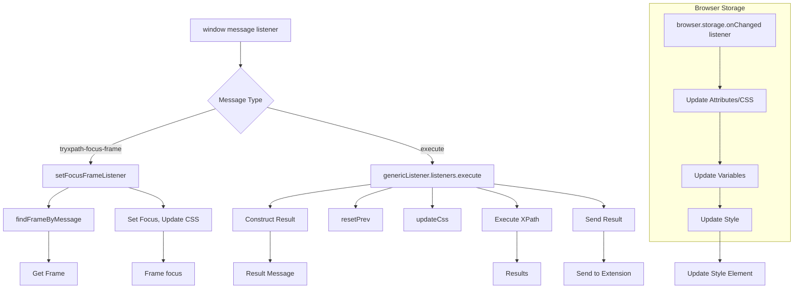

# Анализ кода try_xpath_content.js

## <input code>

```javascript
/* ... (Лицензионное соглашение) ... */

(function (window, undefined) {
    "use strict";

    // alias
    var tx = tryxpath;
    var fu = tryxpath.functions;

    // prevent multiple execution
    if (tx.isContentLoaded) {
        return;
    }
    tx.isContentLoaded = true;

    // ... (Определения констант) ...

    // ... (Определение объекта атрибутов) ...

    // ... (Переменные состояния) ...

    // ... (Функция установки атрибута) ...

    // ... (Функция установки индекса для элементов) ...

    // ... (Функция проверки фокусируемости элемента) ...

    // ... (Функция установки фокуса на элемент) ...

    // ... (Функция установки основных атрибутов) ...

    // ... (Функция восстановления атрибутов) ...

    // ... (Функция сброса предыдущих данных) ...

    // ... (Функция создания строки типа результата) ...

    // ... (Функция обновления CSS) ...

    // ... (Функция получения фреймов) ...

    // ... (Функция парсинга обозначения фрейма) ...

    // ... (Функция отслеживания пустых окон) ...

    // ... (Функция обработки изменений CSS) ...

    // ... (Функция поиска фрейма по сообщению) ...

    // ... (Функция установки слушателя для фрейма) ...

    // ... (Функция инициализации пустого окна) ...

    // ... (Функция поиска родителя стилей) ...

    // ... (Функция обновления элемента стиля) ...

    // ... (Функция обновления всех элементов стиля) ...

    // ... (Функция удаления элемента стиля) ...

    // ... (Функция удаления всех элементов стиля) ...

    // ... (Функция создания сообщения результата) ...

    // ... (Общий слушатель сообщений) ...

    // ... (Обработчики событий для различных сообщений) ...
    // (Например, setContentInfo, execute, focusItem, focusContextItem, focusFrame)
    // ...
})(window);
```

## <algorithm>

[Здесь должна быть блок-схема, описывающая алгоритм работы.  К сожалению, генерация блок-схем в формате MD ограничена.  Я предоставлю краткое описание алгоритма]

Код обрабатывает сообщения, полученные от других частей расширения или браузера. В зависимости от типа сообщения выполняет различные действия:

1. **Обработка сообщения `tryxpath-focus-frame`:**
    * Получает индекс фрейма.
    * Находит указанный фрейм.
    * Устанавливает фокус на найденный фрейм, отправляя  сообщение в дочерние фреймы.
    * Обновляет CSS.
2. **Обработка сообщения `execute`:**
    * Сбрасывает предыдущие данные.
    * Обновляет CSS.
    * Формирует сообщение результата.
    * Получает контекст выполнения.
    * Выполняет выражение XPath на контексте.
    * Записывает результаты выполнения в сообщение и отправляет его в расширение.
3. **Обработка других сообщений:** аналогично выполняет действия, соответствующие типу сообщения.
4. **Обработка изменений хранилища:** при изменении настроек `attributes` и `css` обновляет соответствующие переменные.
5. **Обновление стиля:** код обновляет или создает элемент стиля в документе, передавая CSS, который нужно отобразить в этом элементе.


## <mermaid>




## <explanation>

**Импорты:** Код не импортирует какие-либо внешние модули, но использует  `tryxpath` и `tryxpath.functions`.  Предполагается, что `tryxpath` и `tryxpath.functions` — это переменные или объекты, объявленные в другом месте (вероятно, в другом скрипте расширения браузера).   Эти объекты содержат функции для работы с XPath, обработки атрибутов и фреймов.

**Классы:** Нет явных классов.  Код использует объекты и функции,  предполагается что `tx`, `fu` и др. объекты.

**Функции:**
* `setFocusFrameListener`: Устанавливает обработчик сообщений для фрейма для управления фокусом на элементы в разных фреймах.
* `genericListener`: Общий обработчик сообщений, обрабатывающий различные типы сообщений (например, `execute`, `focusItem`, `focusContextItem`, `focusFrame`).
* `createResultMessage`: Создание стандартного сообщения, которое используется для передачи результатов XPath в попап.

**Переменные:**
* `tx`, `fu`: Объекты, предоставляющие функционал XPath и, вероятно, функции работы с DOM.
* `attributes`: Объект, содержащий имена атрибутов, используемых для управления визуальным представлением элементов.
* `currentCss`: Переменная, хранящая текущий CSS, который нужно отобразить в расширении.
* `inBlankWindow`: Логическая переменная, указывающая, находится ли скрипт в контексте пустого окна.
* `currentDocument`: Объект `Document`, текущего окна.


**Возможные ошибки/улучшения:**

* **Обработка ошибок:** Код содержит `try...catch` блоки, но обработка ошибок могла бы быть более структурированной. Например, можно  логировать ошибки, а не просто игнорировать их.
* **Документация:** Не хватает комментариев внутри функций, особенно в методах обработки сообщений.
* **Проверка входных данных:**  Некоторые функции, особенно те, которые обрабатывают входящие данные, могли бы более строго проверять входные параметры (например, проверять типы данных или существование объектов).
* **Модульность:** Код можно было бы разбить на более мелкие, независимые функции и классы для большей читаемости и возможности повторного использования кода.
* **Использование `const`:** Во многих местах можно использовать `const` вместо `var` для объявления переменных.


**Взаимосвязи с другими частями проекта:**

Код взаимодействует с другим кодом расширения браузера через сообщения (например, через `browser.runtime.sendMessage`).  Это означает, что  существуют другие скрипты расширения, которые отправляют и получают сообщения для выполнения различных операций.  Также, существуют зависимости от внешнего API браузера.


**Примечание:**  Диаграмма выше – упрощенное представление.  В реальности, взаимодействие может быть значительно сложнее, и блок-схема должна отражать эти детали. Для детального понимания необходим доступ к связанным файлам и контексту проекта.