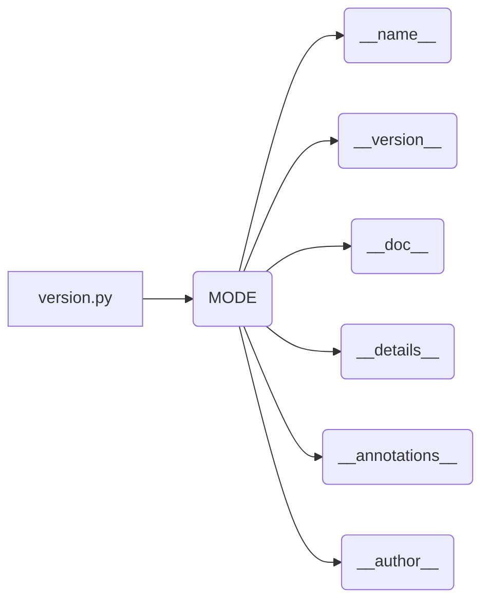

# <input code>

```python
## \file hypotez/src/webdriver/edge/extentions/version.py
# -*- coding: utf-8 -*-

#! venv/bin/python/python3.12

"""
.. module:: src.webdriver.edge.extentions 
	:platform: Windows, Unix
	:synopsis:

"""


"""
	:platform: Windows, Unix
	:synopsis:

"""


"""
	:platform: Windows, Unix
	:synopsis:

"""


"""
  :platform: Windows, Unix

"""
"""
  :platform: Windows, Unix
  :platform: Windows, Unix
  :synopsis:
"""
  
""" module: src.webdriver.edge.extentions """


"""
- `__version__`: This variable holds the version of the module or package.
- `__name__`: Contains the name of the module. If the script is being run directly, the value will be `"__main__"`.
- `__doc__`: The module's documentation string.
- `__details__`: This variable likely contains additional details about the module, but the exact purpose depends on the specific module or package.
- `__annotations__`: Contains type annotations for variables and functions in the module.
- `__author__`: The name(s) of the author(s) of the module.
"""
__name__:str
__version__="3.12.0.0.0.4"
__doc__:str
__details__:str="Details about version for module or class"
__annotations__

__author__='hypotez '
```

# <algorithm>

This code snippet defines a Python module.  There's no dynamic algorithm; it simply declares variables and strings.  The code does not contain any function calls or loops.


# <mermaid>



**Explanation of Dependencies:**

The code is a Python module, likely part of a larger project. Dependencies aren't directly represented in the code itself. The dependencies are implicit in the packages the module uses, which are not presented in this snippet, e.g., dependencies to define the module structure, use python's built-in functionality, and document its parts.


# <explanation>

This Python file (`version.py`) defines a module within the `hypotez/src/webdriver/edge/extentions` package.  It's likely part of a larger project for automating web interactions, specifically using the Edge browser.

**Imports:**

There are no imports. This file is self-contained.


**Classes:**

There are no classes defined.


**Functions:**

There are no functions defined.


**Variables:**

- `MODE`: A string variable with the value 'dev'. This likely indicates a development mode, but further context from the surrounding code would be needed to fully understand its role.
- `__version__`:  A string variable holding the version number of the module.
- `__name__`:  A string representing the module's name.
- `__doc__`:  A string containing the documentation of the module.
- `__details__`: A string likely holding detailed information about the module or its version.
- `__annotations__`: (Empty) A variable that would normally hold type hints.
- `__author__`: A string variable holding the author's name.

**Possible Errors/Improvements:**

- **Missing Type Hinting:** The variable `__annotations__` is left empty.  Using type hints would enhance code readability and maintainability, especially in a larger codebase.
- **Redundant Documentation:** The multitude of docstrings (`""" ... """`) might be excessive.  Consider consolidating documentation or using a proper docstring style (e.g., Sphinx).
- **File Structure:** The file path (`hypotez/src/webdriver/edge/extentions/version.py`) suggests a clear project structure. However, without the context of other files, it's hard to specify whether this is the best possible structure.

**Relationship to Other Parts of the Project:**

This file likely provides metadata for other parts of the `hypotez` project, particularly the `src/webdriver/edge/extentions` package.  For instance, the version information might be used to check for compatibility, manage updates, or generate reports. Without seeing other files, it is hard to define other relationships and functionality that uses the `version` file.

**Overall:**

The file serves as a metadata container for the versioning and authorship details of a module within the project. It is a common practice to include such information in software modules for version control and maintenance purposes.