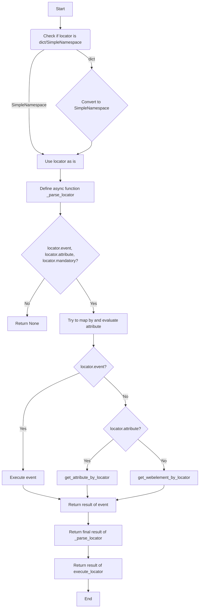

```MD
# <input code>

```python
## \file hypotez/src/webdriver/executor.py
# -*- coding: utf-8 -*-\

#! venv/bin/python/python3.12

"""
.. module: src.webdriver 
	:platform: Windows, Unix
	:synopsis: The purpose of the `executor` module is to perform actions on web elements based on provided configurations, 
known as "locators." These configurations (or "locators") are dictionaries containing information on how to locate and interact with elements on a web page. The module provides the following functionalities:

1. **Parsing and Handling Locators**: Converts dictionaries with configurations into `SimpleNamespace` objects, 
allowing for flexible manipulation of locator data.

2. **Interacting with Web Elements**: Depending on the provided data, the module can perform various actions such as clicks, 
sending messages, executing events, and retrieving attributes from web elements.

3. **Error Handling**: The module supports continuing execution in case of an error, allowing for the processing of web pages 
that might have unstable elements or require a special approach.

4. **Support for Multiple Locator Types**: Handles both single and multiple locators, enabling the identification and interaction 
with one or several web elements simultaneously.

This module provides flexibility and versatility in working with web elements, enabling the automation of complex web interaction scenarios.


"""


import asyncio
import re
import sys
import time
from dataclasses import dataclass, field
from enum import Enum
from pathlib import Path
from types import SimpleNamespace
from typing import BinaryIO, ByteString, Dict, List, Optional, Union

from selenium.common.exceptions import (
    ElementClickInterceptedException,
    JavascriptException,
    NoSuchElementException,
    StaleElementReferenceException,  # Этот импорт был добавлен
    TimeoutException,
)
from selenium.webdriver.common.action_chains import ActionChains
from selenium.webdriver.common.by import By
from selenium.webdriver.common.keys import Keys
from selenium.webdriver.remote.webelement import WebElement
from selenium.webdriver.support import expected_conditions as EC
from selenium.webdriver.support.ui import WebDriverWait

import header
from src import gs
from src.logger import logger
from src.logger.exceptions import (
    DefaultSettingsException,
    ExecuteLocatorException,
    WebDriverException,
)

from src.utils.jjson import j_dumps, j_loads, j_loads_ns
from src.utils.printer import pprint
from src.utils.image import save_png


# ... (rest of the code)
```

# <algorithm>

1. **Input:** `locator` (dict or SimpleNamespace), optional parameters (timeout, timeout_for_event, message, etc.).
2. **Convert to SimpleNamespace:** If `locator` is a dictionary, it's converted to a `SimpleNamespace` object.
3. **Empty Locator Check:** If both `locator.attribute` and `locator.selector` are empty, return `None`. This handles cases where the locator doesn't specify an action.
4. **`_parse_locator` function:** This function handles the main logic of parsing and executing the locator.
   - **Error Handling:** It catches exceptions during locator parsing and logging them, if needed.
   - **Event Execution:** If `locator.event` is present, calls `execute_event`.
   - **Attribute Retrieval:** If `locator.attribute` is present, calls `get_attribute_by_locator`.
   - **Element Retrieval:** If neither event nor attribute are present, calls `get_webelement_by_locator`.
5. **Return Result:** The result of the `_parse_locator` function (or `None` in case of error) is returned.

# <mermaid>



# <explanation>

**Imports:**

- The code imports various modules for different functionalities.  Crucially, it imports from `src` packages, indicating a modular structure within the project. This modularity promotes organization and reusability of code across the project.
- Selenium modules are imported for web driver interaction.
- `src.logger` and `src.logger.exceptions` likely provide custom logging and exception handling mechanisms specific to the project.
- `src.utils.jjson` handles JSON manipulation, enhancing code maintainability by encapsulating these operations.
- `src.utils.printer` presumably provides custom printing functions (e.g., for formatted output) useful for debugging.
- `src.utils.image` suggests the module is for image processing operations, possibly for saving screenshots or other image-related tasks.

**Classes:**

- **`ExecuteLocator`:** This class handles the execution of locators.
    - `driver`: Selenium WebDriver instance.
    - `actions`: `ActionChains` instance for performing mouse and keyboard actions (essential for Selenium automation).
    - `by_mapping`: Maps locator types (e.g., "XPATH," "ID") to their Selenium equivalents (`By.XPATH`, `By.ID`).
    - `mode`: Specifies the execution mode ('dev', 'debug').
    - `__post_init__`: Initializes `actions` if `driver` is provided.
    - `execute_locator`: The core method that takes a locator and executes the associated actions.
    - `evaluate_locator`: Parses locator attributes. (e.g. `%KEY%` into `Keys.KEY`).
    - `get_attribute_by_locator`: Retrieves attribute value(s) from a web element.
    - `get_webelement_by_locator`: Locates web elements on the page.
    - `get_webelement_as_screenshot`: Captures screenshots.
    - `execute_event`: Executes actions (click, typing, pausing, screenshot, clear).
    - `send_message`: Handles sending messages.


**Functions:**

- `execute_locator`:  Takes the locator and optional params and delegates the work to asynchronous functions.  Uses error handling and asynchronous operations.
- `evaluate_locator`: Evaluates attributes and expands them.  It uses regex to parse the string attributes that might contain `%KEY%` format.  Important step for flexibility and potential usage of special keys.
- `get_attribute_by_locator`: Locates an element, handles list of elements or single element.  Extracts attributes if specified.
- `get_webelement_by_locator`: Fetches web elements with specific locators, using either immediate lookup or `WebDriverWait`. Handles timeouts and exceptions gracefully.  Crucially, it handles various scenarios of locating a single or multiple elements in different ways and filtering based on given criteria in `locator.if_list`.
- `execute_event`: A crucial function to implement actions on the located element; click, typing (send_keys), pauses, screenshots.
- `get_webelement_as_screenshot`: Efficiently takes a screenshot of the web element.
- `send_message`: Sends messages to web elements (e.g., typing).  Includes special handling for typing speed and potentially special keys using `replace_dict` argument.

**Variables:**

- `MODE`: A global variable for the execution mode, facilitating easy toggling between debug and release modes.
- `timeout_for_event`: Configures the type of wait condition to use when locating elements.

**Possible Errors/Improvements:**

- **Error Handling:** Exception handling is present, but the `...` parts are placeholders. More explicit error handling or logging (e.g., logging the specific error type) might be helpful for debugging.
- **Documentation:**  The code has docstrings explaining most functions, but more in-depth documentation and examples would be beneficial.  Use appropriate Sphinx style documentation.
- **Asynchronous Operations:**  Extensive use of `asyncio` is good for asynchronous handling, but more context and explanation of async/await use cases would improve readability.
- **Input Validation:** Adding input validation to check the validity of the `locator` data and optional arguments would prevent unexpected behavior or crashes.


**Inter-project dependencies:**

- The code heavily relies on the modules from the `src` directory, which indicates a complex, well-organized project structure.  There are direct imports from `src.logger`, `src.utils.jjson`, `src.utils.printer`, `src.utils.image`, and `src` itself.  These suggest a well-defined structure with clear responsibilities and data/function flows between modules.
- The dependence on Selenium suggests this code is part of a larger web automation project. The Selenium package is used for interacting with web browsers.