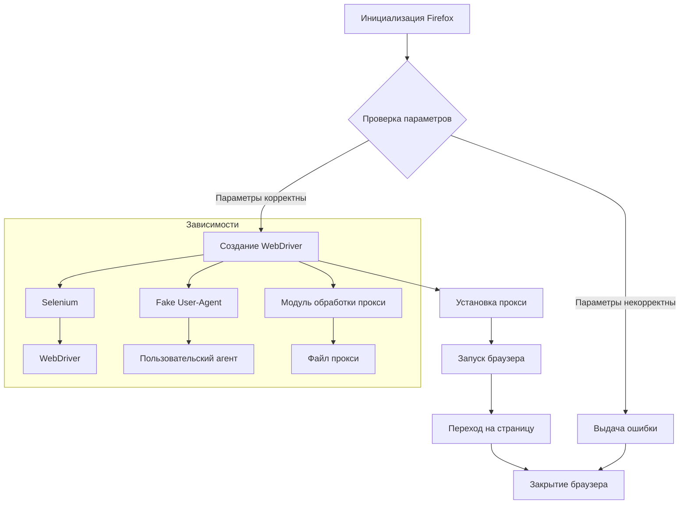

# Анализ кода модуля src.webdriver.firefox

## <input code>

```rst
.. module:: src.webdriver.firefox
```
# Модуль Firefox WebDriver

Этот модуль содержит класс `Firefox`, который расширяет функциональность стандартного Firefox WebDriver. Он позволяет настраивать пользовательский профиль, запускать WebDriver в режиме киоска и устанавливать настройки прокси.

## Требования

- Python 3.12+
- Selenium
- Fake User-Agent
- Модуль обработки прокси

## Установка

1. Установите все зависимости:

   ```bash
   pip install -r requirements.txt
   ```

2. Убедитесь, что установлены следующие компоненты:
   - **geckodriver** (для поддержки WebDriver)
   - **Firefox** (поддерживаемая версия)

3. Для работы с прокси предоставьте путь к файлу прокси с помощью параметра `proxy_file_path`.

## Пример использования

Пример использования класса `Firefox`:

```python
from src.webdriver.firefox import Firefox

if __name__ == "__main__":
    profile_name = "custom_profile"
    geckodriver_version = "v0.29.0"
    firefox_version = "78.0"
    proxy_file_path = "path/to/proxies.txt"

    # Инициализация и запуск браузера
    browser = Firefox(
        profile_name=profile_name,
        geckodriver_version=geckodriver_version,
        firefox_version=firefox_version,
        proxy_file_path=proxy_file_path
    )
    browser.get("https://www.example.com")
    browser.quit()
```

## Описание класса и методов

### Класс `Firefox`

- Расширяет стандартный Firefox WebDriver, добавляя функциональность:
  - Установка пользовательского профиля
  - Настройки прокси
  - Установка пользовательского user-agent
  - Интеграция с JavaScript и выполнение локаторов

#### Конструктор `__init__`

```python
def __init__(self, profile_name: Optional[str] = None,
             geckodriver_version: Optional[str] = None,
             firefox_version: Optional[str] = None,
             user_agent: Optional[str] = None,
             proxy_file_path: Optional[str] = None,
             *args, **kwargs) -> None:
```

- `profile_name`: Имя пользовательского профиля Firefox.
- `geckodriver_version`: Версия geckodriver.
- `firefox_version`: Версия Firefox.
- `user_agent`: Строка user-agent.
- `proxy_file_path`: Путь к файлу прокси.


#### Метод `set_proxy`

```python
def set_proxy(self, options: Options) -> None:
```

- Настраивает прокси для Firefox, выбирая случайный работающий прокси из предоставленного файла прокси.

#### Метод `_payload`

```python
def _payload(self) -> None:
```

- Загружает необходимые исполнители для локаторов и JavaScript.


## Дополнительная настройка

- **Прокси:** Модуль автоматически выбирает доступный работающий прокси из предоставленного файла, указанного параметром `proxy_file_path`.
- **Профиль Firefox:** Вы можете указать путь к пользовательскому профилю Firefox.
- **User-agent:** Модуль позволяет установить пользовательский user-agent для WebDriver.

## Ведение логов

Модуль использует `logger` для ведения логов ошибок и предупреждений.

## Лицензия

Этот проект лицензирован по лицензии MIT. Смотрите файл LICENSE для получения дополнительной информации.
```

## <algorithm>

Блок-схема отсутствует, так как предоставленный код представляет собой документацию, а не исполняемый код.  Алгоритм работы описан в текстовом виде в документации.  Основные действия: инициализация WebDriver с параметрами (профиль, прокси, версия браузера и драйвера), установка прокси, запуск браузера и переход на указанную страницу.

## <mermaid>



## <explanation>

**Импорты:**  
Код содержит документацию, описывающую импорты, но не сам импорт.  Предполагается, что `src.webdriver.firefox` импортирует необходимые библиотеки (Selenium, Fake User-Agent, модуль обработки прокси), чтобы реализовать функционал WebDriver,  используя  `from src.webdriver.firefox import Firefox`.

**Классы:**
- `Firefox`:  Этот класс расширяет стандартный WebDriver для Firefox.  Он отвечает за инициализацию браузера с настраиваемыми параметрами (профиль, версия, прокси, user-agent), выполнение действий внутри браузера (переход на страницы, отправка запросов и т.д.), и за его закрытие.
- Классы `Options`, `Profile` и другие, которые подразумеваются для использования в `Firefox` и являются частью Selenium API.


**Функции:**
- `__init__`:  Инициализирует класс `Firefox`, принимая параметры для конфигурации.  Это ключевой метод для создания экземпляра класса и настройки его поведения.
- `set_proxy`:  Настраивает прокси-сервер для WebDriver.  Он выбирает прокси из предоставленного файла.
- `_payload`:  Вероятно, эта функция выполняет вспомогательные действия, связанные с настройкой WebDriver.  Подробная реализация отсутствует в предоставленной документации.


**Переменные:**
Переменные `profile_name`, `geckodriver_version`, `firefox_version`, `proxy_file_path` представляют параметры, используемые при создании и настройке экземпляра класса `Firefox` для конкретных настроек.

**Возможные ошибки и улучшения:**
- Не хватает реализации класса `Firefox` в коде. Документация лишь описывает функционал.
- Отсутствие проверки корректности введённых параметров в конструкторе `__init__`.  Нужно проверить, что файл прокси существует, путь к нему корректный, указаны корректные версии Firefox и geckodriver и т.д.
- Лучше добавить обработку исключений (например, если файл прокси пуст, или если выбранный прокси не работает).
- Недостаточно описано взаимодействие с другими модулями проекта.

**Взаимосвязь с другими частями проекта:**

Модуль `src.webdriver.firefox` зависит от `Selenium` для работы с WebDriver, `Fake User-Agent` для замены user-agent и модуля обработки прокси для работы с proxy.  Он, вероятно,  используется в других частях проекта, где нужно автоматизировать взаимодействие с браузером Firefox.  Необходимо рассмотреть контекст, в котором этот модуль используется.


**Общий вывод:** Код представлен в формате документации.  Необходимо реализовать сам класс `Firefox` для полноценной работы.  Не хватает подробностей о взаимодействии с другими модулями и обработке исключений.