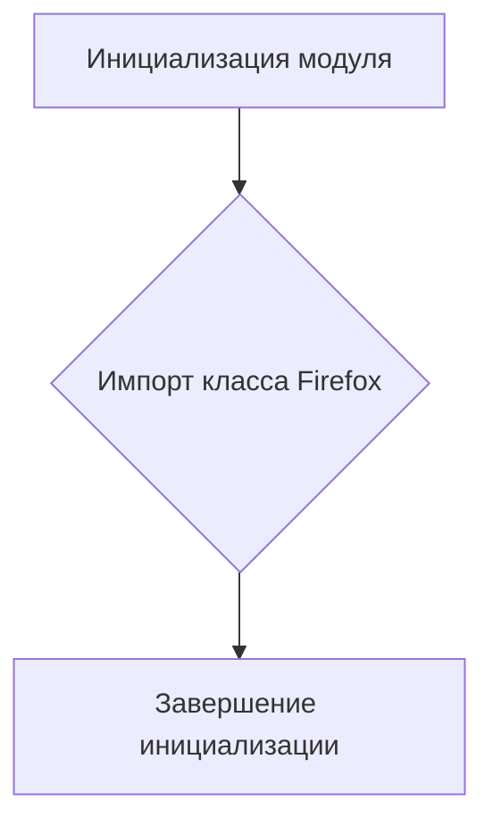

# <input code>

```python
## \file hypotez/src/webdriver/firefox/__init__.py
# -*- coding: utf-8 -*-

#! venv/bin/python/python3.12

"""
.. module:: src.webdriver.firefox 
	:platform: Windows, Unix
	:synopsis:

"""


from .firefox import Firefox
```

# <algorithm>

**Блок-схема алгоритма:**



**Пример:**

При импорте модуля `hypotez.src.webdriver.firefox` выполняется импорт класса `Firefox` из подмодуля `firefox`.  Это подготавливает среду для дальнейшего использования класса `Firefox`, который предположительно предоставляет функции для взаимодействия с браузером Firefox.

# <mermaid>


# <explanation>

**Импорты:**

- `from .firefox import Firefox`:  Этот импорт подключает класс `Firefox` из подмодуля `firefox` внутри пакета `webdriver`.  Символ `.` указывает на поиск класса внутри текущего пакета (`hypotez/src/webdriver`). Это стандартная практика Python для организации модулей и предотвращения конфликтов имён.  Эта строка необходима, чтобы в других частях проекта можно было использовать класс `Firefox`.

**Классы:**

- `Firefox`:  Этот класс, вероятно, определен в файле `hypotez/src/webdriver/firefox/firefox.py`. Он предоставляет функциональность для работы с веб-драйвером для браузера Firefox. Подробная информация о нём может быть найдена в файле `hypotez/src/webdriver/firefox/firefox.py`.

**Функции:**

Нет явных функций в данном `__init__.py` файле.  Функциональность предоставляется через класс `Firefox`.

**Переменные:**

- ``:  Это строковая переменная, которая, вероятно, определяет режим работы (например, `dev`, `prod`).  Она хранит конфигурационную информацию, которая может влиять на поведение кода.

**Возможные ошибки/улучшения:**

- Нет явного использования переменной `MODE`.  Она должна быть использована где-то в другом месте кода, для настройки поведения.
- Нет никакой проверки импорта.  Если файл `hypotez/src/webdriver/firefox/firefox.py` отсутствует или содержит ошибки, код приведёт к ошибке.

**Цепочка взаимосвязей:**

Этот `__init__.py` файл выступает в роли точки входа для использования функциональности `webdriver` для Firefox.  Он импортирует необходимые компоненты из подмодуля, и эти компоненты, предположительно, взаимодействуют с библиотеками веб-драйверов (например, Selenium) для управления браузером Firefox.  Этот `__init__.py` необходим, чтобы избежать прямого импорта классов из `hypotez/src/webdriver/firefox/firefox.py` в других модулях.

**Общее:**

Код организован в соответствии с принципами структурированного программирования в Python. Использование `__init__.py` файлу способствует модульности, повторному использованию и отладке кода.