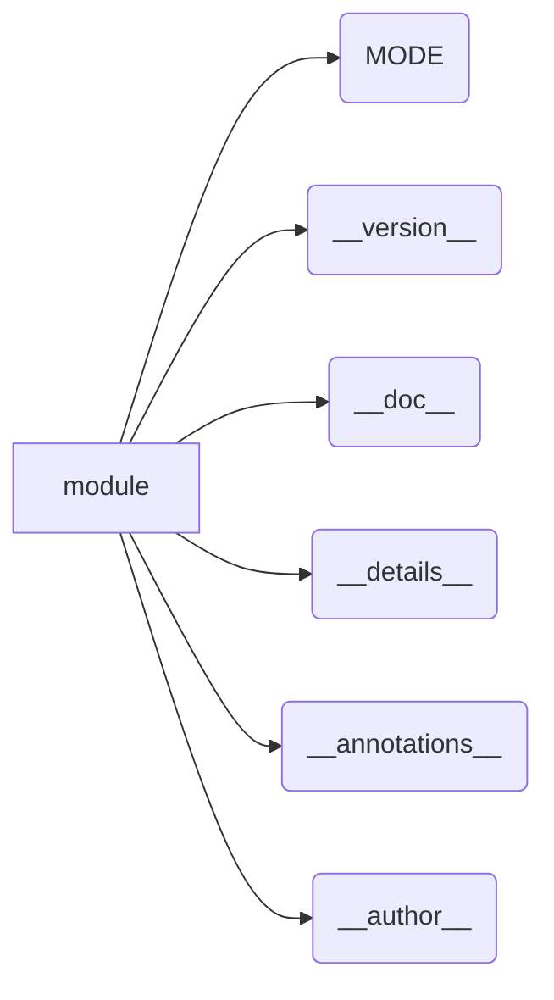

```MD
# Анализ кода из файла `hypotez/src/webdriver/firefox/_examples/version.py`

## <input code>

```python
## \file hypotez/src/webdriver/firefox/_examples/version.py
# -*- coding: utf-8 -*-\
#! venv/Scripts/python.exe
#! venv/bin/python/python3.12

"""
.. module:: src.webdriver.firefox._examples 
	:platform: Windows, Unix
	:synopsis:

"""
MODE = 'dev'

"""
	:platform: Windows, Unix
	:synopsis:

"""


"""
	:platform: Windows, Unix
	:synopsis:

"""


"""
  :platform: Windows, Unix

"""
"""
  :platform: Windows, Unix
  :platform: Windows, Unix
  :synopsis:
"""MODE = 'dev'
  
""" module: src.webdriver.firefox._examples """


"""
- `__version__`: This variable holds the version of the module or package.
- `__name__`: Contains the name of the module. If the script is being run directly, the value will be `"__main__"`.
- `__doc__`: The module's documentation string.
- `__details__`: This variable likely contains additional details about the module, but the exact purpose depends on the specific module or package.
- `__annotations__`: Contains type annotations for variables and functions in the module.
- `__author__`: The name(s) of the author(s) of the module.
"""
__name__:str
__version__="3.12.0.0.0.4"
__doc__:str
__details__:str="Details about version for module or class"
__annotations__

__author__='hypotez '
```

## <algorithm>

Этот код не содержит алгоритма в традиционном смысле. Он представляет собой определения констант и метаданных для модуля `src.webdriver.firefox._examples`.  Нет циклов, условных операторов или вызовов функций, которые бы выполняли какие-либо действия.  Алгоритм — это описание *структуры* модуля, не процесса.  Данные перемещаются лишь путем присваивания значений переменным.


## <mermaid>



## <explanation>

Этот Python-модуль, вероятно, часть более крупного проекта (библиотеки или фреймворка), связанного с веб-драйвером Firefox.  Он определяет константы и атрибуты, которые описывают модуль и его версию, а также документацию.

**Импорты:**  Нет импортов.  Код является полностью автономным модулем.

**Классы:** Нет определений классов.

**Функции:** Нет функций.

**Переменные:**

* `MODE`: Строковая переменная, хранящая значение 'dev'.  Скорее всего, это флаг, указывающий на режим разработки.
* `__version__`: Строковая переменная, содержащая версию модуля.
* `__doc__`: Строковая переменная, хранящая строку документации модуля.
* `__details__`: Строковая переменная, содержащая дополнительные детали о версии.
* `__annotations__`: Переменная, содержащая аннотации типов (возможные типы данных для переменных и возвращаемых значений функций).  В данном контексте не инициализирована.
* `__author__`: Строковая переменная, содержащая имя автора модуля.

**Возможные ошибки или области для улучшений:**

* **Неявное использование Python 3**:  Строки `#! venv/Scripts/python.exe` и `#! venv/bin/python/python3.12` —  обычно используются для указания интерпретатора Python в скриптах. Однако в этом коде они не имеют смысла, так как код предназначен для импорта, а не непосредственного запуска.
* **Двойные комментарии `MODE`:**  Определения `MODE` повторяются. Это лишняя информация и может быть исправлено.
* **Достаточно подробное описание:** Документация к модулю должна быть более информативной и структурированной.


**Взаимосвязи с другими частями проекта:**

Модуль `version.py` служит для хранения метаданных о самом модуле `src.webdriver.firefox._examples`.  Возможно, существуют другие модули в `src.webdriver.firefox`, которые используют эту информацию для версии или вывода.  Точная структура проекта не указана в данном коде, но предположение о взаимосвязи базируется на именах файлов.