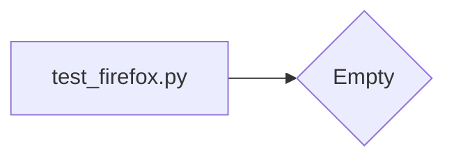

# <input code>

```python
## \file hypotez/src/webdriver/firefox/_pytest/test_firefox.py
# -*- coding: utf-8 -*-\n#! venv/Scripts/python.exe\n#! venv/bin/python/python3.12\n\n"""\n.. module:: src.webdriver.firefox._pytest \n\t:platform: Windows, Unix\n\t:synopsis:\n\n"""\nMODE = \'dev\'\n\n"""\n\t:platform: Windows, Unix\n\t:synopsis:\n\n"""\n\n"""\n\t:platform: Windows, Unix\n\t:synopsis:\n\n"""\n\n"""\n  :platform: Windows, Unix\n\n"""\n"""\n  :platform: Windows, Unix\n  :platform: Windows, Unix\n  :synopsis:\n"""MODE = \'dev\'\n  \n""" module: src.webdriver.firefox._pytest """\n\n\n\n```

# <algorithm>

Этот код представляет собой пустой файл Python.  В нем отсутствуют функции, классы или логика.  Он содержит только комментарии. Алгоритм отсутствует, поскольку нет исполняемых инструкций.

# <mermaid>



# <explanation>

Этот файл `test_firefox.py`  внутри пакета `hypotez/src/webdriver/firefox/_pytest` является, по всей видимости, файлом для тестирования. Однако, он пустой.  В нём нет ни одной функции, класса или переменной.  Все строки – это пустые или документирующие комментарии.

**Импорты:**

Отсутствуют импорты.

**Классы:**

Нет классов.

**Функции:**

Нет функций.

**Переменные:**

Единственная переменная – ``, но она не используется в текущем коде.  Она, скорее всего, определяет режим работы (например, 'dev' – режим разработки), который будет использоваться в других частях проекта.

**Возможные ошибки или области для улучшений:**

Файл бесполезен в текущем состоянии.  Он не содержит ни одной проверочной функции.  Он должен содержать тесты для проверки корректной работы модулей, связанных с `webdriver` и `firefox` в данном проекте.

**Взаимосвязи с другими частями проекта:**

Файл связан с другими частями проекта, поскольку он предназначен для тестирования функциональности класса `Firefox` (или аналогичного) из модуля `src.webdriver.firefox`, используя фреймворк pytest.  Однако, без кода невозможно детально проследить эти взаимосвязи.  Файл `test_firefox.py` должен содержать тесты, которые проверяют, что функциональность `Firefox` работает корректно (напр., инициализация драйвера, закрытие драйвера, выполнение действий).

**Заключение:**

Файл нуждается в добавлении тестов для проверки функциональности.  Этот пустой файл не выполняет никакой полезной функции.