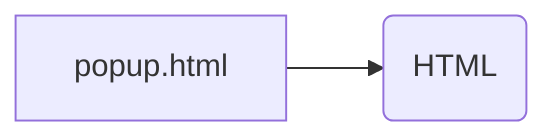

```MD
# Анализ кода popup.html

**1. <input code>**

```html
## \file hypotez/src/webdriver/firefox/extentions/test_extention - Copy/html/popup.html
# -*- coding: utf-8 -*-
#! venv/Scripts/python.exe

""" module: src.webdriver.firefox.extentions.test_extention - Copy.html """
MODE = 'debug'
<!DOCTYPE html>
<html lang="en">
<head>
    <meta charset="UTF-8">
    <meta name="viewport" content="width=device-width, initial-scale=1.0">
    <title>Hypotez</title>
</head>
<body>
    <h1>Hypotez</h1>
    <p>Привет, Это Давидка. Я обучаю модель</p>
</body>
</html>
```

**2. <algorithm>**

Этот код не содержит алгоритма в привычном понимании. Он представляет собой статическую HTML-страницу.  Поэтому блок-схема не нужна.

**3. <mermaid>**



**Описание диаграммы:**

Диаграмма показывает, что файл `popup.html` содержит HTML-контент, который отображается веб-браузером. Зависимости в данном случае нет, так как это статический HTML.

**4. <explanation>**

* **Импорты:**  Нет импортов.  Файл `popup.html` — это HTML-документ, который не содержит импортов Python.
* **Классы:** Нет классов. Файл `popup.html` — это HTML, в нем отсутствуют классы.
* **Функции:** Нет функций.  Файл `popup.html` — это HTML-документ, который содержит только статическую разметку страницы.
* **Переменные:** Переменная `MODE`,  определенная в `popup.html`.  В HTML-файле переменная `MODE`  является константой, хранящей значение `debug` и не имеет практического влияния на работу файла, так как это HTML-код, обрабатываемый браузером, а не скриптом Python.
* **Возможные ошибки или области для улучшений:**  Файл `popup.html` не содержит кода, который может содержать ошибки, кроме ошибок разметки.   
* **Цепочка взаимосвязей:**  Файл `popup.html` скорее всего является частью расширения для браузера Firefox, и его содержание будет отображено в всплывающем окне (popup).  Эта всплывающая форма может быть частью более сложного приложения, взаимодействующего с Python-кодом через JavaScript. Взаимодействие осуществляется через API браузера. Необходимо больше информации о project `hypotez`, чтобы установить более подробные связи с другими частями проекта.


**Заключение:**

Файл `popup.html` — это простая HTML-страница, которая отображает заголовок и текст. Он не содержит логики или взаимодействий, которые могли бы быть представлены алгоритмически. Он скорее всего является частью расширения Firefox.  Для анализа взаимодействия с другими частями проекта требуются дополнительные сведения о структуре проекта `hypotez`.