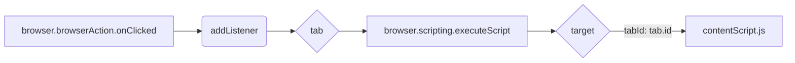

```MD
# Анализ кода background.js

**1. <input code>**

```javascript
// background.js
// background.js

browser.browserAction.onClicked.addListener((tab) => {
    browser.scripting.executeScript({
        target: { tabId: tab.id },
        files: ["contentScript.js"],
    });
});
```

**2. <algorithm>**

```mermaid
graph TD
    A[Клик на иконку расширения] --> B{Проверка наличия активной вкладки};
    B -- Да -> C[Получение ID вкладки];
    B -- Нет -> D[Ничего не делать];
    C --> E[Выполнение скрипта contentScript.js];
    E --> F[Завершение];
    D --> F;
```

**Описание алгоритма:**

1. **Клик на иконку расширения:** Пользователь кликает на иконку расширения в адресной строке браузера.
2. **Проверка наличия активной вкладки:**  Проверяется, есть ли активная вкладка в текущем сеансе.  Пример: если браузер закрыт или нет вкладок, то эта проверка даст результат "нет".
3. **Получение ID вкладки:** Если активная вкладка есть, то запрашивается идентификатор этой вкладки. Пример: ID вкладки может быть 1, 2, 3 и т.д.
4. **Выполнение скрипта contentScript.js:**  С помощью `browser.scripting.executeScript` выполняется `contentScript.js` в контексте текущей вкладки. Пример: если `tab.id` равно 1, `contentScript.js` выполняется в контексте вкладки с ID 1.
5. **Завершение:** Процесс завершается.

**3. <mermaid>**



**Объяснение диаграммы:**

* `browser.browserAction.onClicked`: Вешается обработчик на событие клика по иконке расширения.
* `addListener`: Метод для регистрации обработчика.
* `tab`: Объект, содержащий информацию о текущей вкладке.
* `browser.scripting.executeScript`: Выполняет JavaScript-код в контексте вкладки.
* `target`: Объект, определяющий контекст выполнения (`tabId`).
* `contentScript.js`: Файл, содержащий JavaScript-код, который будет выполнен.


**4. <explanation>**

* **Импорты:** В данном коде нет импортов. Все необходимые компоненты (`browser`, `browserAction`, `scripting`) уже находятся в рамках API браузера (Chrome/Firefox).

* **Классы:** Нет классов.

* **Функции:**
    * `addListener((tab) => { ... })`:  Функция-обработчик события клика на иконку расширения.  Она получает объект `tab`, содержащий информацию о вкладке, на которой был клик.  Внутри обработчика происходит запуск `browser.scripting.executeScript`.

* **Переменные:**
    * `tab`: Объект, содержащий данные о вкладке (id и т.п.), передается как аргумент в обработчик события `onClicked`.
    * Нет других переменных.

* **Возможные ошибки или области для улучшений:**

    * Нет проверки на корректность `tab.id`. Возможно, нужно добавить обработку случаев, когда `tab.id` не определен или является некорректным значением.

* **Цепочка взаимосвязей:**

    Этот код является частью расширения браузера.  Он взаимодействует с `contentScript.js` (который предполагается в том же каталоге).  `contentScript.js` выполняется в контексте конкретной вкладки, и результаты его работы, если таковые есть, могут быть переданы обратно `background.js` с помощью сообщения.


**Вывод:**

Код `background.js` прост и выполняет основную функцию расширения - запуск скрипта в контексте текущей вкладки при клике на иконку. Он эффективно использует API браузера для выполнения этой задачи, но может быть улучшен путем добавления проверок для надежности.