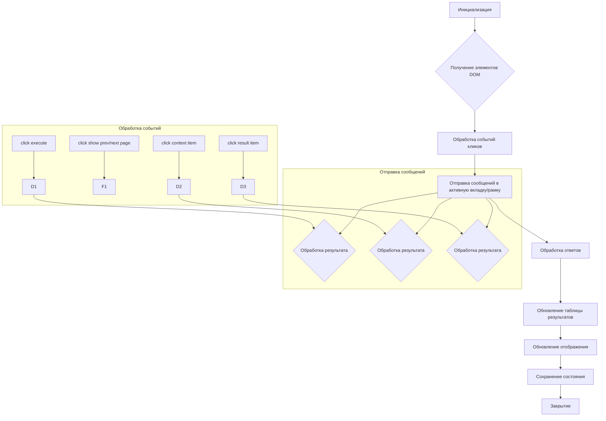
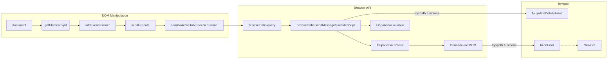

# Анализ кода popup.js

```javascript
/* This Source Code Form is subject to the terms of the Mozilla Public
 * License, v. 2.0. If a copy of the MPL was not distributed with this
 * file, You can obtain one at http://mozilla.org/MPL/2.0/. */

(function (window) {
    "use strict";

    // alias
    var tx = tryxpath;
    var fu = tryxpath.functions;

    var document = window.document;

    const noneClass = "none";
    const helpClass = "help";
    const invalidTabId = browser.tabs.TAB_ID_NONE;
    const invalidExecutionId = NaN;
    const invalidFrameId = -1;

    // ... (много переменных, представляющих элементы DOM) ...

    // ... (множество функций, обрабатывающих DOM, сообщения, состояния) ...
})(window);
```

## <algorithm>

**Блок-схема (Mermaid не поддерживает детальное отображение переменных вложенных объектов):**



**Описание:**

1. **Инициализация:** Получаются ссылки на все элементы DOM, необходимые для работы.
2. **Получение элементов DOM:**  Обработка всех элементов DOM, хранящихся в переменных.
3. **Обработка событий кликов:** Обрабатываются клики по кнопкам (execute, prev/next, контекстным элементам, результатам).
4. **Отправка сообщений в активную вкладку/рамку:**  Функции `sendToActiveTab`, `sendToSpecifiedFrame` отправляют сообщения с запросом выполнения XPath в содержимое активной вкладки/рамки, или с данными для обработки.
5. **Обработка ответов:** Ответы обрабатываются и записываются в `resultedDetails`.
6. **Обновление таблицы результатов:** Функция `fu.updateDetailsTable` обновляет таблицы результатов.
7. **Обновление отображения:** Отображаются результаты в таблице.
8. **Сохранение состояния:** Состояние формы собирается и сохраняется (вкладка закрытия).
9. **Закрытие:** При закрытии вкладки данные состояния сохраняются.


## <mermaid>



**Объяснение зависимостей:**

* `document`:  Объект документа DOM (зависит от браузера).
* `browser`: API для взаимодействия с браузером. (зависит от расширения браузера)
* `tryxpath`: Вероятно, пользовательский модуль, предоставляющий функции для работы с XPath. (зависит от других модулей)

## <explanation>

**Импорты:**

* `tx = tryxpath;`, `fu = tryxpath.functions;`: Эти строки создают алиасы для `tryxpath` и `tryxpath.functions`, чтобы упростить обращение к ним в коде.  `tryxpath` это, вероятно, модуль, содержащий функции для работы с XPath, а `tryxpath.functions` - его подмодуль, содержащий вспомогательные функции. Без знания структуры `tryxpath` сложно сказать, откуда он импортирован.


**Классы:**

Нет явных классов в этом коде.  Вместо них используются объекты и переменные.

**Функции:**

* **`sendToActiveTab(msg, opts)`:** Отправляет сообщение `msg` в активную вкладку. Аргументы: `msg` (сообщение), `opts` (опциональные параметры).  Возвращает `Promise`, представляющий результат отправки.
* **`sendToSpecifiedFrame(msg)`:** Отправляет сообщение `msg` в заданную рамку.  Обрабатывает ошибки при получении ID рамки.  Возвращает `Promise`.
* **`collectPopupState()`:** Собирает текущее состояние элементов управления в popup. Возвращает объект `state`.
* **`changeContextVisible()`, `changeResolverVisible()`, ...:** Меняют видимость блоков с контекстными опциями в popup.
* **`makeExecuteMessage()`:** Собирает данные для запроса XPath из полей ввода, формируя объект `msg` для отправки в активную вкладку.  Возвращает объект `msg`.
* **`getSpecifiedFrameId()`:** Возвращает ID рамки, используемой для выполнения XPath.  Обрабатывает случай, когда рамка не указана.
* **`execContentScript()`:** Выполняет скрипты `try_xpath_functions.js` и `try_xpath_content.js` в контексте активной вкладки. Возвращает `Promise`.
* **`sendExecute()`:** Отправляет сообщение `makeExecuteMessage` в активную вкладку.
* **`showDetailsPage(index)`:** Отображает результаты в таблице, начиная с `index`.
* **`showError(message, frameId)`:** Выводит сообщение об ошибке в popup и очищает результаты.
* **`genericListener(message, sender, sendResponse)`:** Общий обработчик сообщений от активной вкладки.  Ключевой метод для связи popup с активной вкладкой.

**Переменные:**

Большинство переменных являются DOM-элементами или свойствами объектов.


**Возможные ошибки и улучшения:**

* **Обработка ошибок:** Хотя код включает обработку ошибок (`catch(e)`), обработка ошибок в `fu.onError` может быть не достаточно детализированной. Должна быть более полная информация об ошибке и локализация.
* **Избыточные проверки:**  Некоторые проверки (например, `if (!Number.isInteger(index))`) могут быть избыточными или слишком усложнены.
* **Повторное использование кода:** Функции для изменения видимости элементов (`changeContextVisible`, etc) повторяются.  Можно было бы создать более общую функцию.
* **Использование Promises:** В целом код хорошо использует Promises, но местами можно улучшить их применение.
* **Документация:**  Комментарии к коду могли бы быть более подробными и информативными.

**Цепочка взаимосвязей:**

* popup.js взаимодействует с `try_xpath_functions.js`, `try_xpath_content.js` и другими скриптами через `browser.tabs.executeScript`.
* popup.js получает информацию из активной вкладки через `browser.tabs.sendMessage`.
* Сохранение и восстановление состояния (через `browser.runtime`) может связывать popup с другими частями расширения.


В целом, код имеет достаточно сложную логику. Оптимизация и улучшение документирования поможет разобраться в коде и использовать его с большей эффективностью.  Подробный анализ требует большего контекста о `tryxpath` и других связанных модулях.