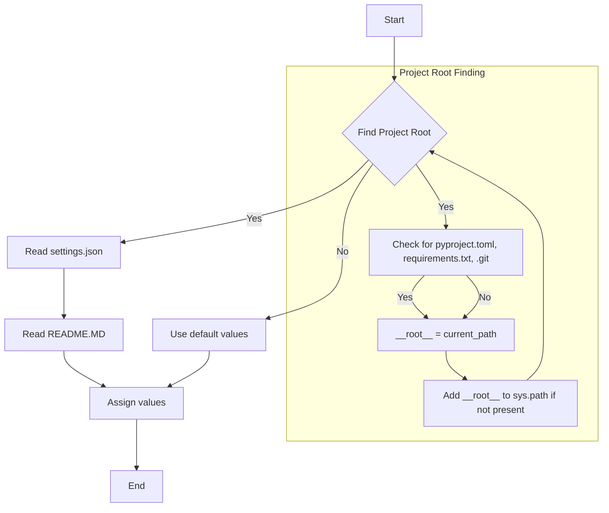
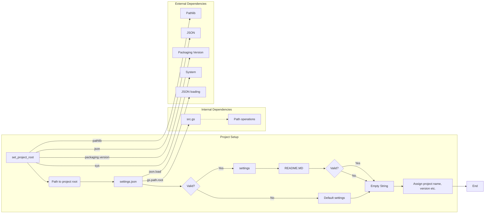

# <input code>

```python
## \file hypotez/src/webdriver/firefox/header.py
# -*- coding: utf-8 -*-\
#! venv/Scripts/python.exe
#! venv/bin/python/python3.12

"""
.. module:: src.webdriver.firefox 
	:platform: Windows, Unix
	:synopsis:

"""


import sys
import json
from packaging.version import Version

from pathlib import Path
def set_project_root(marker_files=('__root__')) -> Path:
    """
    Finds the root directory of the project starting from the current file's directory,
    searching upwards and stopping at the first directory containing any of the marker files.

    Args:
        marker_files (tuple): Filenames or directory names to identify the project root.
    
    Returns:
        Path: Path to the root directory if found, otherwise the directory where the script is located.
    """
    __root__:Path
    current_path:Path = Path(__file__).resolve().parent
    __root__ = current_path
    for parent in [current_path] + list(current_path.parents):
        if any((parent / marker).exists() for marker in marker_files):
            __root__ = parent
            break
    if __root__ not in sys.path:
        sys.path.insert(0, str(__root__))
    return __root__


# Get the root directory of the project
__root__ = set_project_root()
"""__root__ (Path): Path to the root directory of the project"""

from src import gs

settings:dict = None
try:
    with open(gs.path.root / 'src' / 'settings.json', 'r') as settings_file:
        settings = json.load(settings_file)
except (FileNotFoundError, json.JSONDecodeError):
    ...

doc_str:str = None
try:
    with open(gs.path.root / 'src' / 'README.MD', 'r') as settings_file:
        doc_str = settings_file.read()
except (FileNotFoundError, json.JSONDecodeError):
    ...


__project_name__ = settings.get("project_name", 'hypotez') if settings  else 'hypotez'
__version__: str = settings.get("version", '')  if settings  else ''
__doc__: str = doc_str if doc_str else ''
__details__: str = ''
__author__: str = settings.get("author", '')  if settings  else ''
__copyright__: str = settings.get("copyrihgnt", '')  if settings  else ''
__cofee__: str = settings.get("cofee", "Treat the developer to a cup of coffee for boosting enthusiasm in development: https://boosty.to/hypo69")  if settings  else "Treat the developer to a cup of coffee for boosting enthusiasm in development: https://boosty.to/hypo69"
```

# <algorithm>



The algorithm first finds the project root directory (`set_project_root`) by checking for marker files (e.g., `pyproject.toml`) in parent directories starting from the current file's location.  If a marker file is found, the parent directory is considered the project root.  Otherwise, the current directory is used. The root path is added to `sys.path`. Then it tries to load the project settings from `settings.json` file in the root directory. If successful, project name, version, author, and other details are loaded into appropriate variables. If `settings.json` is not found or invalid, default values are used.  Finally, it tries to load the README.md file for documentation. If successful, `__doc__` is loaded; otherwise, it's assigned an empty string.  Finally, the code assigns values to various constants based on the obtained data.

# <mermaid>




# <explanation>

**Импорты:**

- `sys`: Предоставляет доступ к системным переменным и функциям, в частности, позволяет добавлять директории в `sys.path` для импорта модулей из других директорий.
- `json`:  Для работы с файлами JSON.
- `packaging.version`:  Для работы с версиями пакетов.
- `pathlib`: Для работы с путями файлов. Этот импорт crucial для навигации по файловой системе.

**Классы:**

Нет явно определенных классов в предоставленном коде.

**Функции:**

- `set_project_root(marker_files)`:  Находит корневую директорию проекта, начиная от текущего файла и идя вверх по дереву директорий.
    - Аргументы: `marker_files` (кортеж строк) - список файлов/папок, используемых для определения корневого каталога проекта.
    - Возвращаемое значение: `Path` - путь к корневой директории проекта.
    - Алгоритм: Рекурсивно проверяет родительские каталоги, пока не найдет каталог, содержащий хотя бы один из файлов/папок из `marker_files`. Если корневая директория не найдена, то возвращает текущую директорию.  Важно, что эта функция добавляет найденный путь к `sys.path`, что позволит импортировать другие модули из корневого каталога.

**Переменные:**

- `MODE`: Строковая переменная, хранящая режим работы (например, 'dev' или 'prod').
- `__root__`:  `Path` объект, содержащий путь к корневому каталогу проекта.
- `settings`: Словарь, содержащий настройки проекта, загруженные из `settings.json`.
- `doc_str`: Строка, содержащая содержимое файла `README.MD`.
- `__project_name__`, `__version__`, `__doc__`, `__details__`, `__author__`, `__copyright__`, `__cofee__`: Константы, хранящие информацию о проекте.

**Возможные ошибки и улучшения:**

- **Обработка ошибок:** Функция `set_project_root` не обрабатывает случай, когда ни один из `marker_files` не найден, возвращая `Path` к текущей директории, что может быть некорректно. Возможно, следует добавить более ясный обработчик ошибки (например, `ValueError` или исключение с информацией о том, почему не удалось найти корневую директорию).
- **Улучшение читаемости:** Возможно, стоит использовать более описательные имена для переменных и констант, например, `project_root` вместо `__root__` для большей ясности.
- **Модульность:** Можно было бы вынести логику поиска корневой директории в отдельный модуль, чтобы сделать код более структурированным и используемым в других частях проекта.


**Взаимосвязь с другими частями проекта:**

- `gs`:  Представляет собой модуль `gs`, который содержит информацию о пути к корневому каталогу проекта. Вероятно, он играет важную роль в организации проекта.
- `settings.json` и `README.MD`: Эти файлы хранят критическую информацию о проекте, например, настройки и документацию, используемые различными частями проекта.
- Вероятно, этот `header.py` модуль предназначен для предварительной инициализации проекта, получения данных и настроек для запуска других компонентов. Этот файл необходим для других модулей, чтобы они имели доступ к этим данным.