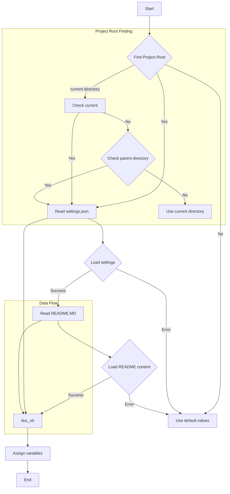
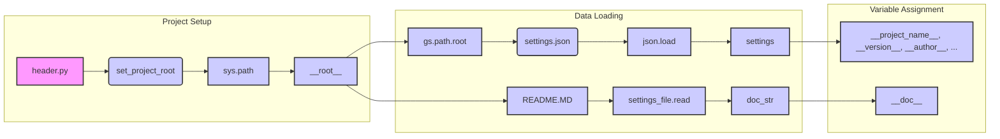

# <input code>

```python
## \file hypotez/src/webdriver/header.py
# -*- coding: utf-8 -*-\
#! venv/Scripts/python.exe
#! venv/bin/python/python3.12

"""
.. module: src.webdriver 
	:platform: Windows, Unix
	:synopsis:

"""
MODE = 'dev'

import sys
import json
from packaging.version import Version

from pathlib import Path
def set_project_root(marker_files=('__root__')) -> Path:
    """ Finds the root directory of the project starting from the current file's directory,
    searching upwards and stopping at the first directory containing any of the marker files.

    Args:
        marker_files (tuple): Filenames or directory names to identify the project root.
    
    Returns:
        Path: Path to the root directory if found, otherwise the directory where the script is located.
    """
    __root__:Path
    current_path:Path = Path(__file__).resolve().parent
    __root__ = current_path
    for parent in [current_path] + list(current_path.parents):
        if any((parent / marker).exists() for marker in marker_files):
            __root__ = parent
            break
    if __root__ not in sys.path:
        sys.path.insert(0, str(__root__))
    return __root__


# Get the root directory of the project
__root__ = set_project_root()
"""__root__ (Path): Path to the root directory of the project"""

from src import gs

settings:dict = None
try:
    with open(gs.path.root / 'src' / 'settings.json', 'r') as settings_file:
        settings = json.load(settings_file)
except (FileNotFoundError, json.JSONDecodeError):
    ...

doc_str:str = None
try:
    with open(gs.path.root / 'src' / 'README.MD', 'r') as settings_file:
        doc_str = settings_file.read()
except (FileNotFoundError, json.JSONDecodeError):
    ...


__project_name__ = settings.get("project_name", 'hypotez') if settings  else 'hypotez'
__version__: str = settings.get("version", '')  if settings  else ''
__doc__: str = doc_str if doc_str else ''
__details__: str = ''
__author__: str = settings.get("author", '')  if settings  else ''
__copyright__: str = settings.get("copyrihgnt", '')  if settings  else ''
__cofee__: str = settings.get("cofee", "Treat the developer to a cup of coffee for boosting enthusiasm in development: https://boosty.to/hypo69")  if settings else "Treat the developer to a cup of coffee for boosting enthusiasm in development: https://boosty.to/hypo69"
```

# <algorithm>



This algorithm finds the project root directory, loads project settings from `settings.json`, and optionally reads the documentation from `README.MD`.  It then uses these to populate various project-related variables. If `settings.json` or `README.MD` are not found, or if there is an error during loading, default values are used instead.


# <mermaid>



**Dependencies:**

*   `sys`:  For interacting with the Python runtime environment.  Used to modify `sys.path`.
*   `json`: For parsing the JSON file `settings.json`.
*   `pathlib`: Used for file path manipulation, crucial for finding and accessing files within the project structure.
*   `packaging.version`: For handling versioning information.
*   `src.gs`:  (External) module handling the project's root directory.


# <explanation>

**Imports:**

*   `sys`: Used to manipulate the Python path. This is crucial for finding and importing modules within the project structure.
*   `json`: Used to parse the `settings.json` file.
*   `packaging.version`:  Used for handling version strings in a robust way.
*   `pathlib`: Provides object-oriented way of working with filesystem paths.  Importantly used here for finding the project root directory.
*   `src.gs`:  This import suggests a likely `src/gs.py` module dedicated to accessing project-related resources, in particular the project root. This assumes the existence of a module `gs` and a `gs.path.root` attribute inside that module, which would point to the project's base directory.

**Classes:**

There are no classes defined in this snippet.


**Functions:**

*   `set_project_root(marker_files)`: This function is crucial for finding the root directory of the project.  It starts from the current file's directory and walks up the directory tree until it finds a directory that contains any of the specified marker files (e.g., `pyproject.toml`, `requirements.txt`, `.git`). This is a robust way to determine the project's base directory, which is necessary for locating other important files. The function modifies `sys.path` to include the found root directory, which allows the import system to locate the necessary modules and packages.
    *   Arguments:
        *   `marker_files`: A tuple of filenames or directory names to search for.
    *   Returns: `Path` object representing the project root.

**Variables:**

*   `MODE`: A string, likely used to indicate the mode (e.g., development, production).
*   `__root__`: A `Path` object representing the project's root directory.
*   `settings`: A dictionary containing project settings loaded from `settings.json`.
*   `doc_str`: A string containing the content of the `README.MD` file.
*   `__project_name__`, `__version__`, `__doc__`, `__details__`, `__author__`, `__copyright__`, `__cofee__`: Strings obtained from `settings` (or defaults if `settings` is `None` or the relevant keys are not found). These variables likely hold project metadata.

**Possible Errors/Improvements:**

*   Error handling with `try...except` blocks is good for robustness. However, consider logging the errors instead of using `...` as that is not very informative.
*   The `__root__` variable is assigned but not immediately used. This can be considered a slight stylistic issue.

**Relationships with other parts of the project:**

The code heavily relies on the existence of a `gs` module (likely within the `src` directory) to determine the project root (`gs.path.root`) for file access. This indicates a structured project organization with clear responsibility for accessing and manipulating paths.