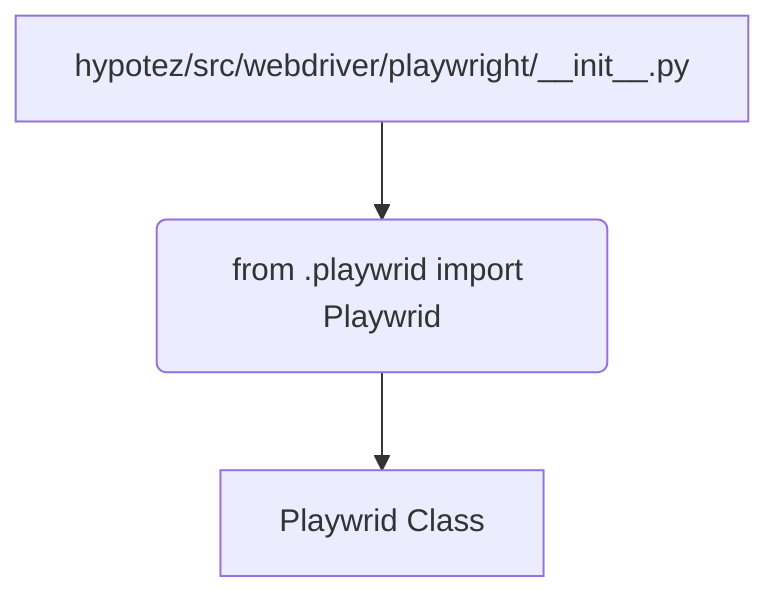

# <input code>

```python
## \file hypotez/src/webdriver/playwright/__init__.py
# -*- coding: utf-8 -*-\
#! venv/Scripts/python.exe
#! venv/bin/python/python3.12

"""
.. module:: src.webdriver.playwright 
	:platform: Windows, Unix
	:synopsis:
https://chatgpt.com/share/67428d3f-6b18-800d-a585-eb414eef60e2
"""
MODE = 'dev'

from .playwrid import Playwrid
```

# <algorithm>

Этот код является инициализационным файлом модуля `playwright` в пакете `webdriver`.  Он не содержит логики выполнения, а только импортирует класс `Playwrid` из модуля `playwrid.py` внутри того же пакета.  Пошаговый алгоритм здесь тривиален:

1. **Импорт:** Модуль `playwright` импортирует класс `Playwrid`.  Данные не перемещаются между функциями или классами в этом коде, так как он просто устанавливает импорт.

# <mermaid>



**Объяснение диаграммы:**

* `hypotez/src/webdriver/playwright/__init__.py`: Этот файл является точкой входа для модуля `playwright`.
* `from .playwrid import Playwrid`: Это оператор импорта, который инициирует загрузку класса `Playwrid` из модуля `playwrid.py`, находящегося в той же директории.
* `Playwrid Class`: Представляет класс, определённый в `playwrid.py`.  Этот модуль (`.playwrid`) является зависимостью.  Без его наличия код `playwright/__init__.py` не скомпилируется.

# <explanation>

* **Импорты:**  `from .playwrid import Playwrid` импортирует класс `Playwrid` из модуля `playwrid.py` в текущем подпакете (`./playwrid`).  `.` в начале пути указывает на текущий пакет, что важно для работы вложенных импортов.  Этот импорт позволяет использовать класс `Playwrid` в файлах этого же пакета.

* **Классы:** Код определяет, что класс `Playwrid` определен в файле `playwrid.py` в подпакете `playwright` (то есть, файл `playwrid.py` находится в той же директории, что и `__init__.py`).  Данный код не содержит определения класса.  Он лишь указывает на необходимость наличия класса `Playwrid` в соответствующем файле.


* **Функции:**  Нет функций в данном файле, только импорт.


* **Переменные:** `MODE = 'dev'` — это переменная, которая, вероятно, определяет режим работы программы (разработка, продакшн).  Тип — строка.


* **Возможные ошибки и улучшения:**  Если `playwrid.py` не существует или в нём нет определения класса `Playwrid`, то при запуске программы будет ошибка импорта.  Было бы целесообразно добавить проверку существования файла `playwrid.py` для предотвращения таких ошибок во время выполнения.

**Цепочка взаимосвязей:**

* `hypotez/src/webdriver/playwright/__init__.py` импортирует `Playwrid` из `hypotez/src/webdriver/playwright/playwrid.py`
* Ожидается, что класс `Playwrid` взаимодействует с другими компонентами `webdriver` или другими частями приложения `hypotez`, такими как браузер, конфигурации тестов и т.д.   Чтобы определить точное взаимодействие, потребуется просмотреть код `playwrid.py`.

**Выводы:**

Файл `__init__.py` выполняет простую, но важную функцию — делает класс `Playwrid` доступным для использования в других файлах пакета `playwright`.  Это типичный паттерн организации кода на Python, особенно для модульных библиотек.  Следующим шагом для анализа будет изучение файла `playwrid.py`.