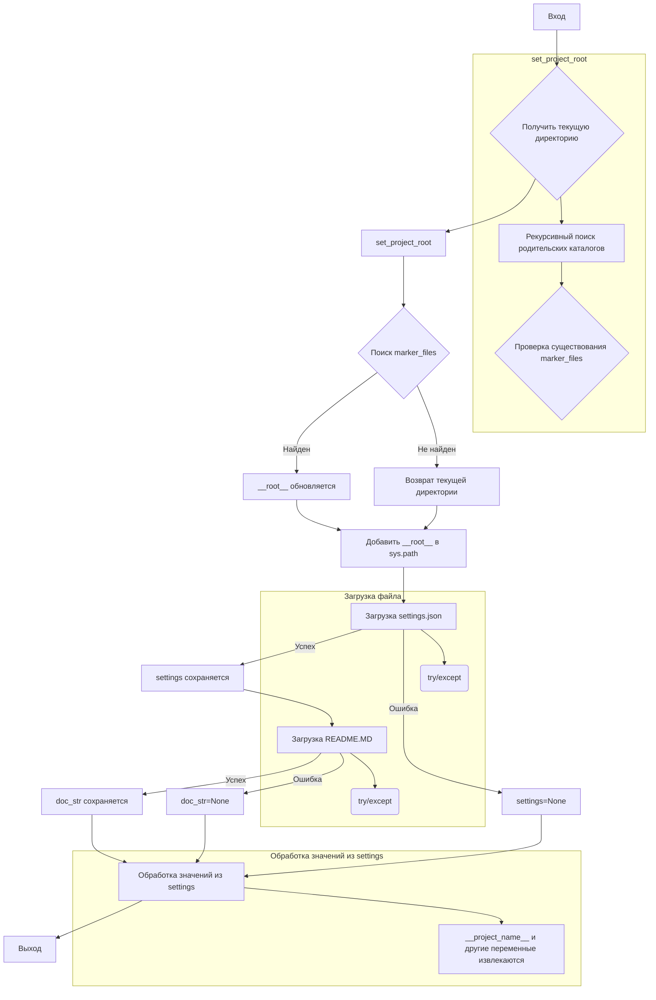

# <input code>

```python
## \file hypotez/src/webdriver/playwright/header.py
# -*- coding: utf-8 -*-\
#! venv/Scripts/python.exe
#! venv/bin/python/python3.12

"""
.. module:: src.webdriver.playwright 
	:platform: Windows, Unix
	:synopsis:

"""


import sys
import json
from packaging.version import Version

from pathlib import Path
def set_project_root(marker_files=('__root__','.git')) -> Path:
    """
    Finds the root directory of the project starting from the current file's directory,
    searching upwards and stopping at the first directory containing any of the marker files.

    Args:
        marker_files (tuple): Filenames or directory names to identify the project root.
    
    Returns:
        Path: Path to the root directory if found, otherwise the directory where the script is located.
    """
    __root__:Path
    current_path:Path = Path(__file__).resolve().parent
    __root__ = current_path
    for parent in [current_path] + list(current_path.parents):
        if any((parent / marker).exists() for marker in marker_files):
            __root__ = parent
            break
    if __root__ not in sys.path:
        sys.path.insert(0, str(__root__))
    return __root__


# Get the root directory of the project
__root__ = set_project_root()
"""__root__ (Path): Path to the root directory of the project"""

from src import gs

settings:dict = None
try:
    with open(gs.path.root / 'src' /  'settings.json', 'r') as settings_file:
        settings = json.load(settings_file)
except (FileNotFoundError, json.JSONDecodeError):
    ...

doc_str:str = None
try:
    with open(gs.path.root / 'src' /  'README.MD', 'r') as settings_file:
        doc_str = settings_file.read()
except (FileNotFoundError, json.JSONDecodeError):
    ...


__project_name__ = settings.get("project_name", 'hypotez') if settings  else 'hypotez'
__version__: str = settings.get("version", '')  if settings  else ''
__doc__: str = doc_str if doc_str else ''
__details__: str = ''
__author__: str = settings.get("author", '')  if settings  else ''
__copyright__: str = settings.get("copyrihgnt", '')  if settings  else ''
__cofee__: str = settings.get("cofee", "Treat the developer to a cup of coffee for boosting enthusiasm in development: https://boosty.to/hypo69")  if settings  else "Treat the developer to a cup of coffee for boosting enthusiasm in development: https://boosty.to/hypo69"
```

# <algorithm>

**Шаг 1**: Вызов `set_project_root(marker_files)`.
  * Передается кортеж `marker_files`, содержащий имена файлов для поиска корневой директории проекта.
  * Внутри функции `set_project_root` происходит поиск родительских директорий начиная от текущего файла.
  * **Пример**: Если текущий файл находится в `hypotez/src/webdriver/playwright`, функция будет искать `pyproject.toml`, `requirements.txt` и `.git` в `hypotez/src/webdriver`, `hypotez/src`, `hypotez`, и т.д.
  * Если найден файл из `marker_files`, то `__root__` обновляется и цикл прерывается.
  * Если ни один файл не найден, `__root__` сохраняет текущую директорию.
  * `__root__` добавляется в `sys.path`, если он ещё не там.

**Шаг 2**: Получение `__root__`.

**Шаг 3**: Инициализация `settings` и `doc_str`.
  * Пытается загрузить `settings.json` из корневого каталога проекта (через `gs.path.root`).
  * Обрабатывает исключения `FileNotFoundError` и `json.JSONDecodeError`, если файл не существует или содержит некорректный JSON.
  * Аналогично загружает `README.MD` и сохраняет в `doc_str`.
  * **Пример**: Если `settings.json` не найден, `settings` останется `None`.


**Шаг 4**: Извлечение данных из `settings`:
  * Считывает значения из `settings` с использованием `settings.get()`, используя значения по умолчанию, если ключ не найден.
  * **Пример**: Если `settings` не содержит ключа `project_name`, `__project_name__` получит значение 'hypotez'.


**Шаг 5**: Сохранение и возвращение корневой директории.

**Пример данных между функциями**:
  - `set_project_root` получает кортеж `marker_files` и возвращает `Path` к корневому каталогу.
  - Эта `Path` используется в последующих операциях для поиска и чтения файлов, например `settings.json` и `README.MD`.


# <mermaid>




# <explanation>

**Импорты**:

* `sys`: предоставляет доступ к системным параметрам, в частности, позволяет управлять путем поиска модулей. Используется для добавления корневой директории в `sys.path`.
* `json`: для работы с JSON-файлами, в частности, для загрузки настроек из `settings.json`.
* `packaging.version`: для работы с версиями пакетов (не используется напрямую в этом примере).
* `pathlib`: для работы с файлами и директориями в объектно-ориентированном стиле. Используется для создания путей (`Path`) и проверки существования файлов.
* `src.gs`: модуль, предположительно, предоставляющий пути к файлам и каталогам проекта (не доступен для анализа без полного кода).


**Классы**:

Нет классов в данном фрагменте кода.

**Функции**:

* `set_project_root(marker_files)`:
    * `marker_files`: кортеж строк, являющихся именами файлов, которые необходимо найти для определения корневого каталога проекта.
    * Возвращает: объект `Path` к корневому каталогу проекта.
    * Функциональность: рекурсивно ищет вверх по файловой системе, пока не найдёт директорию содержащую файлы из `marker_files` (например, pyproject.toml, requirements.txt, .git). Если ни один не найден, возвращает директорию текущего скрипта. Важно, что корневой каталог добавляется в `sys.path` для последующего импорта модулей из него.

**Переменные**:

* `MODE`: Строка, вероятно, определяющая режим работы.
* `__root__`: Объект `Path`, содержащий путь к корневому каталогу проекта.
* `settings`: Словарь, содержащий настройки проекта, загруженные из `settings.json`.
* `doc_str`: Строка, содержащая контент из `README.MD`.
* `__project_name__`, `__version__`, `__doc__`, `__details__`, `__author__`, `__copyright__`, `__cofee__`: Строковые переменные, содержащие информацию о проекте, полученные из `settings`.


**Возможные ошибки или области для улучшений**:

* **Обработка ошибок**: Хотя код использует `try...except` блоки для обработки `FileNotFoundError` и `json.JSONDecodeError`, более подробная и структурированная обработка ошибок могла бы улучшить надёжность кода. (Например, логирование ошибок).
* **Избыточность**: Проверка `if settings` повторяется несколько раз. Можно использовать условный оператор `or` для компактного варианта.
* **Документация**: Код содержал бы пользу от улучшенных комментариев в стиле docstrings, описывая цели переменных и функций более подробно.  Документация по модулю `gs` отсутствует.
* **Структура**: При большом количестве переменных, связанных с настройками и информацией о проекте, возможно, было бы полезно создать класс для хранения всех данных, что улучшило бы организацию и гибкость кода.


**Взаимосвязи с другими частями проекта**:

Код, вероятно, связан с другими частями проекта, используя модуль `gs` для работы с путями. Модуль `gs` является ключевым элементом для работы с путями и директориями в проекте, а его использование здесь говорит о его необходимости для работы с файлами проекта. Полное понимание взаимосвязей потребует доступа к полному коду модуля `gs`.