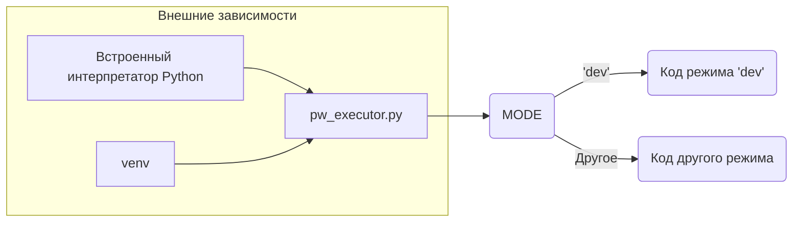

# <input code>

```python
## \file hypotez/src/webdriver/playwright/pw_executor.py
# -*- coding: utf-8 -*-

#! venv/bin/python/python3.12

"""
.. module:: src.webdriver.playwright 
	:platform: Windows, Unix
	:synopsis:

"""

```

# <algorithm>

```mermaid
graph TD
    A[Начало] --> B{Проверка переменной MODE};
    B --  --> C[Выполнение кода режима 'dev'];
    B -- Иное --> D[Выполнение кода другого режима (если есть)];
    C --> E[Конец];
    D --> E;
```

Пример:

Переменная `MODE` имеет значение 'dev'.  В данном случае, алгоритм просто проверяет значение переменной, но не выполняет никаких действий в зависимости от результата.

# <mermaid>



В данном случае `pw_executor.py` зависит от переменной `MODE` и других зависимостей, установленных в окружении выполнения (venv).


# <explanation>

**Импорты**:

Код не содержит импортов.  Он определяет только переменную `MODE` и docstring для файла, что указывает на описание и возможные платформы.

**Классы**:

Нет определённых классов.

**Функции**:

Нет функций.

**Переменные**:

- `MODE`: Строковая переменная, хранящая значение 'dev'.  Это, скорее всего, конфигурационная переменная, которая используется для определения режима работы (например, режим разработки или производства), влияющего на дальнейшие действия в кодовой базе проекта.

**Возможные ошибки или области для улучшений**:

- Нет функциональности: сам по себе код не выполняет никаких действий. Необходимо добавить код, который будет использовать значение переменной `MODE`.
- Отсутствие ясности использования:  без дальнейшего контекста переменной `MODE`, неясно, как она будет использоваться в других частях проекта.  В идеале, должна быть возможность определить разные режимы работы (например 'prod') и применять различные настройки кода в каждом из них.
- Отсутствие взаимодействия с другими частями проекта:  код, скорее всего, будет частью более крупного проекта, в котором переменная `MODE` будет использоваться для выбора разных настроек или механизмов работы.


**Цепочка взаимосвязей с другими частями проекта**:

Переменная `MODE` скорее всего,  будет использована в других частях проекта `hypotez`, чтобы настроить поведение, например, разные пути к логам, различные конфигурации браузера Playwright для тестирования.  Значение `MODE` может служить ключом к выбору определённого поведения, используемого в других модулях.  Без контекста других частей проекта, точное назначение и использование `MODE` неизвестны.